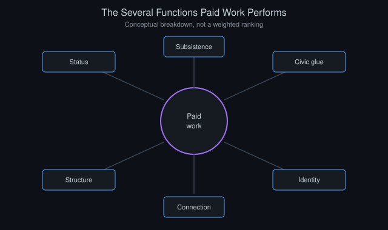
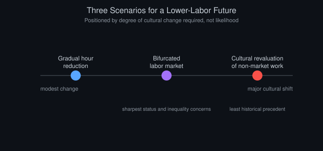

# The Post-Labor Society: Work, Meaning, and AI

*By Vizanix, AI & Society*

> If a meaningfully large share of economically necessary labor can eventually be performed by machines, the harder question is not economic but psychological and civic: what happens to a species that has organized much of its sense of purpose, status, and social structure around paid work.

## Table of Contents

1. Distinguishing the Economic Question From the Meaning Question
2. Where Work Comes From, Historically, Beyond Subsistence
3. The Psychological Research on Work and Well-Being
4. Three Scenarios for a Lower-Labor Future
5. Status, Hierarchy, and the Risk of a New Kind of Inequality
6. Historical Precedents: Leisure Classes and Their Discontents
7. What Might Actually Fill the Gap
8. The Civic Dimension: Work as Social Glue

## 1. Distinguishing the Economic Question From the Meaning Question

Discussion of a "post-labor society" tends to blur two genuinely separate questions that deserve separate treatment. The first is economic: can a society sustain broadly shared material prosperity if a large share of the population is not engaged in traditional paid employment, a question of production, distribution, and financing mechanisms addressed at length in the companion essays on prosperity and economic disruption elsewhere in this collection. The second is psychological and civic. Even if the economic question is solved satisfactorily, what happens to individual well-being, social status structures, and civic cohesion in a society where paid work no longer occupies the central organizing role it has held for most people throughout industrial and post-industrial history?

This essay focuses primarily on the second question, because it is the one most often neglected in technology-forward discussions of AI's economic impact, which tend to treat "people will have more free time" as an unambiguously positive outcome requiring no further analysis. It is also the one most often exaggerated in pessimistic discussions, which sometimes assume a lack of paid work automatically produces a listless, purposeless population, a claim that deserves more scrutiny than it typically receives from either direction.

It is worth being explicit up front that this scenario, a substantial reduction in the necessity of human labor for a large share of the population, remains speculative and contested rather than a settled forecast. The economic disruption essay in this collection documents genuine reasons for both more modest and more dramatic possibilities. What follows treats the more dramatic version as a scenario worth taking seriously and reasoning through carefully, not as a confident prediction of what will happen.

## 2. Where Work Comes From, Historically, Beyond Subsistence

To reason clearly about a lower-labor future, it helps to disentangle the several distinct functions that paid work has historically served. A shift away from work-as-subsistence-necessity does not automatically eliminate the other functions work has come to serve, some of which may prove considerably more resistant to automation of purpose than to automation of task.

The most obvious function is subsistence: work as the mechanism by which people obtain the resources needed to survive and meet basic material needs. But work has also historically served as a primary source of social status and hierarchy, of daily structure and time organization, of social connection to a network of colleagues outside one's family, of a sense of contribution and competence, mastering a skill and applying it usefully, and of identity. The common social reflex of introducing oneself by profession is not an accident. It reflects how deeply occupation has become entangled with self-conception in industrial and post-industrial societies specifically, a pattern that is itself a relatively recent historical development rather than a human universal. Pre-industrial and non-market societies have organized status, structure, and identity around other axes, kinship, craft guild membership, religious role, land tenure, suggesting these functions can in principle attach to something other than paid employment, even if paid employment is what currently carries them for most people in modern economies.

*Figure 1: Paid work currently bundles several distinct functions together. A lower-labor future has to find some replacement for each, not just for the subsistence function.*

This distinction matters because it reframes the post-labor question. The economically necessary version of work, work as subsistence mechanism, is the version most directly addressed by AI-driven productivity gains and potential redistribution mechanisms. The socially and psychologically load-bearing version of work, work as status, structure, connection, and identity, is a much harder problem. It is not obviously solved by simply providing people with income absent employment. It requires some replacement mechanism for the non-economic functions work has been serving, and history offers limited, mixed guidance on how societies have handled this when it has arisen on a smaller scale before.

## 3. The Psychological Research on Work and Well-Being

A substantial body of research in occupational and social psychology has examined the relationship between employment status and well-being, and its findings are more nuanced than either optimistic or pessimistic popular narratives typically convey. Involuntary unemployment is consistently and robustly associated with lower measured well-being, higher rates of depression and anxiety, and in some studies, worse physical health outcomes. These effects persist even after controlling for the income loss involved, suggesting the psychological cost of unemployment is not purely a function of reduced material resources but also reflects the loss of the structural, social, and identity functions described above.

However, this research was conducted almost entirely in contexts where unemployment was involuntary, stigmatized, and financially precarious. Three conditions that may not transfer directly to a hypothetical future where reduced paid employment is a broad societal pattern rather than an individual misfortune, is not associated with financial precarity because of adequate income support mechanisms, and does not carry the same social stigma because it is a widely shared condition rather than a mark of individual failure or bad luck. Retirement research offers a partially useful, if imperfect, analogue here. Well-being outcomes after retirement vary enormously depending on whether the transition is voluntary or forced, whether the retiree has cultivated non-work sources of structure and social connection in advance, and whether adequate financial security removes the anxiety component. Voluntary, well-prepared, financially secure retirement shows considerably better well-being outcomes than the unemployment literature's typically grim findings, suggesting the psychological cost associated with not working is not fixed but highly dependent on the surrounding social and economic conditions under which it occurs.

The honest scientific conclusion is that existing research cannot directly answer what a broad, society-wide, adequately-resourced, non-stigmatized reduction in paid work would do to well-being. No society has yet experienced that specific combination of conditions at scale for a sustained period. This is a genuinely open empirical question that current psychological science can inform but not conclusively answer, a point worth stating plainly rather than extrapolating too confidently from research conducted under quite different conditions.

## 4. Three Scenarios for a Lower-Labor Future

It is useful to sketch, concretely, several distinct scenarios for how a substantial reduction in necessary paid labor could actually play out, since the term "post-labor society" often gets used as though it describes a single well-defined outcome rather than a family of quite different possibilities with different implications.

The first scenario involves gradual work-hour reduction across the existing workforce rather than mass unemployment. As productivity per hour rises, the average work week shortens over time, a pattern with real historical precedent: the standard work week in most industrialized economies fell substantially over the first half of the twentieth century as productivity gains were partially captured as leisure rather than entirely as additional output, before that trend largely stalled in many countries during the latter half of the century for reasons that remain debated among economic historians. Under this scenario, most people remain employed, but the total demands paid work places on their time and identity gradually diminish, allowing the non-work functions of life to expand incrementally rather than requiring an abrupt substitute.

The second scenario involves a bifurcated labor market, where a substantial minority of the population continues in demanding, well-compensated, meaning-laden work, particularly in domains requiring the kind of judgment, accountability, and human trust discussed in the economic disruption essay, while a growing share of the population either does not work in a traditional sense or works part-time, supplementary hours in roles that supplement rather than substitute for a broader income support mechanism. This scenario raises the sharpest and most difficult status and inequality concerns, discussed further below, since it creates a visible, potentially resentment-generating divide between those whose lives remain organized around traditional work-based status and those whose lives are not.

The third, most speculative scenario involves something closer to a genuine society-wide transformation in how work is understood. Non-market activity, caregiving, community organizing, artistic and creative pursuit, lifelong learning, becomes broadly recognized and socially valorized as legitimate contribution in its own right, comparable in social status to paid employment. Such a shift would require significant cultural evolution beyond any purely economic or technological change, and there is limited historical precedent to draw confident conclusions from, though partial, smaller-scale analogues exist in some volunteer-intensive civic cultures and in the historical role of unpaid domestic and community labor, disproportionately performed by women, that sustained social functions parallel to paid work for a very long time without ever being fully recognized or compensated as such. A historical parallel worth taking seriously both as precedent and as cautionary example of how easily such contributions can be undervalued.

## 5. Status, Hierarchy, and the Risk of a New Kind of Inequality

A concern raised by serious observers across the political spectrum is that a bifurcated labor market scenario, described above, risks producing a new and potentially more socially corrosive form of inequality than purely income-based inequality. It stratifies not just material resources but the sense of purpose, status, and social contribution that work has historically distributed, however unevenly, across a much broader swath of the population than a bifurcated future might.

The concern is not merely theoretical. Something like it has been observed in specific historical and contemporary contexts where a subset of the population has access to meaningful, well-compensated work while another subset, receiving adequate or even generous material support, nonetheless reports lower measured life satisfaction and higher rates of social disengagement. Patterns like this have been documented in some studies of regions experiencing prolonged deindustrialization even where social insurance systems were comparatively generous, suggesting that income adequacy alone does not fully substitute for the other functions work provides, a finding directly relevant to any policy response premised primarily on redistribution without complementary attention to the structural and identity functions of work.

The honest counterpoint is that this pattern may be substantially a product of the specific historical conditions under which it has been observed so far: deindustrialization experienced as decline, stigma, and loss of a previously higher status, rather than an inevitable psychological consequence of not working under any conditions whatsoever. A society that entered a lower-labor equilibrium gradually, without the framing of decline or personal failure, and with deliberately cultivated alternative sources of status and structure, might not reproduce the same pattern. This remains, again, an untested hypothesis rather than a confident prediction, since no society has yet undergone this specific transition under conditions designed to avoid the deindustrialization pattern's negative framing.

## 6. Historical Precedents: Leisure Classes and Their Discontents

History offers a genuinely useful, if imperfect and limited, precedent in the historical experience of aristocratic and rentier classes who, across many different societies and eras, did not need to work for subsistence and had to construct meaning, status, and daily structure without the organizing force of economic necessity. The historical record on how well this actually worked is decidedly mixed and worth taking seriously as a cautionary data point rather than dismissing as irrelevant to a modern context.

Some historical leisure classes developed rich alternative structures of purpose: patronage of the arts and sciences, elaborate systems of social obligation and civic duty, intensive cultivation of skill in pursuits like scholarship, statecraft, or the arts pursued for their own sake rather than for income. Other historical leisure classes, and often the same ones at different points in their history, are documented as having struggled with patterns of ennui, status anxiety displaced onto increasingly elaborate and sometimes destructive competitive consumption, and a kind of purposelessness that social critics of the time repeatedly diagnosed as a genuine social problem specific to their circumstances rather than a universal human condition.

The lesson this history offers is not that a post-labor future is doomed to replicate the least flattering aspects of historical leisure classes. It's that freedom from economic necessity does not automatically produce meaning or purpose. It requires active cultivation of replacement structures, and societies and individuals that failed to cultivate them, historically, tended toward the less flattering outcomes the historical record documents. This is arguably the single most important, underappreciated lesson available from history for thinking clearly about a lower-labor future, and it argues strongly against treating expanded leisure time as an automatically positive outcome requiring no further societal design or individual effort.

## 7. What Might Actually Fill the Gap

If paid work's non-economic functions, status, structure, connection, identity, need some replacement in a lower-labor future, it is worth asking concretely what plausible candidates exist, drawing on both the historical record and contemporary examples of activity that already provides some of these functions outside traditional employment.

Structured, skill-intensive avocational pursuits, amateur sport, musicianship, craft production, competitive intellectual pursuits, already provide many people with a sense of mastery, incremental improvement, and identity independent of income. There is no obvious reason these could not expand to fill a larger share of people's time and self-conception given adequate resources and cultural validation, though the honest caveat is that this pattern currently correlates strongly with existing socioeconomic advantage, since cultivating a serious avocational pursuit itself typically requires the kind of stable material security, education, and unstructured time that a well-designed post-labor transition would need to provide broadly rather than only to those already advantaged.

Caregiving and community-oriented activity, for children, for aging family members, for local civic institutions, already constitutes an enormous amount of socially valuable, currently under-recognized labor. A society that deliberately elevated the status and social recognition of this category of contribution, independent of whether it flows through a formal paid-employment structure, could plausibly absorb a meaningful share of the purpose and structure functions currently tied to paid work, building on the smaller-scale precedent, noted above, of unpaid domestic and community labor that has always performed adjacent social functions, while correcting the historical undervaluation that category of work has suffered.

Lifelong education and genuinely open-ended intellectual or creative exploration, pursued for its own sake rather than instrumentally toward employment, represents a third plausible candidate, one that becomes considerably more economically feasible in a world where AI-driven productivity gains have, in the more optimistic economic scenarios discussed in the companion prosperity essay, meaningfully lowered the cost of both material subsistence and the tools, educational content, mentorship substitutes, needed to pursue serious learning outside formal institutional structures.

None of these candidates is a guaranteed or complete substitute for what paid work currently provides. A realistic assessment should expect a mixed, imperfect, and unevenly distributed patchwork of replacement structures rather than any single clean solution, mirroring the genuinely uneven historical record on how well past leisure classes managed the same underlying challenge.

*Figure 2: Three distinct scenarios for a lower-labor future, arranged by how much cultural change each would require. This is a way of organizing possibilities, not a probability ranking.*

## 8. The Civic Dimension: Work as Social Glue

Beyond individual psychological well-being, paid work has historically served an important civic function often overlooked in individually-focused discussions. Workplaces are one of the few remaining institutions in many modern societies that reliably bring together people from different backgrounds, political affiliations, and social strata into sustained, cooperative interaction toward a shared practical goal. This function has grown increasingly important as other traditional sites of cross-cutting social contact, religious congregations, civic and fraternal organizations, extended multigenerational households, have weakened over recent decades in many industrialized societies for reasons largely independent of AI or automation.

A substantial reduction in paid work's centrality, absent some deliberate replacement mechanism, risks further eroding this already-weakening category of cross-cutting social contact, potentially deepening the kind of social and political polarization that many observers already identify as a significant challenge in contemporary societies. People increasingly self-select into more homogeneous social environments once the mixed-background cooperative structure that many workplaces have historically provided is removed from their daily lives, an outcome that would be a genuine civic cost even in a scenario where the economic and individual psychological dimensions of the post-labor transition were handled reasonably well.

This civic dimension argues for taking seriously, in any deliberate post-labor institutional design, not just how individuals will find personal meaning and structure, but how a society will maintain the kind of cross-cutting, cooperative social contact that paid work has inadvertently provided for much of modern history. That function will need some other institutional home if paid work's centrality genuinely diminishes at scale, and it's one that current discussions of AI's economic impact rarely address with the seriousness the historical record suggests it deserves.

## Where This Leaves Us

A post-labor future, if it arrives in anything like its more dramatic forms, is not automatically a utopia of liberated human potential, nor automatically a crisis of mass purposelessness. The historical and psychological evidence available today supports neither confident conclusion. What it does support is a clear-eyed recognition that paid work currently performs several distinct functions simultaneously, subsistence, status, structure, connection, identity, civic cohesion, and that solving the economic question alone, however important, leaves most of these other functions unaddressed.

The historical record on societies and individuals freed from economic necessity is genuinely mixed, offering real examples of flourishing alongside real, well-documented examples of drift and purposelessness. The difference between those outcomes appears to hinge substantially on deliberate cultivation of replacement structures rather than on anything automatic about freedom from labor itself. If AI does eventually reduce the necessity of human labor at a meaningful scale, the harder and more interesting work will not be economic redistribution, difficult as that is, but the slower, more uncertain cultural and institutional work of building the structures that will need to carry the weight paid work has carried for so long. That work has barely begun, and no society has yet demonstrated how to do it well at scale.

---

*This essay is part of the Vizanix Quant Engineering Library. Licensed under CC BY 4.0 — free to read, share, and adapt with attribution to Vizanix.*
