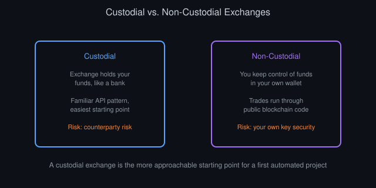
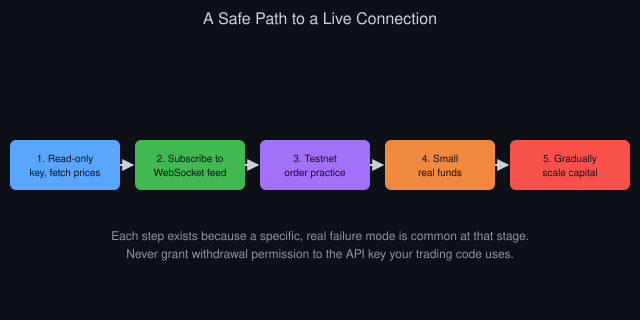

# The Beginner's Guide to Crypto Exchange Connectivity

*By Vizanix — Beginner Level*

> This book focuses specifically on connecting to cryptocurrency exchanges, covering the quirks, risks, and practical steps unique to this corner of the market.

## Table of Contents

1. Why Crypto Exchanges Deserve Their Own Book
2. Custodial vs Non-Custodial: Where Your Funds Actually Sit
3. Spot, Margin, and Derivatives: Know What You're Connecting To
4. The Practical Steps of Connecting
5. Symbols, Precision, and Minimum Sizes
6. Withdrawal Risk and Key Hygiene
7. Handling Multiple Exchanges at Once
8. A Safe Path From Zero to Your First Live Connection

## 1. Why Crypto Exchanges Deserve Their Own Book

Cryptocurrency exchanges share the same fundamental building blocks covered in the previous book: REST and WebSocket APIs, authentication through keys, and rate limits. But several features of the crypto market make connectivity meaningfully different in practice, and worth its own dedicated attention.

Crypto markets run continuously, with no fixed opening or closing time, unlike most traditional stock exchanges. Your system needs to be ready to handle activity, and potential problems, at any hour, since there's no overnight window where nothing happens.

The number of distinct exchanges is far larger than in traditional markets, and quality varies enormously. Some are well-established with deep liquidity and mature APIs; others are newer, thinner, and more prone to outages or inconsistent documentation. Because the same coin often trades across dozens of these venues with no central regulator forcing consistent behavior, the fragmentation introduced earlier in this library is especially pronounced here.

Finally, and most importantly, many crypto exchanges give you direct custody-related actions, like withdrawals, through the same API you use for trading, which raises the practical stakes of key security well beyond what a typical stock brokerage API involves. This book walks through these differences concretely.

## 2. Custodial vs Non-Custodial: Where Your Funds Actually Sit

A custodial exchange holds your funds on your behalf, similar to how a bank holds your money. You deposit crypto or cash into an account the exchange controls, and you trust the exchange to let you trade and withdraw as promised. Most large, well-known crypto exchanges work this way, and it's the model most beginners start with because it closely resembles a traditional brokerage experience.

A non-custodial approach, common in decentralized exchanges, lets you keep control of your funds in your own wallet, with trades executed through code running on a public blockchain rather than through a company's internal systems. This removes a certain kind of counterparty risk, the risk that the entity holding your funds fails or acts against your interests. It introduces a different set of technical and security considerations, like protecting your own private keys and understanding how blockchain transaction fees work, that go beyond the scope of a beginner book.

For your first automated trading project, a custodial exchange is the more approachable starting point. The API patterns resemble the general exchange APIs from the previous book closely, and you don't need to simultaneously learn blockchain-specific concepts on top of everything else. Just go in aware that "custodial" means real counterparty risk: only keep on any given exchange the amount you're genuinely comfortable being unable to access if that exchange has a serious problem.

*Figure 1: Custodial exchanges trade counterparty risk for a familiar, approachable API pattern.*

## 3. Spot, Margin, and Derivatives: Know What You're Connecting To

Crypto exchanges typically offer several distinct trading products, and connecting to the wrong one by mistake is a genuinely common beginner error. Spot trading means buying or selling the actual asset directly, exactly as described throughout this library: you pay cash and receive the coin, or vice versa.

Margin trading lets you borrow funds from the exchange to trade a larger position than your own capital alone would allow, which amplifies both potential gains and potential losses, and introduces the risk of a forced liquidation, where the exchange automatically closes your position if losses eat too far into your borrowed capital.

Derivatives, particularly perpetual futures contracts unique to crypto markets, let you speculate on a coin's price without holding the actual coin, often with substantial built-in leverage, meaning a small price move can produce a large change in your position's value. These contracts also involve a funding rate, a periodic payment exchanged between long and short position holders, which adds an ongoing cost or income beyond simple price movement.

Each of these products typically has its own separate section of an exchange's API, with different endpoints, different symbols, and different risk parameters. As a beginner, confirm explicitly which product you're connecting to and stick to spot trading until you thoroughly understand margin and leverage. Accidentally sending an order to a margin or derivatives endpoint you didn't intend to use can create risk exposure far beyond what you expected.

## 4. The Practical Steps of Connecting

Start by creating an account on the exchange and completing whatever identity verification it requires, a process most regulated exchanges call KYC (know your customer), before you can deposit meaningful funds or access full trading functionality. This step has nothing to do with code, but it's a genuine prerequisite you can't skip.

Next, generate an API key specifically for your automated project, separate from any key you might use for manual trading through the website, and set its permissions to the minimum your project needs, following the guidance from the previous book. For your very first connection, request read-only permissions and don't enable trading at all yet.

Read the exchange's specific API documentation for its base URL (the address your requests go to), its authentication scheme (exactly how it expects you to sign or attach your credentials to each request), and its symbol naming convention. Exchanges vary in whether they call a trading pair "BTCUSD," "BTC-USD," or "BTC/USD," and getting this exactly right matters, since a malformed symbol typically produces a rejected request rather than a helpful suggestion.

Write a small test script that does nothing but fetch the current price for one instrument using your read-only key, confirm it works, then move on to subscribing to a WebSocket stream for live updates, following the patterns from the previous book. Only after both of these work reliably should you consider a key with order-placing permission, and even then, test exclusively on a testnet if the exchange offers one.

## 5. Symbols, Precision, and Minimum Sizes

Every exchange enforces rules about how precisely you can specify a price and a quantity for a given instrument, and about the smallest order size it will accept. These rules exist partly for technical reasons and partly to keep the order book from filling with impractically tiny orders.

Sending a price or quantity with too many decimal places, or below the minimum allowed size, typically results in a rejected order, and the specific limits vary by instrument and by exchange, not just by asset. A quantity precision that works fine for one coin can be completely wrong for another traded on the very same exchange.

Most exchanges expose these rules through an endpoint that returns exchange information, including each instrument's allowed precision and minimum order size. A well-built wrapper, as introduced in the previous book, fetches and caches this information rather than hardcoding assumptions that will eventually go stale or turn out wrong for a new instrument you add later.

Rounding a calculated order quantity or price incorrectly, even by a tiny amount, is a common and entirely avoidable source of rejected orders. Build a small, well-tested rounding function that respects each instrument's actual rules, and use it consistently everywhere an order gets constructed in your code, rather than rounding ad hoc at each call site.

## 6. Withdrawal Risk and Key Hygiene

Some crypto exchange APIs allow withdrawals, meaning an API key with the right permission can move funds off the exchange entirely, not just place trades. This is a meaningfully higher stakes capability than anything covered so far, since a leaked key with withdrawal permission gives an attacker a direct path to draining your account, while a leaked trading-only key limits the damage to unwanted trades within your existing balance.

As an unbending rule for any automated trading project, never grant withdrawal permission to an API key your trading code uses. If you need to move funds, do that manually and separately through the exchange's website or app, using your own direct login rather than an automated key.

Many exchanges also let you restrict an API key to a specific whitelist of IP addresses, meaning the key only works from computers at those specific network addresses. This adds a genuinely valuable extra layer of protection, since even a leaked key becomes far less useful to someone connecting from a different, unauthorized location. Enable this whenever your infrastructure setup allows it, particularly once you move from testing on your own laptop to running on a server with a stable address.

Rotate your keys periodically, meaning generate a new key and retire the old one, and immediately revoke any key you suspect might have been exposed, rather than waiting to see whether anything bad actually happens first.

## 7. Handling Multiple Exchanges at Once

Once you move beyond a single exchange, whether to compare prices, to look for arbitrage opportunities introduced earlier in this library, or simply to diversify where your funds sit, you'll quickly notice that no two exchanges behave identically, even for conceptually identical operations.

Symbol naming conventions differ. Rate limits differ. The exact fields returned in an order status response differ. Some exchanges are far more reliable about maintaining stable WebSocket connections than others. Handling all of this cleanly means extending the thin wrapper pattern from the previous book: build one wrapper per exchange that translates each exchange's specific quirks into the same simple, consistent internal interface, so your strategy code above that layer never needs to know or care which specific exchange it's ultimately talking to.

This investment feels like overhead when you're only using one exchange, but it pays off substantially the moment you add a second one, since you extend your system by writing one new wrapper rather than rewriting your strategy logic to accommodate a second set of exchange-specific details scattered throughout it.

## 8. A Safe Path From Zero to Your First Live Connection

Move through this progression deliberately, and resist the urge to skip steps because they feel slow. First, connect with a read-only key and fetch prices successfully. Second, subscribe to a live WebSocket data stream and confirm you're receiving continuous, sensible updates. Third, if the exchange offers a testnet, create trading-permitted keys there and practice placing, checking, and canceling orders with fake funds until it feels routine and boring, in a good way.

Fourth, if you move to real funds, start with an amount you'd be completely fine losing entirely, treating it explicitly as tuition for learning the operational realities of live connectivity rather than as a serious trading allocation. Fifth, only after your system has run reliably, with proper error handling and logging as covered in the previous book, for a meaningful stretch of time, consider gradually increasing the capital involved.

Every step in this progression exists because a real, specific failure mode is common at that stage: rejected orders from precision mistakes, dropped connections your code doesn't notice, or a leaked key doing real damage. Walking through them in order, rather than jumping straight to live trading with real capital, is the single highest-leverage habit this book can hand you.

*Figure 2: A deliberate, ordered path from zero to a live connection, catching a different failure mode at each stage.*

## Summary

- Crypto exchanges run continuously and vary enormously in maturity, making robust error handling especially important.
- Custodial exchanges are the more approachable starting point; understand the counterparty risk before depositing real funds.
- Know explicitly whether you're connecting to spot, margin, or derivatives endpoints, and start with spot only.
- Respect each instrument's precision and minimum size rules, and never grant withdrawal permission to a trading API key.
- Move through read-only access, testnet trading, and small real funds in that order before scaling up capital.

---

*This book is part of the Vizanix Quant Engineering Library. Licensed under CC BY 4.0 — free to read, share, and adapt with attribution to Vizanix.*
