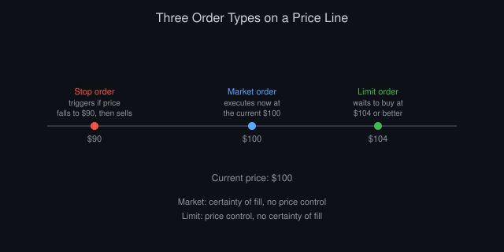
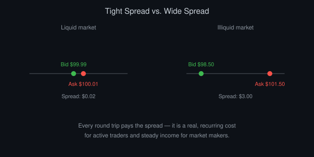

# How Markets Actually Work: Orders, Prices, and Participants

*By Vizanix — Beginner Level*

> This book explains the plumbing behind a market price: what an order really is, how a trade gets matched, and why the price on your screen moves the way it does.

## Table of Contents

1. A Market Is a Matching Problem
2. Orders: The Basic Unit of a Market
3. How a Trade Actually Happens
4. Bid, Ask, and the Spread
5. Exchanges, Venues, and Fragmentation
6. What Moves Prices
7. Liquidity and Why It Matters to You
8. Putting It Together: Reading a Price Move

## 1. A Market Is a Matching Problem

Strip away the jargon and a financial market is a matching problem. Some people want to buy an asset, some want to sell it, and the market's job is to pair them up at a price both sides accept. The charts, the news, the algorithms, all of it exists to help someone decide what price they're willing to accept.

Imagine a small fruit stall where three people want to buy apples and two people want to sell them. Each buyer has a maximum price they'll pay, each seller has a minimum price they'll accept, and a trade happens whenever a buyer's maximum meets or exceeds a seller's minimum. Financial markets do the same thing, just with a computer doing the matching instead of a person at a stall, and with thousands or millions of participants instead of five.

The exchange, the company or system that runs the market, doesn't set the price itself. It enforces the rules for how buyers and sellers meet and records the result. Understanding this removes a lot of mystery. A "market price" is simply the price at which the most recent trade happened to match, not a fixed value assigned by some authority.

This matching problem also explains why prices constantly wiggle even when nothing important seems to be happening. Every new order, even a small one, changes who's currently waiting to buy or sell and at what price, and that can shift where the next match occurs.

## 2. Orders: The Basic Unit of a Market

An order is an instruction to buy or sell a specific quantity of an instrument, and it comes in a few standard flavors.

A market order says "buy or sell right now, at whatever price is currently available." You give up control over the exact price in exchange for certainty that your order executes immediately.

A limit order says "buy or sell, but only at this price or better." If you place a limit order to buy at $50 and the current price is $52, your order sits and waits until the price drops to $50 or lower, if it ever does. Limit orders give you price control but no guarantee of execution.

A stop order activates only after the price crosses a certain level, at which point it typically converts into a market order. Traders use these to limit losses. If you own an asset at $100 and place a stop order at $90, your position sells automatically if the price falls to $90, capping further loss.

*Figure 1: A market order fills immediately, a limit order waits for its price, and a stop order triggers past a threshold.*

Orders also carry a side (buy or sell), a quantity, and often a time-in-force instruction that says how long the order should remain active. It might stay open for the rest of the trading day, until canceled, or be marked immediately-or-cancel, meaning it fills what it can right away and cancels the rest.

Every order you place becomes visible, in aggregate, in the exchange's order book, the running list of everyone waiting to trade. The next chapter, and a dedicated book in this library, cover it in more detail.

## 3. How a Trade Actually Happens

When you send a market order to buy, the exchange looks at the order book for the lowest price someone is currently willing to sell at, and matches you against that seller. If your order is bigger than what that seller offered, the exchange keeps matching you against the next-lowest seller, and the next, until your order is fully filled or no more sellers remain at any price.

This process, filling one order against multiple resting orders at different price levels, is called walking the book. It's why a large market order can end up paying a noticeably worse average price than the price you saw right before you clicked buy. That effect is called slippage: the difference between the price you expected and the price you actually got.

Most modern exchanges use price-time priority to decide who gets matched first among orders at the same price, meaning whoever placed their order earliest at that price level gets filled first. This rewards being early and discourages canceling and replacing orders constantly just to jump the queue, though in practice some venues have more nuanced rules.

The exchange records every completed trade with its price, quantity, and timestamp. This stream of completed trades, distinct from the order book itself, is what most price charts are built from.

## 4. Bid, Ask, and the Spread

At any moment, the highest price any buyer is currently willing to pay is called the bid, and the lowest price any seller is currently willing to accept is called the ask (sometimes called the offer). The bid is always lower than or equal to the ask. If a buyer's price ever meets or exceeds a seller's price, a trade happens immediately and those orders leave the book.

The difference between the ask and the bid is the spread. A tight spread, say a few cents on a heavily traded stock, signals a liquid, active market where buyers and sellers largely agree on value. A wide spread signals uncertainty, low trading activity, or a market maker demanding more compensation for the risk of holding inventory.

The spread matters enormously to anyone trading frequently, because every time you cross it, buying at the ask and later selling at the bid, you pay that cost. A strategy that trades a hundred times a day needs the spread cost built into its expected profit calculation. Otherwise it will look profitable on paper and lose money in practice.

Market makers, introduced in the first book of this library, earn their living by capturing the spread repeatedly, buying at the bid and selling at the ask, while managing the risk that the price moves against their open inventory before they can offload it.

*Figure 2: A tight spread signals a liquid, active market, while a wide spread signals uncertainty or thin trading.*

## 5. Exchanges, Venues, and Fragmentation

You might assume a stock trades in exactly one place, but in most modern markets the same instrument trades simultaneously across multiple venues: several exchanges, plus other trading systems that match orders privately. This is called fragmentation.

Fragmentation exists partly because competition among venues can lower costs, and partly because some venues offer features certain participants value, like anonymity or specific order types. For you as a trader, it means the "best price" for an instrument might technically live on a venue your broker doesn't route to by default. It also means building a complete picture of the market sometimes requires combining data from several sources.

Cryptocurrency markets take fragmentation further. The same coin can trade on dozens of exchanges around the world with no central regulator forcing them to show consistent prices, which occasionally creates the price discrepancies that arbitrageurs look for.

For a beginner, the practical takeaway is simple: know which venue your data and your orders actually go through, and don't assume the price you see from one source perfectly represents the whole market.

## 6. What Moves Prices

At the most mechanical level, a price moves because a trade happens at a different level than the last one, which happens because the balance between buy and sell orders at each price shifts. It helps, though, to understand the forces behind that shifting balance.

New information moves prices: an earnings report, an economic data release, a piece of news about a company or an asset. Participants update their view of fair value and adjust their orders accordingly.

Order flow imbalance moves prices even without news. If far more people want to buy than sell at the current price, buyers will keep consuming available sell orders and pushing the price up as they work through progressively higher asks.

Liquidity changes move prices too. If a large market maker steps back from providing quotes, perhaps due to increased uncertainty, the spread widens and even modest orders can move the price further than they would have when more liquidity was present.

Finally, expectations and positioning matter. If many participants believe a price will rise and have already bought based on that belief, there may be fewer buyers left to push it further, and a piece of merely neutral news can trigger a fall as those participants take profits.

## 7. Liquidity and Why It Matters to You

Liquidity describes how easily you can trade a meaningful quantity of an instrument without moving its price much. A highly liquid market has many participants, tight spreads, and deep order books, meaning lots of quantity waiting at prices close to the current one. An illiquid market has the opposite: wide spreads, thin order books, and prices that can jump sharply on modest orders.

As a beginner building or testing a strategy, liquidity affects you in two direct ways. First, it determines your realistic trading costs: the less liquid the instrument, the more slippage you should expect, and the more careful your backtests need to be about modeling that cost. Second, it determines how much capital you can actually deploy in a strategy. A strategy that looks great on a small illiquid asset might be completely infeasible at any meaningful size, because your own orders would move the price against you.

Checking an instrument's typical trading volume and spread before designing a strategy around it saves you from building something that works only in a spreadsheet.

## 8. Putting It Together: Reading a Price Move

Next time you watch a price chart tick, remind yourself what's actually happening underneath. Someone sent an order. That order either matched immediately against a resting order from the book, producing a trade at a specific price, or it joined the book to wait for a match later. The chart you're watching is a summary of thousands of these small matching events.

When you see a sharp price jump, ask yourself whether it reflects new information, a shift in order flow, or a temporary liquidity gap that a large order pushed through. These have very different implications: news-driven moves tend to persist, while liquidity-driven moves tend to partially reverse once normal trading resumes.

Building this instinct, connecting the visible price to the invisible mechanics of orders and matching, is one of the most valuable habits you can develop before writing any trading code. The next book in this library goes deeper into reading the order book itself, the live snapshot of everyone waiting to trade right now.

## Summary

- A market matches buyers and sellers; the exchange enforces rules, it doesn't set prices.
- Orders come mainly as market, limit, and stop orders, each trading off certainty against price control.
- Trades fill against the order book following price-time priority, and large orders can "walk the book," creating slippage.
- The bid-ask spread is a real, recurring cost for active traders and a source of income for market makers.
- Liquidity determines both your trading costs and how much capital a strategy can realistically absorb.

---

*This book is part of the Vizanix Quant Engineering Library. Licensed under CC BY 4.0 — free to read, share, and adapt with attribution to Vizanix.*
