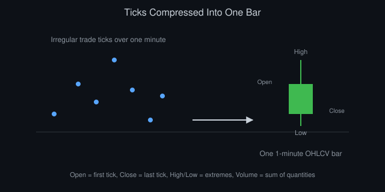
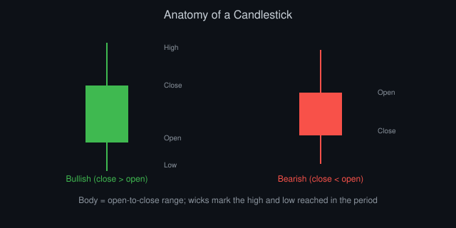
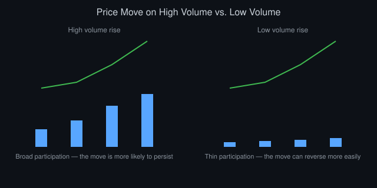

# Market Data 101: Ticks, Bars, and Candles Explained

*By Vizanix — Beginner Level*

> This book explains the raw material every trading strategy runs on: ticks, bars, and candles, and how to choose the right representation of market data for your purpose.

## Table of Contents

1. Market Data Is Not One Thing
2. Ticks: The Rawest Form of Data
3. Bars: Compressing Ticks Into Something Usable
4. Candlesticks: Bars With Extra Information
5. Choosing a Timeframe
6. Volume, and Why It's Not Optional
7. Data Quality Problems You Will Hit
8. Storing and Working With Market Data

## 1. Market Data Is Not One Thing

When people say "market data," they usually mean one of several different things, and confusing them causes real bugs. There's tick data, the record of every individual trade or quote change as it happens. There's bar data, tick data compressed into fixed intervals like one minute or one day. There's order book data, the live snapshot of resting orders covered in the previous book. And there's reference data: things like an instrument's name, trading hours, and contract details that don't change minute to minute.

Every one of these serves a different purpose. A strategy that reacts to fleeting order book shifts needs tick-level or order book data. A strategy that looks at daily trends can work perfectly well with daily bars and never touch a single tick. Grabbing the wrong granularity either drowns you in data you don't need or starves your strategy of detail it actually requires.

This book focuses on the two forms you'll use constantly as a beginner: ticks and bars, including the specific bar style called a candlestick that appears on nearly every trading chart you've ever seen.

## 2. Ticks: The Rawest Form of Data

A tick is a single data point representing one event: a trade occurred, or the best bid or ask changed. A trade tick typically includes a timestamp, a price, and a quantity. A quote tick includes a timestamp and the updated bid and/or ask price and size.

Tick data is the closest thing to "the truth" of what happened in a market, since nothing has been summarized or thrown away. If you want to reconstruct exactly what any trader could have seen at a precise moment, you need tick data.

The catch is volume. A liquid instrument can generate thousands of ticks per second during busy periods, and storing, processing, and analyzing that much data requires real engineering effort: efficient storage formats, careful indexing, and code that doesn't fall over when the data rate spikes. A beginner project working with daily strategies rarely needs to touch raw ticks at all, while a beginner project studying short-term order flow has no substitute for them.

It's worth internalizing early that ticks arrive irregularly in time. Sometimes ten trades happen in a second, sometimes none happen for a minute. This irregular spacing is exactly why bars exist: many analytical techniques, and much of classical statistics, assume observations arrive in regular intervals, which raw ticks simply don't provide.

## 3. Bars: Compressing Ticks Into Something Usable

A bar summarizes all the ticks within a fixed period into a handful of numbers: the opening price (the first trade price in the period), the closing price (the last trade price), the highest price reached, and the lowest price reached. Add up the trading volume during that period and you have a complete one-minute, one-hour, or one-day bar.

This compression throws away a lot of detail. What it gains you is a regular, predictable structure. A day's worth of one-minute bars always contains the same number of rows regardless of how many actual trades occurred, which makes bars far easier to feed into standard analysis tools, spreadsheets, and most machine learning pipelines.

Building a bar from ticks is a simple aggregation once you understand the rule: group ticks by time window, take the first price as open, the last price as close, the maximum price as high, the minimum price as low, and sum the quantities as volume. Most data providers hand you bars already built this way, but understanding the underlying computation matters because it explains bars' limitations. A bar tells you the range of prices touched during the period, but nothing about the order in which they occurred within it, nor how many separate trades contributed to that range.

There are variations beyond simple time-based bars. Volume bars close after a fixed amount of quantity has traded, regardless of how much time that takes. Tick bars close after a fixed number of trades. These alternatives can behave more consistently during periods of wildly different activity levels, though time-based bars remain the most common starting point for beginners because nearly every data source and charting tool supports them natively.

*Figure 1: Open is the first tick's price, close is the last, and high/low mark the extremes touched in between.*

## 4. Candlesticks: Bars With Extra Information

A candlestick is simply a visual representation of a bar, drawn to make the relationship between open, close, high, and low immediately visible at a glance. Picture a small rectangle, called the body, spanning from the open price to the close price. If the close is higher than the open, the body is typically shown in one color (commonly green or white); if the close is lower, it's shown in another (commonly red or black). Thin lines called wicks or shadows extend above and below the body to mark the high and low reached during the period.

This visual encoding lets a trader scan a chart of hundreds of candles and immediately spot patterns. A long green body suggests strong buying pressure through the period. A small body with long wicks on both ends suggests a period of indecision where price moved a lot but ended close to where it started.

Some traders build entire strategies around named candlestick shapes and sequences, believing certain visual patterns predict future price movement. As a beginner, treat these patterns with healthy skepticism. They describe what already happened in a visually memorable way, but whether a particular shape reliably predicts the future is a claim that needs rigorous statistical testing, not just visual pattern-matching, before you trust it with real capital. The backtesting book in this library shows you how to test such claims properly.

Candlesticks contain exactly the same information as a plain OHLC (open-high-low-close) bar. The value is purely in how quickly a human eye can extract meaning from the picture rather than from a table of four numbers.

*Figure 2: The body spans open to close; the thin wicks above and below mark the high and low reached in the period.*

## 5. Choosing a Timeframe

The timeframe you choose, one minute, one hour, one day, shapes almost every property of your strategy. Shorter timeframes give you more data points and let you react faster, but they also amplify noise: random, meaningless fluctuations that don't reflect any real underlying signal. Longer timeframes smooth out noise but reduce the number of independent opportunities your strategy gets to act, and they demand more patience between decisions.

A useful early exercise is plotting the same instrument at several timeframes side by side. A chart that looks like a clear, obvious trend on a daily timeframe can look like chaotic noise zoomed into one-minute bars, and vice versa: a clean pattern on a five-minute chart might be invisible once you zoom out to weekly bars. Neither view is more "correct" than the other; they simply answer different questions.

Match your timeframe to your strategy's holding period, established in the first book of this library. If you intend to hold positions for days, building your signals from one-minute bars usually adds complexity and noise without adding real information relevant to your holding period.

## 6. Volume, and Why It's Not Optional

Volume, the total quantity traded during a period, gets less attention than price from beginners, but it carries genuine information. A price move on unusually high volume suggests broad participation and conviction behind the move. The identical price move on unusually low volume suggests it might be driven by just a few participants and could reverse more easily.

Volume also matters practically. It's your best simple proxy for liquidity when deeper order book data isn't available. If an instrument's typical daily volume is small relative to the position size you want to trade, expect meaningful slippage, regardless of how attractive its price chart looks.

Get in the habit of looking at volume alongside price on every chart you study, not as an afterthought squeezed into a small panel at the bottom, but as a genuine second dimension of the story the data is telling you.

*Figure 3: An identical price move carries very different implications depending on how much volume accompanied it.*

## 7. Data Quality Problems You Will Hit

Real market data is messier than any textbook example. Gaps appear when an exchange has no trades during a period, particularly for less liquid instruments, or when your data feed briefly disconnects. Duplicate records occasionally show up from certain feeds or reprocessing pipelines. Corporate actions, like a stock split, can make historical prices before the action look discontinuous with prices after it unless the data provider adjusts for them.

Timestamps deserve particular caution. Different data sources may use different time zones, different precision (seconds versus milliseconds versus microseconds), or even different definitions of when a bar "starts" versus "ends." Mixing data from two sources without reconciling these details produces subtly wrong analysis that can be very hard to spot after the fact.

Before trusting any dataset for a strategy, do a basic sanity pass. Check for missing periods, check that high is always greater than or equal to both open and close, check that volume is never negative, and spot-check a handful of bars against another source if one is available. This unglamorous work saves you from building an entire strategy on top of a data bug.

## 8. Storing and Working With Market Data

For a beginner project, a simple file format like CSV or a lightweight database is entirely sufficient for storing bar data, since daily or hourly bars for even a few years of history amount to a modest number of rows. Tick data, by contrast, grows large quickly and benefits from a columnar storage format designed for efficient querying of large time-series datasets, along with compression, since raw tick files can otherwise consume enormous disk space.

Whatever you choose, keep raw data separate from any cleaned or adjusted version you produce. If you discover a bug in your cleaning logic later, you want to be able to regenerate the cleaned data from the untouched original rather than trying to reverse-engineer what you might have already damaged. This habit, keeping an immutable raw copy, is one of the simplest and most valuable practices you can adopt before you write a single line of strategy code.

## Summary

- Market data comes in several distinct forms; ticks, bars, and order book data serve different purposes and shouldn't be confused.
- Bars compress irregular ticks into regular intervals using open, high, low, close, and volume.
- Candlesticks are a visual encoding of bar data, useful for fast pattern recognition but not inherently predictive.
- Timeframe choice should match your intended holding period, not just what looks interesting on a chart.
- Volume is a genuine second signal, and real-world data quality issues deserve deliberate checking before use.

---

*This book is part of the Vizanix Quant Engineering Library. Licensed under CC BY 4.0 — free to read, share, and adapt with attribution to Vizanix.*
