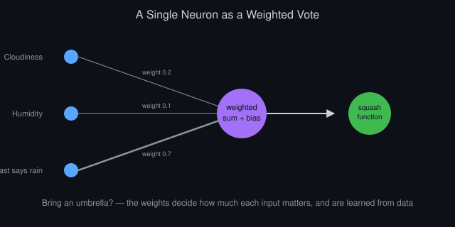
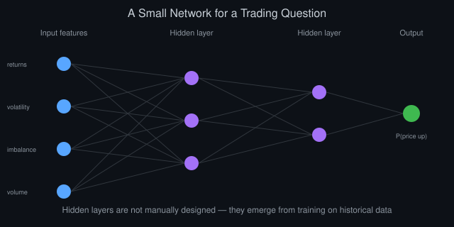
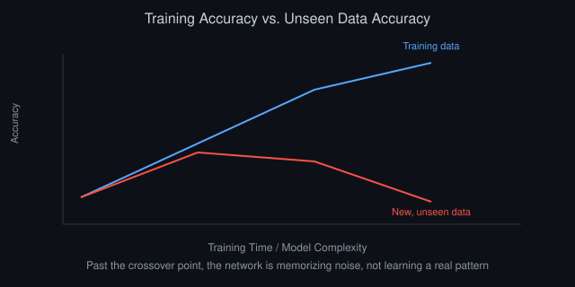

# Neural Networks Explained for Traders: A Gentle Introduction

*By Vizanix — Beginner Level*

> This book explains what a neural network actually is and how it might apply to trading, using plain analogies instead of heavy mathematics, so you understand the concept before you ever touch a modeling library.

## Table of Contents

1. Forget the Hype, Start With the Mechanism
2. A Neuron Is Just a Weighted Vote
3. Layers: Stacking Simple Votes Into Complex Judgments
4. How a Network Actually Learns
5. What a Neural Network Could Look at in Trading
6. Why This Is Harder Than It Looks in Markets
7. Overfitting, Revisited at Full Strength
8. A Sensible First Step, Not a Leap

## 1. Forget the Hype, Start With the Mechanism

Neural networks get discussed in trading circles with a mix of excitement and vague mystery, as though they're a kind of digital oracle. Strip away that framing and a neural network is a specific, well-defined mathematical structure that takes some numbers in, performs a series of straightforward calculations, and produces some numbers out. Nothing about the underlying mechanism is mysterious once you see it built up piece by piece, which is exactly what this book does.

The reason neural networks matter at all is that this simple mechanism, repeated and combined in the right structure, turns out to be remarkably good at approximating complicated relationships between inputs and outputs, relationships too complex to write down as a simple formula by hand. Whether that capability translates into something useful for trading specifically is a separate, harder question this book addresses honestly in later sections, rather than assuming the answer is automatically yes.

Understanding the mechanism first, before worrying about whether it "works" for markets, matters because you can't sensibly evaluate a tool's usefulness for a specific job until you understand what the tool actually does. This book builds that understanding from the smallest possible piece, a single artificial neuron, up to a full network.

## 2. A Neuron Is Just a Weighted Vote

Picture a single artificial neuron as a small decision-maker that takes several numbers as input, multiplies each one by its own importance weight, adds the results together along with a fixed adjustment called a bias, and then passes that sum through a simple function that squashes the result into a predictable range, producing one number as output.

A concrete analogy helps here. Imagine you're deciding whether to bring an umbrella based on three pieces of information: how cloudy it looks, how humid the air feels, and whether the forecast mentioned rain. You don't weigh these equally. Maybe the forecast matters most to you, cloudiness matters somewhat, and humidity matters least. You mentally combine these, weighted by how much you personally trust each one, and if the combined "worry score" crosses some threshold, you grab the umbrella. A single artificial neuron does exactly this kind of weighted combination, just with numbers instead of a gut feeling, and the weights, how much each input matters, aren't set by hand. They're learned from data, as the next sections explain.

One neuron alone can only express fairly simple relationships between its inputs and its output, roughly equivalent to drawing a single straight dividing line between two outcomes. The real power of neural networks comes from connecting many neurons together, which is exactly what the next section covers.

*Figure 1: The umbrella example: each input is weighted by how much it matters, and the weights are learned, not hand-set.*

## 3. Layers: Stacking Simple Votes Into Complex Judgments

A layer is simply a group of neurons that each look at the same set of inputs but combine them with their own independent weights, producing several different outputs from the same input data. Stack multiple layers so that one layer's outputs become the next layer's inputs, and you get what's called a deep neural network, "deep" referring simply to having several layers stacked in sequence rather than to any deeper meaning of the word.

Why does stacking layers matter? Each individual neuron can only express a relatively simple pattern, but a layer of many neurons, each focusing on a slightly different combination of the inputs, can collectively capture a much richer set of simple patterns. Feeding those patterns into a further layer lets the network combine simple patterns into more complex ones, in the same way a simple sketch built from a few basic shapes can become a detailed picture once you layer enough of those shapes together thoughtfully.

The final layer of the network, called the output layer, is shaped to match whatever question you're actually asking. If you want the network to predict a single number, like tomorrow's price change, the output layer might produce just one value. If you want it to classify a situation into categories, like "price likely goes up" versus "price likely goes down," the output layer is shaped accordingly. The layers between the input and the output, called hidden layers, are where the network builds up its internal, learned representation of the patterns in the data. They don't correspond to anything a human explicitly designed; they emerge from the learning process itself.

## 4. How a Network Actually Learns

A freshly created neural network starts with essentially random weights, and in that state its outputs are essentially meaningless. Learning is the process of adjusting every weight in the network, gradually, so that its outputs get progressively closer to the correct answers on a set of examples you already know the answer to, called training data.

This adjustment happens through a repeated cycle. The network makes a prediction based on its current weights. You compare that prediction to the actual known correct answer and calculate how wrong it was, using a specific numerical measure of error. Then, through a mathematical technique that calculates exactly how much each individual weight in the network contributed to that error, called backpropagation, the network nudges every weight slightly in the direction that would have reduced the error, had that adjustment already been in place. Repeat this cycle many thousands of times across many examples, and the weights gradually settle into values that make reasonably accurate predictions on the training data.

The crucial word in that description is "training data." The network only ever learns to be accurate on the specific examples you show it during this process. Whether that learned pattern generalizes usefully to new, unseen situations is an entirely separate question, one this book returns to directly in a later section, because it's exactly where trading applications tend to run into serious trouble.

## 5. What a Neural Network Could Look at in Trading

A neural network applied to trading needs numerical inputs, called features, that hopefully carry some genuine, useful information about future price movement. These might include recent returns over several different periods, a measure of recent volatility, order book imbalance from the reading-the-order-book book of this library, or various other numerical summaries of recent market behavior.

The network's output, correspondingly, might be a predicted future return, a probability that the price rises over the next period, or a classification into a small number of categories like "up," "down," or "flat." Whatever the specific output, it needs to be a concrete, testable prediction the network can be trained against using historical data where you already know what actually happened next.

*Figure 2: A small network built from returns, volatility, order book imbalance, and volume as its input features.*

Building this pipeline connects directly to earlier books in this library. You need clean market data, as covered in the market data and Python books. You need it structured into meaningful features rather than raw prices. And critically, you need the same rigorous backtesting discipline, including strict chronological ordering and honest out-of-sample validation, applied to a neural network's predictions exactly as you'd apply it to any simpler rule-based strategy. A neural network doesn't exempt you from any of the testing discipline covered earlier in this library. If anything, it demands more of it, for reasons the next section explains.

## 6. Why This Is Harder Than It Looks in Markets

Neural networks achieve their well-known successes in domains like image recognition partly because those domains offer huge amounts of clean, stable, and genuinely informative data, where the underlying relationship between inputs and outputs, a picture of a cat versus a picture of a dog, doesn't change over time. Financial markets differ from this in an important, specific way: the relationships in market data are comparatively weak, noisy, and can shift over time, as the statistics-for-trading book of this library discussed under regime dependence.

This creates a genuine tension. Neural networks are powerful precisely because they can learn extremely intricate, flexible patterns from data, but that same flexibility makes them prone to learning patterns that are actually just noise specific to the historical data they were trained on, rather than a genuine, stable relationship that will hold going forward. A network with many parameters, and even a fairly small network has quite a few, has enormous room to fit coincidental quirks in a limited, noisy historical dataset.

None of this means neural networks are useless for market data. It means they demand even more disciplined validation than simpler approaches, precisely because their flexibility makes them more capable of producing an impressive-looking but ultimately hollow result. The next section makes this concrete.

## 7. Overfitting, Revisited at Full Strength

The backtesting book of this library introduced overfitting as fitting a strategy's rules too closely to historical noise. Neural networks amplify this risk substantially, because they have vastly more adjustable parameters than a simple rule with one or two thresholds, giving them correspondingly more room to find and exploit coincidental patterns that exist only in your specific historical sample.

A neural network trained without care can achieve outstanding accuracy on its training data while performing no better than random guessing, or worse, on genuinely new data it hasn't seen. This is exactly the overfitting failure mode described earlier in this library, just occurring more severely and less obviously than with a simpler strategy. Detecting this requires strict discipline: a clear separation between data used to train the network and a genuinely untouched portion used only once, at the very end, to check whether the learned pattern generalizes at all.

*Figure 3: Past the crossover point, the network has started memorizing training noise rather than a real pattern.*

Simpler techniques from the statistics-for-trading book, like checking whether your sample size and number of independent trades are large enough to draw any real conclusion, apply here with even more force, since a neural network's flexibility means an impressive-but-fake result is easier to accidentally produce and easier to be fooled by than a corresponding result from a much simpler rule-based strategy.

## 8. A Sensible First Step, Not a Leap

If you're a beginner intrigued by neural networks and trading, resist the urge to jump straight to building one as your first trading project. The earlier books in this library, particularly backtesting, statistics for trading, and common mistakes, describe skills and discipline that matter more for a neural-network-based strategy, not less, precisely because of the amplified overfitting risk this book just described.

A sensible path builds a solid, simple, fully understood rule-based strategy first, complete with rigorous backtesting and honest out-of-sample validation, before introducing the added complexity and added risk of a neural network. When you do reach that point, start with the simplest possible network, few layers, few neurons, on a clearly defined, modest prediction task, and hold it to exactly the same rigorous, skeptical validation standard as any simpler strategy, resisting the temptation to trust it more just because it sounds more sophisticated.

The companion book in this library, covering machine learning for market data more broadly, picks up directly from here and walks through the practical workflow of building, validating, and honestly evaluating a model on real market data.

## Summary

- A neural network is a well-defined structure of weighted combinations and simple functions, not a mysterious black box.
- Layers stack simple patterns into progressively more complex ones; hidden layers emerge from training rather than manual design.
- Training adjusts weights repeatedly to reduce error on known examples, but only ever guarantees accuracy on that training data.
- Market data's weak, noisy, and shifting relationships make neural networks especially prone to a severe form of overfitting.
- Build a simple, well-tested rule-based strategy first, and hold any neural network to an even stricter validation standard.

---

*This book is part of the Vizanix Quant Engineering Library. Licensed under CC BY 4.0 — free to read, share, and adapt with attribution to Vizanix.*
