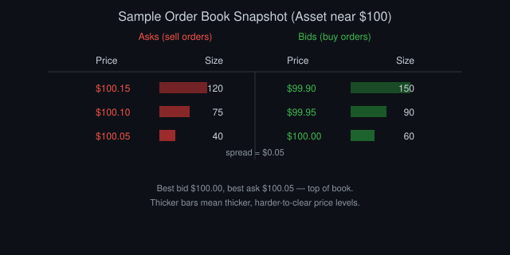
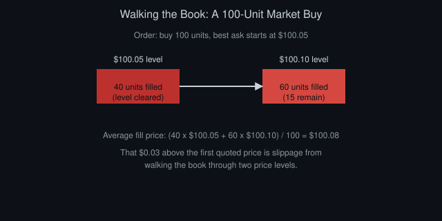
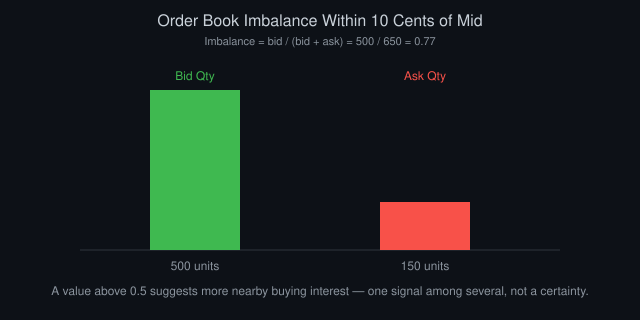

# Reading the Order Book: A Beginner's Guide

*By Vizanix — Beginner Level*

> This book teaches you to read a live order book like a trader does, turning a wall of numbers into a picture of who wants to trade and how badly.

## Table of Contents

1. What an Order Book Actually Is
2. Anatomy of a Book: Levels, Sizes, and Sides
3. Depth: Reading Beyond the Top of the Book
4. How the Book Updates in Real Time
5. Reading Imbalance and Pressure
6. Spoofing, Iceberg Orders, and Other Wrinkles
7. Order Books Across Different Markets
8. Practicing Book-Reading on Your Own

## 1. What an Order Book Actually Is

The order book is the exchange's live list of every outstanding limit order for an instrument, organized by price. Think of it as a ledger of intentions, everyone who has said "I'll buy at this price" or "I'll sell at this price" and is currently waiting for someone to take them up on it.

The book has two sides. The bid side lists buy orders, sorted from the highest price (closest to trading) down to lower prices. The ask side lists sell orders, sorted from the lowest price (closest to trading) up to higher prices. The highest bid and lowest ask sit at the "top of the book," and the gap between them is the spread you learned about in the previous book.

A simple price chart shows you only what has already happened. The order book shows you what might happen next, the standing intentions of market participants before any of them turns into an actual trade. That makes it one of the richest sources of information available to a trader. It's also one of the trickiest to interpret correctly, since intentions can be canceled at any moment.

You'll typically view an order book through a trading platform or by pulling raw data from an exchange's API, the programmatic interface a later book in this library covers. Whatever the source, the underlying structure is the same: a sorted list of price levels, each with a total quantity waiting there.

## 2. Anatomy of a Book: Levels, Sizes, and Sides

Picture a simplified order book for a hypothetical asset trading around $100:

Asks (sell orders): $100.05 for 40 units, $100.10 for 75 units, $100.15 for 120 units.
Bids (buy orders): $100.00 for 60 units, $99.95 for 90 units, $99.90 for 150 units.

Each row is called a price level, and the size at each level tells you how much quantity is waiting to trade at that exact price. The best bid here is $100.00, the best ask is $100.05, so the spread is five cents.

*Figure 1: Bar length shows size at each price level; thicker levels act like walls that are harder to clear.*

If you send a market order to buy 100 units, the exchange fills 40 units at $100.05, clearing that whole level, then fills the remaining 60 units at $100.10, since the first level didn't have enough quantity. Your average fill price ends up above $100.05. That's the slippage effect the previous book introduced, now visible directly in the book's structure.

*Figure 2: Walking the book across two price levels produces an average fill price of $100.08, worse than the first quote.*

Reading a single snapshot like this tells you the immediate supply and demand picture. A thick level, one with a large size, acts like a wall: it takes a lot of buying or selling pressure to clear it entirely. A thin level offers little resistance and can disappear in a single trade.

Beginners often stare only at the best bid and ask. The levels behind them tell you how sturdy the current price is likely to be if pressure builds in one direction.

## 3. Depth: Reading Beyond the Top of the Book

Depth refers to how much total quantity sits within some distance of the current price, across multiple levels rather than just the top one. A market with deep order books can absorb large orders without the price moving much. A market with shallow depth reacts sharply to relatively small orders.

A useful habit is summing the quantity available within, say, ten cents of the best price on each side. If the bid side within that range totals 500 units and the ask side totals only 150 units, that asymmetry suggests more buying interest is queued up nearby than selling interest, at least for now. It doesn't guarantee the price rises, since any of those orders can be canceled instantly, but it's a real signal worth incorporating alongside others.

Depth also matters directly for sizing your own orders. If you plan to trade a quantity larger than what typically sits within a reasonable price range, expect to move the market yourself, and account for that in your strategy's cost assumptions rather than assuming you'll always get today's displayed price.

Visualizing depth as a chart, cumulative quantity on the vertical axis against price on the horizontal axis, produces the classic "depth chart" shape: two curves stepping away from the current price, one for bids and one for asks, illustrated in the diagram above. The steeper a curve rises near the current price, the more resistance a large order meets immediately. The flatter it stays, the thinner that side of the market is.

## 4. How the Book Updates in Real Time

An order book isn't a static picture. It changes constantly as participants add, cancel, and fill orders. Exchanges typically communicate these changes through a data feed as discrete update messages: a new order added at a certain price and size, an existing order's size reduced or removed, or a trade occurring that consumes resting quantity.

Two common ways to receive this are a full snapshot, where the exchange sends you the entire book state at once, and an incremental feed, where the exchange sends only the changes since the last message, which you apply to a book you maintain yourself in memory. Incremental feeds are far more efficient for high-frequency use but require careful, correct code, since a single dropped message can leave your local copy of the book permanently out of sync with reality.

Watching the rate and pattern of updates itself carries information. A period of rapid order placement and cancellation on one side of the book, without many trades occurring, can indicate participants are repositioning ahead of an anticipated move. Sometimes it just means a market maker is actively adjusting quotes as conditions shift.

For a beginner, the practical lesson is this: the order book you see rendered on a screen or returned by an API call is already slightly stale by the time you look at it. Professional systems account for this latency deliberately. You should at least be aware it exists.

## 5. Reading Imbalance and Pressure

Order book imbalance compares the quantity on the bid side to the quantity on the ask side, usually within some depth range near the current price. A simple imbalance measure divides bid quantity by the sum of bid and ask quantity. A value above 0.5 suggests more buying interest nearby; below 0.5 suggests more selling interest.

Traders use imbalance as one input among several, since heavy skew toward one side sometimes precedes short-term price movement in that direction, as the imbalance gets worked through by upcoming trades. But imbalance is noisy and can flip quickly, especially in liquid markets where large participants adjust orders continuously.

A related concept is "pressure": the pace at which one side of the book is being consumed by trades relative to how quickly it's being replenished by new orders. If asks are getting eaten by market buy orders faster than new sell orders arrive to replace them, the ask side is thinning, and the price may need to step up to the next level to find enough supply. This pattern is sometimes visible just before a short, sharp price move.

Treat these signals as pieces of evidence rather than certainties. A beginner strategy built entirely around order book imbalance, without other confirmation, tends to generate a lot of false signals in practice, since imbalance can be driven by orders that vanish before ever leading to a trade.

*Figure 3: A bid/ask imbalance of 0.77 suggests more nearby buying interest, though it is only one noisy signal among several.*

## 6. Spoofing, Iceberg Orders, and Other Wrinkles

Not every visible order represents a genuine, stable intention to trade. Spoofing describes placing a large order with no intention of letting it fill, purely to create a false impression of demand or supply and influence other participants' behavior, before canceling it. This practice is illegal in regulated markets, though detecting it in real time is genuinely hard. It's worth knowing about so you don't over-trust a single large order you spot in the book.

Iceberg orders work differently. A trader wants to buy or sell a large quantity but only displays a small visible portion at a time, with the rest hidden and automatically refreshed as the visible part fills. This lets large participants trade sizable quantities without immediately revealing their full intent to the rest of the market, since a giant visible order tends to move the price against the person placing it.

Because of these wrinkles, an order book snapshot always represents a mix of fully genuine resting interest and orders shaped by strategic considerations. Experienced order book readers develop intuition for spotting patterns, like a level that keeps refilling to the same size after being partially filled repeatedly, which often signals an iceberg order rather than many independent small orders coincidentally arriving at the same price.

## 7. Order Books Across Different Markets

Order book structure is broadly similar across asset classes, but details vary. Stock exchanges typically enforce strict price-time priority and heavy regulation around order types and disclosure. Futures markets often show deep, active books during specific trading hours and thinner books overnight. Cryptocurrency exchanges frequently offer very granular, freely accessible order book data through public APIs, making them a popular, low-barrier place for beginners to practice reading books and building tools, though liquidity and depth vary enormously between larger and smaller crypto exchanges.

Some markets, particularly certain bond and foreign exchange markets, don't use a fully open, centralized order book at all. They rely instead on dealers who quote prices directly to clients on request. If you move into those markets later, you'll need to adapt the intuition from this book to a different structure, but the underlying ideas about supply, demand, and depth still apply conceptually.

## 8. Practicing Book-Reading on Your Own

The fastest way to build real intuition is to watch a live order book for a liquid, actively traded instrument, ideally one with a public data feed you can access for free, like many cryptocurrency exchanges offer. Watch how the top few levels shift as trades occur, and try predicting, just for your own practice, which direction the next few trades will push the price based on the depth and imbalance you observe.

Keep a simple log: note the imbalance, note what happened over the following minute, and review your predictions afterward. This turns book-reading from an abstract skill into a data-driven exercise, and it will make the material in the market data and backtesting books that follow feel far more concrete.

## Summary

- The order book lists every outstanding limit order, sorted by price, on both the bid and ask sides.
- Depth beyond the top of the book tells you how much quantity is available and how far a large order might move the price.
- Order books update continuously through snapshot or incremental feeds, and what you see is always slightly stale.
- Imbalance and pressure offer useful but noisy signals about near-term price direction.
- Not every visible order is genuine; spoofing and iceberg orders both distort a naive reading of the book.

---

*This book is part of the Vizanix Quant Engineering Library. Licensed under CC BY 4.0 — free to read, share, and adapt with attribution to Vizanix.*
