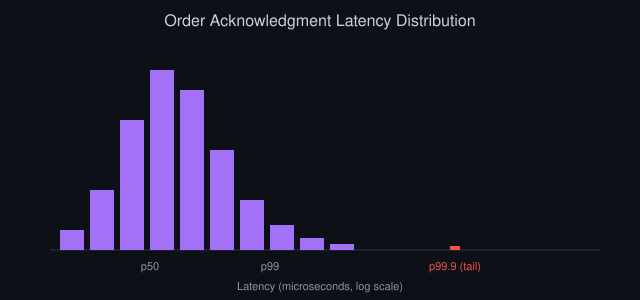

# Statistics for Trading: What You Actually Need to Know

*By Vizanix — Beginner Level*

> This book covers the core statistical ideas that actually matter for evaluating a trading strategy, skipping theory you won't use and focusing on what changes real decisions.

## Table of Contents

1. Why Statistics Matters More Than Intuition Here
2. Returns, Not Prices
3. Mean and Volatility: The Two Numbers That Anchor Everything
4. Distributions and Why Extreme Moves Happen More Than You'd Guess
5. Correlation, Revisited With Numbers
6. Sample Size and Why Ten Good Trades Prove Nothing
7. Risk-Adjusted Return: Comparing Strategies Fairly
8. Statistical Traps Specific to Trading

## 1. Why Statistics Matters More Than Intuition Here

Human intuition evolved to spot patterns in a physical, everyday world, and it's often actively misleading when applied to financial markets, which are full of randomness that looks deceptively like pattern. You can stare at a price chart and convincingly see a trend, a cycle, or a signal that a rigorous statistical test would reveal as indistinguishable from pure noise.

This isn't a reason to distrust your own judgment entirely, but it is a strong reason to back that judgment with numbers before risking capital on it. Statistics, in the trading context, isn't about complex mathematical theory for its own sake; it's a practical toolkit for answering concrete questions: is this pattern likely real or likely coincidence, how much should I trust this backtest result, and how do I fairly compare two strategies that made different amounts of money in different ways.

This book covers exactly the subset of statistics that answers those questions, building directly on the market data and backtesting books earlier in this library, without wandering into material you won't actually use as a trading practitioner.

## 2. Returns, Not Prices

The first statistical habit to build is working with returns rather than raw prices. A return is the percentage change from one period's price to the next: if a price moves from $100 to $102, that's a two percent return for the period. Returns matter more than raw price changes because a two percent move means something very different for an asset trading at $10 versus one trading at $10,000, while the return figure captures that relative significance directly and consistently across any price level.

Returns also have a statistical property raw prices lack: they're much closer to what statisticians call stationary, meaning their statistical properties, like their average and their typical spread, stay reasonably stable over time, whereas a raw price series can drift arbitrarily far from its starting point over a long history, making direct statistical comparisons across different time periods far less meaningful.

Compute returns over whatever period matches your strategy's holding horizon, established in the first book of this library: daily returns for a strategy holding positions for days, hourly returns for a strategy holding for hours. Nearly every statistical technique in the rest of this book operates on a series of returns, not on the raw price series itself.

## 3. Mean and Volatility: The Two Numbers That Anchor Everything

The mean of a series of returns is simply its average: add them up and divide by how many there are. It tells you the typical return per period, which you can scale up to estimate an expected return over a longer horizon, though scaling carries its own subtleties beyond this book's scope.

Volatility measures how much returns typically vary around that mean, most commonly calculated as the standard deviation, a number that captures the typical size of deviation from the average, in the same units as the returns themselves. Two assets with an identical average return can have wildly different volatility: one might move a steady, small amount most periods, while the other swings wildly, occasionally producing large gains and large losses that happen to average out to the same mean over time.

Volatility matters enormously in practice because it's directly connected to risk, as covered in the dedicated risk management book of this library. A high-volatility instrument requires wider stop losses, smaller position sizes for the same dollar risk, and a trader psychologically prepared for larger swings along the way, even if its average return over the long run looks identical to a calmer instrument's.

Calculate both numbers for any instrument or strategy before trading it, and get comfortable thinking about return and volatility as a pair, never one without the other, since a return figure quoted alone tells you almost nothing about whether that return came with a bumpy or a smooth ride.

## 4. Distributions and Why Extreme Moves Happen More Than You'd Guess

A distribution describes how often different outcomes occur across a full range of possibilities, and plotting a histogram of returns, as introduced in the Python book of this library, gives you a direct, visual look at your specific instrument's distribution rather than relying on a generic textbook assumption.

Many introductory statistical methods assume returns follow a bell-shaped normal distribution, where extreme outcomes become rapidly and predictably rarer the further they sit from the average. Real financial returns very often disagree with this assumption, producing what statisticians call fat tails: extreme moves, both up and down, that occur meaningfully more often than a normal distribution would predict. A day when a price moves further than any of your typical calculations anticipated happens more frequently in real markets than a naive normal-distribution assumption suggests.

This matters directly for risk management, since a strategy or a stop loss calibrated only against typical, everyday volatility can be badly unprepared for the more frequent extreme moves that fat tails imply. A practical response is to look directly at your own instrument's actual historical distribution, including its most extreme observed moves, rather than relying purely on an average and a standard deviation computed under an assumption of normality that the real data doesn't fully satisfy.

## 5. Correlation, Revisited With Numbers

The risk management book of this library introduced correlation conceptually: the tendency of two things to move together. Statistically, correlation is a single number between negative one and positive one that summarizes this tendency across a historical period. A value near positive one means the two series moved together closely; a value near negative one means they moved in opposite directions closely; a value near zero means little consistent relationship existed between them over that period.

Calculating correlation directly, rather than eyeballing two charts side by side, gives you a concrete, comparable number, and it's straightforward to compute using the data manipulation tools from the Python book of this library. But remember the important caveat already raised earlier in this library: correlation calculated over one historical period can shift meaningfully during a different period, particularly during broad market stress, so treat a calculated correlation value as a useful, current estimate rather than an immutable fact about the relationship between two instruments.

When building a portfolio of multiple strategies or instruments, calculating pairwise correlations directly, rather than assuming diversification purely because the instruments have different names, turns the risk management book's conceptual warning into an actual, checkable number you can monitor over time.

## 6. Sample Size and Why Ten Good Trades Prove Nothing

Sample size refers to how many independent observations, in trading terms usually how many separate trades, back up a given conclusion. A strategy that produced ten winning trades in a row looks impressive, but ten data points is far too few to distinguish a genuinely skillful strategy from one that simply got lucky, in the same way flipping a coin ten times and getting eight heads doesn't prove the coin is unfair, even though it looks suggestive.

The core intuition is that random noise has more room to produce a misleadingly good or bad-looking result when you have fewer observations, and that room shrinks, though it never disappears entirely, as your sample size grows. A strategy tested across five hundred independent trades spanning multiple different market conditions gives you meaningfully more confidence than the same apparent performance achieved over just fifteen trades concentrated in a single calm month.

This directly connects back to the backtesting book's warning about overfitting: with a small number of trades, it's especially easy to tune a strategy's parameters until it happens to look good on that specific limited sample, without that apparent edge reflecting anything real or repeatable. As a practical habit, always report and consider how many independent trades sit behind any performance number you're evaluating, your own or someone else's, before assigning it real weight.

## 7. Risk-Adjusted Return: Comparing Strategies Fairly

Comparing two strategies purely by their total return can be deeply misleading, since one might have achieved a higher return by taking on dramatically more risk and volatility along the way. Risk-adjusted return metrics attempt to level this comparison by weighing return against the volatility or drawdown that produced it.

A widely used approach divides a strategy's average return by its volatility, producing a single number that answers, roughly, "how much return did this strategy generate per unit of bumpiness endured to get there." A strategy earning a modest but very steady return can score better on this measure than a strategy earning a higher but wildly erratic return, and for most traders, especially beginners still building both capital and confidence, the steadier strategy is genuinely the more attractive one to run, despite its lower headline return.

Other risk-adjusted measures weigh return specifically against maximum drawdown, the worst peak-to-trough decline covered in the backtesting and risk management books, rather than against overall volatility, which can be more relevant if drawdown, and the psychological and practical strain of living through it, is your primary concern. Whichever specific measure you choose, the underlying discipline matters most: never compare two strategies on return alone without also weighing the risk each one took to produce it.

## 8. Statistical Traps Specific to Trading

Beyond the general statistical concepts above, a few traps show up specifically and repeatedly in trading contexts. Data snooping, closely related to the overfitting covered in the backtesting book, happens when you test many different strategy variations against the same historical data and report only the best-performing one, without acknowledging or correcting for how many variations you tried. The more variations you test, the more likely one of them looks good purely by chance, and reporting it without that context substantially overstates its real, expected future performance.

Regime dependence describes the reality that a statistical relationship, like a correlation or a typical volatility level, calculated over one period of market conditions can behave quite differently once conditions genuinely change, for reasons like shifting participant behavior or changing macroeconomic conditions. Treat any statistic you calculate as describing the specific historical period you calculated it over, not as an eternal law of that instrument's behavior.

Finally, beware of survivorship bias, introduced in the backtesting book: any dataset covering only currently existing instruments has quietly excluded everything that failed or disappeared, which biases whatever statistics you calculate from it toward looking more favorable than the true, complete historical picture would show. Building the habit of asking "what's missing from this dataset, and would including it change my conclusion" is a genuinely valuable statistical instinct worth carrying into every piece of analysis you do from here forward.

## Summary

- Work with returns, not raw prices, since returns are more comparable across instruments and more statistically stable over time.
- Always report and think about return and volatility together; a return figure alone hides the risk taken to earn it.
- Real return distributions have fatter tails than a naive normal assumption predicts; extreme moves happen more often than intuition suggests.
- Correlation is measurable and useful but can shift meaningfully during market stress, exactly when diversification matters most.
- Small sample sizes and data snooping routinely make a lucky, coincidental result look like genuine, repeatable skill.

---

*This book is part of the Vizanix Quant Engineering Library. Licensed under CC BY 4.0 — free to read, share, and adapt with attribution to Vizanix.*
