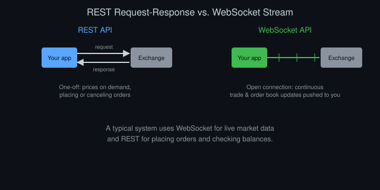
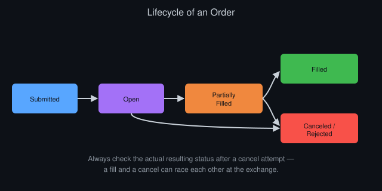

# Understanding Exchange APIs: Connecting to Live Markets

*By Vizanix — Beginner Level*

> This book demystifies exchange APIs, the interfaces your code uses to fetch market data and place real orders, and shows you how to work with them safely.

## Table of Contents

1. What an API Is, Concretely
2. REST APIs: Asking and Getting an Answer
3. WebSocket APIs: A Continuous Stream
4. Authentication and Keeping Your Keys Safe
5. Rate Limits and Why They Exist
6. Placing, Checking, and Canceling Orders
7. Handling Errors and Disconnections
8. Building a Thin Wrapper Around an Exchange

## 1. What an API Is, Concretely

An API, application programming interface, is simply a defined way for one piece of software to ask another piece of software to do something or hand over some information. An exchange's API is how your trading program talks to the exchange's systems: fetching prices, checking your account balance, and sending orders, all without a human clicking anything on a website.

Think of it like ordering food through a structured menu instead of a free-form conversation with a chef. The exchange defines a specific, limited set of requests you're allowed to make: "give me the current price of this instrument," "place a buy order for this quantity at this price," "cancel this order." Each has a precise, documented format for what you send and what you get back. Follow that format exactly and the exchange's system understands and responds; deviate from it and you'll get an error rather than a guess at what you meant.

Every exchange publishes documentation describing its specific API, and no two exchanges are identical in their exact details. Nearly all of them build on the same two underlying communication patterns covered in the next two sections: request-response style calls and continuous data streams.

## 2. REST APIs: Asking and Getting an Answer

A REST API works like sending a letter and waiting for a reply. Your program sends a request to a specific address, called an endpoint, asking for something specific, like the current order book for an instrument, and the exchange sends back a response containing that information. Then the conversation for that particular request ends.

Each request typically specifies a method describing the type of action, commonly "GET" for retrieving information without changing anything, and "POST" for submitting something, like a new order. The exchange responds with a status code, a short number indicating success or the type of failure, along with the actual data, usually formatted as JSON, the structured text format introduced in the Python book of this library.

REST APIs suit situations where you need a specific piece of information at a specific moment, or need to submit an action, like placing or canceling an order. They're straightforward to work with and to debug, since each request and response is a self-contained, isolated exchange.

Their limitation is that they don't naturally suit constantly changing data. If you want up-to-the-moment prices, repeatedly sending requests asking "has anything changed yet?" wastes bandwidth and still leaves gaps between checks. That's exactly the problem the next kind of connection solves.

## 3. WebSocket APIs: A Continuous Stream

A WebSocket connection works like an open phone line rather than a series of separate letters. Your program opens the connection once, tells the exchange what it wants to hear about, subscribing to updates for a particular instrument's trades or order book, for instance, and then the exchange pushes new messages to your program continuously as events happen, without you having to ask again each time.

This matches the nature of live market data far better than repeated REST requests. New trades and order book changes arrive as they happen, often within milliseconds, letting your program react to a genuinely current picture of the market rather than a snapshot that's already somewhat stale by the time a REST request returns it.

Working with a WebSocket connection requires slightly different code discipline than REST. Your program needs to stay running and actively listening for incoming messages, rather than making a request and moving on, and it needs a plan for what happens if the connection drops unexpectedly, covered later in this book. Most exchanges also expect you to periodically send a small "still here" message, called a heartbeat, to keep the connection alive and let the exchange know your program hasn't silently disappeared.

A typical trading system uses both: a WebSocket connection for the continuous flow of market data, and REST calls for placing orders, checking account balances, and other actions that naturally happen as discrete, one-off requests rather than a continuous stream.

*Figure 1: REST suits one-off requests and actions, while WebSocket suits continuous, live market data.*

## 4. Authentication and Keeping Your Keys Safe

Fetching public market data, like general price information, usually requires no special permission. But placing orders or viewing your own account details requires the exchange to know who you are and to trust that the request genuinely comes from you.

Most exchanges handle this through an API key, a unique identifier tied to your account, paired with a secret, a private string used to cryptographically sign your requests, proving they actually came from someone holding that secret without transmitting the secret itself in plain form each time. Treat your API secret exactly like a password. Never paste it directly into code you might share or commit to a public code repository, and never post it anywhere, even accidentally, in a screenshot or a support forum message.

Most exchanges let you configure permissions per API key: some keys can only read data, others can also place orders, and a smaller set can additionally withdraw funds. As a strong default habit, create keys with the minimum permission your task actually needs, and never grant withdrawal permission to a key used by an automated trading script. A leaked key with withdrawal rights represents a direct path to losing funds, while a leaked read-only key represents essentially no financial risk at all.

Store secrets in environment variables or a dedicated secrets manager rather than hardcoded in your source files, and add any file containing real secrets to your version control system's ignore list immediately, before you ever commit it.

## 5. Rate Limits and Why They Exist

Exchanges limit how many requests you can send within a given time window, called a rate limit, to keep their systems stable and fair across all the participants sharing them. Exceed the limit and the exchange typically responds with an error rather than processing your request, and repeated violations can sometimes lead to a temporary or permanent block on your account's access.

Rate limits are usually expressed as a maximum number of requests per second, minute, or other time window, sometimes with different limits for different types of requests. Placing an order often costs more of your limit "budget" than simply checking a price. Read the specific exchange's documentation carefully here, since assumptions from one exchange rarely transfer exactly to another.

Design your code to respect rate limits proactively rather than reactively. A simple approach tracks how many requests you've sent recently and deliberately pauses before sending more once you approach the limit, rather than firing requests as fast as possible and only handling the resulting errors after they occur. Relying on WebSocket streams for continuously changing data, rather than polling with repeated REST requests, also naturally reduces how much of your rate limit budget you consume for the same information.

## 6. Placing, Checking, and Canceling Orders

Placing an order through an API typically means sending a POST request specifying the instrument, side (buy or sell), quantity, order type (market, limit, or others covered in the second book of this library), and price if applicable. The exchange responds with an order identifier, a unique reference you use for all future questions about that specific order.

Checking an order's status means sending a request with that identifier and receiving back its current state: still open and waiting, partially filled, completely filled, or canceled. Many exchanges also push order status updates directly through your WebSocket connection as they happen, which is generally faster and more efficient than repeatedly polling with REST requests to ask "has this filled yet?"

Canceling an order means sending a request referencing that same identifier and asking the exchange to remove it from the book if it hasn't already filled. Be aware of a subtle race condition here: your cancel request and a matching trade might arrive at the exchange at nearly the same moment, so always check the actual resulting order status after a cancel attempt rather than assuming it succeeded just because you sent the request.

*Figure 2: An order moves through a small set of states, and a cancel attempt can race against a fill.*

Test every one of these operations extensively on an exchange's testnet, a separate practice environment many exchanges provide that behaves like the real thing but uses fake funds, before ever sending real orders backed by real money.

## 7. Handling Errors and Disconnections

Networks fail, exchanges have brief outages, and WebSocket connections drop unexpectedly even when nothing is wrong on your end. A production-quality trading system assumes these failures will happen regularly and handles them deliberately, rather than treating them as rare exceptions to worry about later.

For REST requests, this means checking the response status explicitly rather than assuming success, and having a clear, deliberate plan for retries. Some errors are worth retrying after a short pause, like a temporary server overload, while others, like an invalid order parameter, will fail identically every time you retry and need a code fix instead.

For WebSocket connections, this means detecting a dropped connection promptly, reconnecting automatically, and re-subscribing to whatever data streams you need. Critically, it also means reconciling your program's internal understanding of the world, like which orders you believe are currently open, against the exchange's actual current state immediately after reconnecting, since messages sent during the disconnection gap were missed entirely and your local picture may now be stale or wrong.

Log every error and every reconnection event with enough detail to diagnose what happened later. A system that silently swallows errors and keeps running looks reassuring in the moment but can hide a genuinely serious problem, like a strategy that's been unable to place any orders for the last hour without anyone noticing.

## 8. Building a Thin Wrapper Around an Exchange

As a practical habit, write your own thin layer of code between your trading logic and the exchange's specific API, rather than calling the exchange's raw functions directly from your strategy code. This wrapper handles authentication, rate limiting, retries, and translates the exchange's specific message formats into a simpler, consistent shape your own strategy code uses internally.

This extra layer pays off the moment you want to test against a second exchange, or switch from a testnet to production, since only the wrapper needs to change. Your strategy logic, which shouldn't care about the specific details of any one exchange's API, stays untouched. It also gives you one clear, central place to add logging, error handling, and safety checks consistently across every part of your system that talks to the outside world.

Keep this wrapper's surface area intentionally small at first. Functions for getting the current price, placing an order, checking an order's status, and canceling an order cover most of what a beginner strategy actually needs, and you can extend it deliberately as real requirements arise, rather than trying to anticipate and build everything an exchange's full API offers before you've even tested your first idea.

## Summary

- An API defines a specific, documented set of requests your code can make to an exchange's systems.
- REST APIs suit one-off requests and actions; WebSocket connections suit continuous, live market data.
- Guard API keys like passwords, and grant the minimum permission level a given key actually needs.
- Respect rate limits proactively, and prefer streaming data over repeated polling wherever possible.
- Assume disconnections and errors will happen regularly, and reconcile your local state against the exchange after any reconnection.

---

*This book is part of the Vizanix Quant Engineering Library. Licensed under CC BY 4.0 — free to read, share, and adapt with attribution to Vizanix.*
