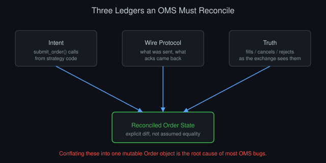
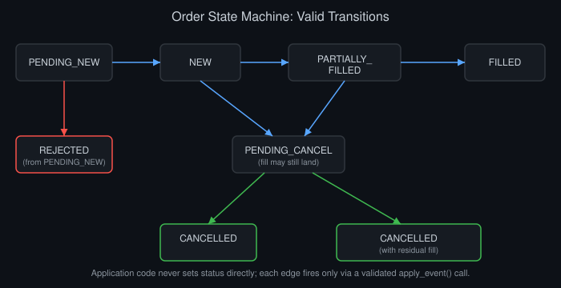
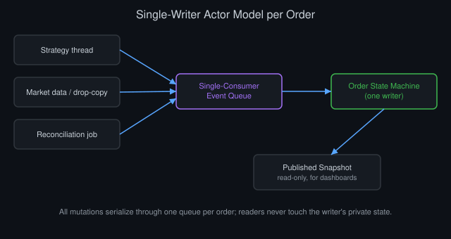

# Designing an Order Management System from Scratch

*By Vizanix — Intermediate Level*

> Learn how to architect an order management system that stays correct under concurrency, network failure, and exchange weirdness, not just under a demo.


## Table of Contents

1. What an OMS Actually Owns
2. The Order State Machine
3. Modeling Orders, Fills, and Amendments
4. Concurrency: One Order, Many Writers
5. Talking to Exchanges Without Lying to Yourself
6. Persistence and Crash Recovery
7. Position and P&L Bookkeeping
8. Testing an OMS Like You Mean It

## 1. What an OMS Actually Owns

An order management system is not a REST wrapper around an exchange API. It is the single source of truth for what you intended to do, what you asked the market to do, and what actually happened. Those three things drift apart constantly. Your OMS's entire job is to keep them reconciled.

Think of your OMS as owning three ledgers at once. The first is intent: a strategy calls `submit_order()` and expects that call to mean something durable, even if the process crashes a millisecond later. The second is the wire protocol, what you sent to the exchange, what acknowledgments came back, and in what order. The third is truth: fills, cancels, and rejects as the exchange sees them, which you only learn about asynchronously.

A common design mistake is conflating these three. Teams build a single `Order` object, mutate it in place from multiple threads, and call it done. That works until a cancel request races an unsolicited fill, and now your object holds status `CANCELLED` while a fill sits unaccounted for in a log file somewhere. If you take one lesson from this chapter, take this: separate the record of what you tried from the record of what happened, and reconcile them explicitly rather than assuming they match.



*Figure 1: An OMS keeps intent, wire-protocol state, and confirmed exchange truth as distinct ledgers and reconciles them explicitly rather than assuming they match.*

Your OMS also owns idempotency. Every order you send to an exchange needs a client-generated identifier that survives retries. If your network call times out, you have no way of knowing whether the exchange received it. Resending with the same client order ID and checking the exchange's response for "already exists" is the only sane way to avoid duplicate orders. Skip this step and you will eventually double an order size during a network blip, usually on the worst possible day for it.

You will also need to decide, deliberately, what "ownership" means across multiple deployment instances of your own system. Run redundant OMS processes for failover, and only one of them can be actively sending orders for a given account at any moment. Otherwise you risk two processes independently retrying the same logical order and producing two live orders instead of one. A leader-election mechanism, backed by a distributed lock or a consensus store, needs to gate who is allowed to submit new orders at any given time. The standby instance needs to be genuinely passive, not just idle: it shouldn't even attempt to reconnect to the exchange with trading permissions until it has confirmed it holds the lock. Get this wrong and your redundancy design, meant to increase reliability, becomes the source of a duplicate-order incident instead.

## 2. The Order State Machine

Model every order as a finite state machine, not a bag of booleans. A minimal but honest state set looks like this:

```
PENDING_NEW -> NEW -> PARTIALLY_FILLED -> FILLED
                 |            |
                 v            v
           PENDING_CANCEL  PENDING_CANCEL
                 |            |
                 v            v
             CANCELLED    CANCELLED (with residual fill)
                 |
                 v
              REJECTED (from PENDING_NEW only)
```



*Figure 2: The order lifecycle as a finite state machine; every edge fires only through a validated `apply_event()` call, never a direct field write.*

The key discipline is that transitions are one-directional and explicit. You never let application code just set `order.status = "CANCELLED"`. Instead you call `order.apply_event(CancelAckEvent(...))` and let the state machine validate whether that transition is legal from the current state. If it is not, say a cancel ack arrives for an order already in `FILLED`, you log it as an anomaly rather than silently overwriting state. This single guardrail catches an enormous fraction of the bugs that would otherwise surface as "why does our position not match the exchange."

Pending states deserve special attention. `PENDING_NEW` means you sent the order but have not received acknowledgment. `PENDING_CANCEL` means you sent a cancel, but the order could still fill before the cancel lands. That's a genuine race, and it exists on every exchange with any queuing delay. Your state machine must allow a fill event to arrive while in `PENDING_CANCEL` and handle it correctly, updating filled quantity before finalizing the cancel.

Timeouts on pending states need their own explicit policy rather than an indefinite wait. If an order sits in `PENDING_NEW` for longer than your exchange's typical acknowledgment latency by some meaningful multiple, you have a genuine ambiguity. Did the message get lost? Is the exchange slow today? Or is your own network connection degraded without having dropped outright? Treat this as an operational alert rather than a silent retry loop. Retrying blindly on top of an unacknowledged order risks creating exactly the duplicate-order problem idempotent client IDs are meant to prevent, so the safer default is to query order status explicitly rather than resend and hope the exchange's deduplication logic saves you.

## 3. Modeling Orders, Fills, and Amendments

Keep the order and its fills as separate entities linked by identifier. Never flatten a fill into a single mutable "filled quantity" field with no history. You want an append-only fill log:

```
Fill {
  order_id, exec_id, price, quantity,
  side, timestamp_exchange, timestamp_received,
  liquidity_flag  // maker/taker
}
```

`exec_id` is your deduplication key. Exchanges resend fill notifications after reconnects, and if you sum quantities blindly, you will double-count. Always check `exec_id` against what you have already applied before incrementing filled quantity.

Amendments, quantity or price changes on a live order, are trickier than most engineers expect, because different exchanges implement them differently. Some treat an amend as cancel-then-replace with a new order ID; others mutate the existing order in place and may or may not reset queue priority. Your OMS needs an exchange-specific adapter layer that normalizes these into a common internal event, rather than leaking exchange quirks into your core state machine.

Store the full lifecycle of an order as a chain of linked identifiers when amendments create new order IDs. A strategy that submitted an order, amended it twice, and finally saw it fill should be able to query one logical history and see the whole story. Not three disconnected order records that happen to share no obvious link except a timestamp that's close together. This becomes especially important during post-trade analysis and client reporting, where "what happened to the order I placed" needs to be answerable without an engineer manually reconstructing the amendment chain from raw logs.

## 4. Concurrency: One Order, Many Writers

In production, an order's state can be touched by at least three independent actors: the strategy thread requesting a cancel, the market data or drop-copy thread applying a fill, and a reconciliation job comparing against an exchange position snapshot. If these three write to the same in-memory object without discipline, you get torn reads and lost updates.

The cleanest pattern is a single-writer actor model per order (or per order-book-of-orders keyed by instrument), where all mutations go through one serialized event queue. Every event, submit, cancel request, fill, reject, amend ack, gets pushed onto that queue and applied sequentially by one thread that owns the order's memory. Readers get a consistent snapshot; writers never race.

```
class OrderActor:
    def __init__(self, order_id):
        self.state = OrderStateMachine()
        self.queue = SingleConsumerQueue()

    def enqueue(self, event):
        self.queue.push(event)   # thread-safe push

    def run(self):
        while True:
            event = self.queue.pop()   # single consumer
            self.state.apply(event)
            self.publish_state_change()
```



*Figure 3: A single-writer actor per order serializes all writers (strategy, market data, reconciliation) through one queue, eliminating torn reads.*

This costs some throughput compared to a naive shared-memory approach. It buys correctness you cannot get any other way without extremely careful lock design, and lock-based order state machines are notoriously easy to get subtly wrong.

Scaling this pattern across thousands of concurrently live orders means running many actors in parallel, not one giant serialized queue for your entire order book. Shard actors by instrument, or by account, depending on which dimension your workload concentrates contention around, and keep the sharding key stable so a given order's events always route to the same actor for its entire lifetime. Resist the temptation to share any mutable state across actor boundaries even for read-only convenience. A snapshot published periodically by each actor to a read-only aggregation layer serves dashboards and monitoring far more safely than letting external code reach directly into an actor's private state.

## 5. Talking to Exchanges Without Lying to Yourself

Your OMS should never trust its own optimistic state as ground truth for risk decisions. Build an explicit "confirmed vs assumed" distinction. When you send a new order, you can optimistically decrement available buying power immediately, so a fast strategy loop does not overspend before the ack arrives, but you must track that decrement as provisional and reverse it cleanly if the order is rejected.

Sequence numbers matter more than most people assume before their first outage. If an exchange feed sends events with a monotonic sequence number, track the last sequence you processed and detect gaps immediately. A gap means you missed a fill or a cancel ack, and continuing to trade on stale state is how positions silently diverge from reality over a trading day. Better to pause new order flow on that instrument and force a snapshot resync than to keep trading blind.

Different exchanges also disagree on what "confirmed" even means at the protocol level. Some acknowledge receipt of your order before the matching engine has actually processed it, meaning an ack only tells you the message arrived, not that it was accepted or rejected. Others combine receipt and acceptance into a single acknowledgment. Your adapter layer needs to normalize these differences explicitly into a small, well-defined set of internal semantics, received, accepted, rejected, rather than assuming every exchange's "ack" message means the same thing. Building downstream logic on a false assumption here produces bugs that only surface on the specific exchange whose semantics differ from the one you originally tested against.

## 6. Persistence and Crash Recovery

Every state transition needs to hit durable storage before you consider it "applied," or you will lose orders on crash. Write-ahead logging is the right mental model: append the event to a durable log first, then update in-memory state, then acknowledge upstream. On restart, replay the log to rebuild state before accepting any new orders.

Recovery also means reconnecting to exchanges and reconciling. On startup, request current open orders and positions from every connected exchange and diff them against your recovered local state. Any mismatch, an order you think is live that the exchange says is filled, or vice versa, goes into a manual review queue rather than being silently auto-corrected, at least until your reconciliation logic has proven itself over months of production use.

Test crash recovery deliberately, not just correctness under normal operation. Kill the OMS process mid-order-lifecycle in a controlled test environment: after sending an order but before receiving its acknowledgment, after a partial fill but before the corresponding log entry is confirmed durable, during an in-flight cancel request. Verify recovery produces the correct final state every time. These specific interruption points are exactly where naive implementations lose data, because they are the moments where an engineer's mental model of "this happens atomically" quietly breaks down against the reality of a process that can be killed at any single machine instruction.

## 7. Position and P&L Bookkeeping

Positions should be derived, not stored as an independently mutated field. Compute position as a fold over your fill log: sum signed quantity by instrument. This makes your position auditable. You can always answer "why do we think we are long 500 shares" by pointing at the exact fills that produced that number, rather than trusting a counter that might have drifted due to a missed decrement somewhere.

Realized P&L needs a consistent cost-basis method (FIFO is the simplest to reason about and audit) applied uniformly. Unrealized P&L requires a mark price, and you should timestamp which mark you used, because "what was our P&L at 14:32:07" is a question you will eventually need to answer precisely during a dispute or a post-mortem.

Multi-currency books add another layer engineers often underestimate at design time. A position denominated in one currency, marked using an instrument price quoted in that same currency, still needs conversion to your reporting currency for aggregate P&L and risk purposes. That conversion rate itself moves independently of the instrument's price. Keep the underlying position and P&L in their native currency as the authoritative record, and treat the reporting-currency conversion as a derived view computed at read time using a timestamped exchange rate. Converting once at trade time loses the ability to recompute historical reporting-currency P&L under a different rate assumption later, which auditors and finance teams will eventually ask you to do.

## 8. Testing an OMS Like You Mean It

Unit tests on the state machine are necessary but nowhere near sufficient. Build a deterministic exchange simulator that can inject reordered acknowledgments, duplicate fill notifications, dropped connections mid-order, and partial fills followed by late rejects. Replay these scenarios against your real OMS code, not a mock, and assert that final state always matches an independently computed expected state.

Property-based testing pays off here: generate random sequences of valid exchange events (respecting the state machine's legal transitions) and assert invariants hold after every event. Position never goes negative on quantity that was never bought. Filled quantity never exceeds order quantity. No fill is ever double-counted. These invariant checks catch classes of bugs that scenario-specific tests miss entirely.

Chaos-style testing deserves a place in your CI pipeline too, not just your local development loop. Wire your exchange simulator to run automatically against every proposed change to the OMS's core logic, with a fixed but rotating set of random seeds so failures are reproducible. Treat any invariant violation as a build-blocking failure rather than a warning someone can choose to look at later. Teams that skip this step consistently find out about state machine bugs from a live incident instead, at a point where the cost of the bug has already been paid in real capital rather than caught for the price of a slower CI run.

It also pays to test your OMS against exchange behavior your test suite has never seen in production yet but that you know, from reading exchange documentation carefully, is technically possible. A fill notification for a quantity larger than what remained on your order due to a rounding quirk in the exchange's own matching engine. A cancel acknowledgment that arrives after the exchange has already fully filled the order. A reject that cites a reason code your adapter has never mapped before. Building explicit test cases for documented-but-rare exchange behavior, rather than waiting to encounter it live, converts a future production surprise into a solved problem ahead of time.

## Summary

- Separate intent, wire protocol, and confirmed truth into distinct ledgers; never conflate them into one mutable object.
- Model orders as explicit state machines with validated transitions, including pending states for the race between cancel and fill.
- Use `exec_id` deduplication on fills and a single-writer actor model per order to avoid concurrency bugs.
- Treat sequence-number gaps in exchange feeds as a hard stop signal, not something to silently paper over.
- Persist every state transition via write-ahead logging before acknowledging it upstream, and reconcile against exchange state on every restart.
- Derive positions and P&L from an append-only fill log so they stay auditable rather than trusted blindly.

---

*This book is part of the Vizanix Quant Engineering Library. Licensed under CC BY 4.0 — free to read, share, and adapt with attribution to Vizanix.*
