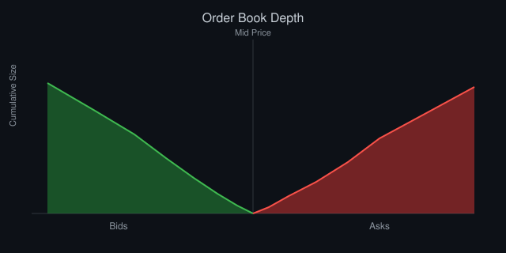

# Market Microstructure for Engineers

*By Vizanix — Intermediate Level*

> Get a working, engineering-grade mental model of how orders actually interact inside an exchange, so your systems stop treating the market as a black box that returns a price.



## Table of Contents

1. The Limit Order Book as a Data Structure
2. Matching Engines and Priority Rules
3. Spread, Depth, and What They Tell You
4. Order Types Beyond Market and Limit
5. Auctions: Open, Close, and Why They're Different
6. Market Makers and the Economics of Providing Liquidity
7. Information Leakage and Why Order Size Matters
8. Building Systems That Respect Microstructure

## 1. The Limit Order Book as a Data Structure

Strip away the finance vocabulary and a limit order book is a pair of sorted data structures: bids sorted descending by price, asks sorted ascending by price, with each price level holding a queue of orders in arrival order. As an engineer, this framing should feel familiar — it is essentially two priority queues with an additional FIFO queue at each price level.

```
BookLevel {
  price: float
  orders: Deque[OrderRef]   // FIFO within the level
  total_quantity: int       // sum of order quantities at this level
}

OrderBook {
  bids: SortedDict[price, BookLevel]  // descending
  asks: SortedDict[price, BookLevel]  // ascending
}
```

The best bid and best ask define the "top of book," and the gap between them is the spread. Everything about how orders execute against this structure follows from two simple properties: price priority (better prices execute first) and, within a price level, time priority (earlier orders execute before later ones at the same price) on most exchanges, though some venues use pro-rata allocation instead, splitting fills proportionally by size at a price level rather than strictly by arrival time.

Understanding this data structure directly, not just abstractly, matters because it explains behavior that otherwise looks mysterious: why a limit order sitting at the best price for a long time without filling might still be "worth" more than it looks (queue position has value), and why canceling and resubmitting an order at the same price resets you to the back of the queue, a cost many new systems accidentally incur by canceling and replacing orders more often than necessary.

Some exchanges support an in-place quantity reduction that preserves your queue position, distinct from a full cancel-replace that does not, and the difference between these two operations is exactly the kind of detail that separates a naive integration from one that respects the underlying mechanics. If your system needs to shrink a resting order's size, using the quantity-reduction operation where available keeps your place in line; using cancel-and-resubmit with a smaller size, even though it achieves the same superficial end state, quietly costs you queue priority and can meaningfully reduce your realized fill rate over many such adjustments across a trading day.

## 2. Matching Engines and Priority Rules

A matching engine's core job, on every incoming order, is deceptively simple to state: check whether the incoming order crosses the opposite side of the book (a buy at or above the best ask, or a sell at or below the best bid), and if so, match it against resting orders following the priority rule, walking through price levels until the incoming order is exhausted or no more crossing prices remain.

```
def match_incoming_buy(book, incoming_qty, limit_price):
    fills = []
    while incoming_qty > 0 and book.asks and book.asks.best_price() <= limit_price:
        level = book.asks.best_level()
        while incoming_qty > 0 and level.orders:
            resting = level.orders[0]
            trade_qty = min(incoming_qty, resting.remaining_qty)
            fills.append((resting, trade_qty, level.price))
            incoming_qty -= trade_qty
            resting.remaining_qty -= trade_qty
            if resting.remaining_qty == 0:
                level.orders.popleft()
        if not level.orders:
            book.asks.remove_level(level.price)
    if incoming_qty > 0:
        book.bids.add_order(Order(limit_price, incoming_qty))  # rests on the book
    return fills
```

If any incoming quantity remains after matching, it rests on the book as a new passive order at its limit price — this is exactly how a marketable limit order can partially fill and partially rest.

The practical lesson for engineers building order routing logic: you are never just "sending an order," you are inserting into a specific position in a specific data structure, and the exact rules of that insertion (time priority vs pro-rata, whether hidden orders exist, whether there's a minimum resting time) vary by venue and materially affect your fill probability and cost.

## 3. Spread, Depth, and What They Tell You

The bid-ask spread is the most visible but least informative single number in microstructure. A tight spread signals competitive liquidity provision at the very top of book, but tells you nothing about how much size sits behind that top price. Depth — the cumulative quantity available at each price level moving away from the touch — tells you how much you can trade before your own order starts consuming multiple levels and paying a worse average price.

A useful engineering habit is computing "depth-adjusted spread" or an effective spread for a hypothetical order size: given you need to trade Q shares right now with a market order, what average price do you actually get, compared to the mid price before you traded? This single number, computed programmatically from live book snapshots, is far more useful for sizing decisions than staring at the raw top-of-book spread.

```
def effective_cost_bps(book_side, quantity, mid_price):
    filled = 0
    total_cost = 0.0
    for price, size in book_side:
        take = min(quantity - filled, size)
        total_cost += take * price
        filled += take
        if filled >= quantity:
            break
    avg_price = total_cost / filled
    return abs(avg_price - mid_price) / mid_price * 10000
```

Depth also thins out predictably around scheduled events (economic releases, earnings) as market makers widen or pull quotes to avoid being picked off by informed order flow reacting faster than they can update. Systems that size orders without accounting for this get worse fills specifically at the moments liquidity matters most.

## 4. Order Types Beyond Market and Limit

Real exchanges support a rich vocabulary of order types beyond the two everyone learns first. Stop orders convert to market or limit orders once a trigger price trades. Iceberg orders display only a portion of their true size, refreshing the visible quantity as it fills, letting a large participant trade without revealing full size to the book. Pegged orders automatically track a reference price (often the near-touch or the midpoint) without requiring the sender to resubmit on every tick.

Each of these order types exists to solve a specific engineering-adjacent problem for the trader using it: icebergs manage information leakage, pegged orders manage the operational cost of constantly re-quoting, stop orders encode a conditional trigger without needing a separate monitoring process. When you build an OMS or a smart order router, supporting these types correctly — including their exchange-specific quirks around how they interact with priority rules — is often what separates a toy system from one professionals will actually route flow through.

## 5. Auctions: Open, Close, and Why They're Different

Continuous trading, where the matching engine processes orders one at a time as they arrive, is not how every session begins and ends. Most equity exchanges run call auctions at the open and close, where orders accumulate over a window without executing, and the exchange computes a single clearing price that maximizes matched volume, executing all crossing orders simultaneously at that one price.

This matters enormously for anyone building execution logic, because a meaningful fraction of a stock's daily volume — sometimes a very large fraction for index-included names near rebalance dates — trades in the closing auction alone, at a single price determined by an auction algorithm rather than continuous order book matching. An execution algorithm that ignores this and tries to work a large residual order into the close using continuous-market logic will behave very differently than one that properly participates in the auction imbalance.

## 6. Market Makers and the Economics of Providing Liquidity

A market maker continuously quotes both a bid and an ask, profiting from the spread when both sides trade, while managing the risk of holding inventory between those trades. The core economic tension a market maker manages is adverse selection: some counterparties trading against their quotes know something the market maker does not, and those trades are systematically unprofitable for the maker, while trades against uninformed flow are systematically profitable. A market maker's quoting logic — how wide to set the spread, how much size to show, how quickly to adjust quotes as informed order flow arrives — is fundamentally a real-time estimation problem about the composition of who is currently trading against them.

Understanding this from the taker's side explains a lot of observed exchange behavior: quotes widen when volatility spikes because adverse selection risk rises, size at the touch shrinks around news because makers reduce exposure to being picked off, and markets with more competing makers tend to have tighter spreads because competition compresses the premium any single maker can charge for bearing that risk.

## 7. Information Leakage and Why Order Size Matters

Every order you send, even one that never executes, is information. A large limit order resting at a price level signals demand at that level; a pattern of repeated small orders at increasing prices signals an accumulating buyer; a canceled-and-replaced order at a tighter price signals urgency. Sophisticated market participants and their systems watch for exactly these patterns, and if your own trading system produces recognizable patterns, you should expect the market to react to them, typically to your disadvantage.

This is the deep justification for execution algorithms discussed elsewhere in this library: randomizing clip sizes and timing, avoiding round-number order sizes that stand out, and varying your venue and order type choices are not paranoid overengineering, they are a direct response to the fact that the order book is a public information channel and every message you send into it is observable.

## 8. Building Systems That Respect Microstructure

Concretely, this means your order routing and sizing logic should never treat "the market" as a single number to trade against. It should model available depth at multiple levels, account for queue position value when deciding whether to cancel-and-replace versus hold, treat auction periods as structurally distinct regimes requiring different logic, and instrument your own order flow's footprint so you can detect if your own trading is moving prices more than expected. Systems built on a naive single-price view of the market will systematically underperform systems that model these mechanics explicitly, even when both are trading on the exact same signal.

## Summary

- The limit order book is two sorted structures with FIFO or pro-rata priority within each price level; understanding this explains most observed market behavior.
- Depth matters more than the raw spread for any order of meaningful size; compute effective cost for your actual order size, not just top-of-book spread.
- Auctions are a structurally different matching mechanism from continuous trading and deserve separate execution logic.
- Market makers manage adverse selection risk in real time; their quoting behavior around volatility and news follows directly from that.
- Every order sent to the book, filled or not, leaks information; design systems assuming the market is watching your footprint.
- Treat order type selection (iceberg, pegged, stop) as an engineering decision with real tradeoffs, not a minor API detail.

---

*This book is part of the Vizanix Quant Engineering Library. Licensed under CC BY 4.0 — free to read, share, and adapt with attribution to Vizanix.*
