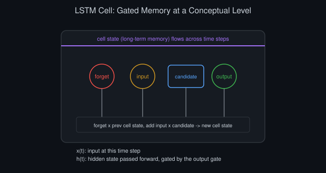
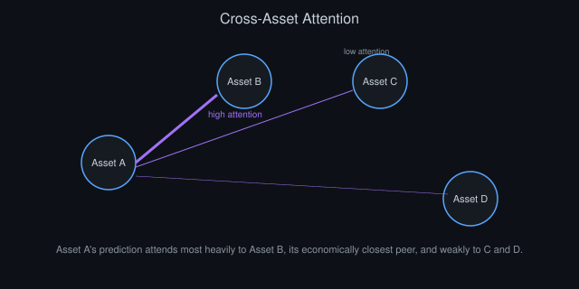
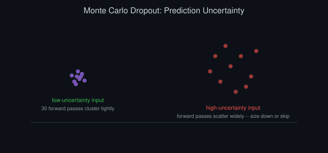
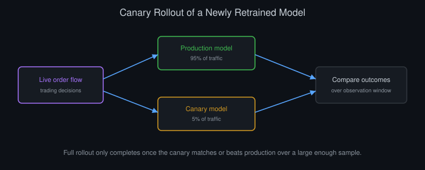

# Deep Learning Architectures for Market Prediction: A Rigorous Treatment

*By Vizanix — Professional Level*

> A production-grade examination of deep learning architectures applied to market prediction, focused on the specific failure modes that separate research results from deployable systems.


## Table of Contents

1. The Honest Starting Point: Signal-to-Noise Reality
2. Architecture Survey: Matching Structure to Problem
3. Attention Mechanisms for Multi-Asset and Multi-Horizon Prediction
4. Regularization as the Central Engineering Challenge
5. Training Data Construction and Point-in-Time Discipline
6. Uncertainty Quantification and Why Point Predictions Mislead
7. Model Interpretability for Risk and Compliance
8. Deployment Architecture and Inference Latency
9. Model Monitoring and Decay Detection
10. When Deep Learning Is the Wrong Tool

## 1. The Honest Starting Point: Signal-to-Noise Reality

Deep learning architectures achieve remarkable results in domains with abundant data and a favorable signal-to-noise ratio, image recognition, language modeling, board games with well-defined rules. Financial market prediction offers neither abundant clean data relative to model capacity nor a favorable signal-to-noise ratio. Markets are close to informationally efficient specifically because participants continuously trade away easily discoverable patterns, which means whatever residual predictive signal remains is genuinely faint and genuinely difficult to distinguish from noise using any method, deep learning included.

This is the professional-level framing this entire chapter operates under: deep learning is not a magic amplifier that finds signal a simpler model would miss by sheer architectural sophistication. It's a flexible function approximator that, without careful engineering discipline specifically adapted to this low-signal, limited-data domain, will find and confidently model noise as if it were signal, producing results that look excellent in research and degrade sharply, often to the point of net negative value, once deployed against genuinely out-of-sample future data.

The organizational dynamics around this problem deserve mention because they compound the technical challenge. A well-funded quantitative research effort can produce, over a period of months, dozens or hundreds of candidate deep learning models, each representing a genuine attempt at a distinct architectural or feature idea. Even under a rigorous validation protocol, evaluating this many candidates against a limited amount of truly independent out-of-sample data means some will pass validation by chance alone, and the pressure to ship a model after a large research investment creates a real incentive to interpret an ambiguous validation result generously. Building organizational discipline around this, a pre-registered evaluation protocol, a fixed number of "shots" at the final untouched test set, and a genuine willingness to conclude that months of research produced no deployable improvement, is as important as any individual modeling technique in this chapter.

## 2. Architecture Survey: Matching Structure to Problem

Different architectures encode different structural assumptions about your data, and matching that structure to the actual properties of financial data is more important than raw architectural sophistication. Convolutional architectures, originally designed for spatial locality in images, can be applied to financial time series by treating a window of recent bars as a one-dimensional sequence and learning local temporal patterns, useful when short, local patterns in price and volume genuinely carry information, but with a real risk of learning spurious local patterns given limited effective sample size.

Recurrent architectures (LSTM and GRU variants) explicitly model sequential dependency and maintain an internal state across a sequence, in principle suited to time series with meaningful long-range dependency. In practice, for most financial prediction tasks at daily or hourly resolution, the effective useful lookback window is often shorter than the architecture's theoretical capacity to remember, because genuine, stable predictive relationships in financial data rarely extend usefully across very long historical windows without decaying or regime-shifting first.

Temporal convolutional networks offer a middle ground worth considering explicitly between simple lag-feature tabular models and full recurrent architectures. By stacking convolutions with increasing dilation, they can capture a wide effective receptive field over the input sequence while training more efficiently and more stably than recurrent architectures, which suffer from sequential dependency during training that limits parallelization. For financial sequences where the useful lookback is moderate (tens to low hundreds of time steps) rather than very long, a temporal convolutional architecture frequently offers a better complexity-to-performance tradeoff than either a full recurrent network or a large attention-based model, and it deserves a place in the standard comparison set before committing to a more complex architecture.

```
# Illustrative architecture sketch — not a literal recommended production config
class MarketLSTM(nn.Module):
    def __init__(self, n_features, hidden_size=16, dropout=0.4):
        super().__init__()
        self.lstm = nn.LSTM(n_features, hidden_size, batch_first=True)
        self.dropout = nn.Dropout(dropout)
        self.head = nn.Linear(hidden_size, 1)

    def forward(self, x):
        _, (h_n, _) = self.lstm(x)
        return self.head(self.dropout(h_n[-1]))
```



*Figure 1: The forget and input gates jointly update the cell's long-term memory each time step, and the output gate decides how much of it becomes the visible hidden state.*

Note the deliberately small hidden size and aggressive dropout in this sketch. Given the low signal-to-noise ratio and typically modest effective sample size in financial applications relative to, say, vision or language tasks, oversized architectural capacity is a liability, not a feature, because it gives the model ample room to memorize training-set-specific noise rather than learning genuine, generalizable structure.

## 3. Attention Mechanisms for Multi-Asset and Multi-Horizon Prediction

Attention-based architectures earn their added complexity most clearly in settings with genuinely rich, structured relationships to learn, for instance, predicting returns for many related instruments simultaneously where the relevant relationships between instruments shift over time and aren't well captured by a single fixed correlation structure. An attention mechanism can, in principle, learn to weight the influence of related instruments' recent behavior dynamically rather than through a hand-specified, static feature.

```
# Simplified cross-asset attention sketch
class CrossAssetAttention(nn.Module):
    def __init__(self, n_features, n_heads=2):
        super().__init__()
        self.attention = nn.MultiheadAttention(n_features, n_heads, batch_first=True)
        self.head = nn.Linear(n_features, 1)

    def forward(self, asset_features):
        # asset_features: (batch, n_assets, n_features)
        attended, _ = self.attention(asset_features, asset_features, asset_features)
        return self.head(attended)
```

The rigorous caveat that separates professional use from naive enthusiasm: attention mechanisms have substantially more parameters and require correspondingly more data to fit reliably without overfitting than the simpler architectures discussed above, and applying them to a modest-sized financial dataset (which describes the large majority of realistic financial ML datasets relative to typical deep learning benchmark dataset sizes) frequently produces a model that overfits training-period-specific inter-asset relationships rather than learning genuinely stable structure. Reserve this architectural complexity for problems with both a large enough effective dataset and a genuine hypothesis for why dynamic, learned cross-asset weighting should outperform a simpler, more constrained relationship model.

Attention weight visualization offers a genuinely useful interpretability angle specific to this architecture family, distinct from the general interpretability techniques discussed later in this chapter. Inspecting which assets the model is attending to most heavily when producing a given prediction can reveal whether the learned relationships match a domain expert's economic intuition (a semiconductor stock's prediction drawing heavily on its direct supply chain peers, for instance) or whether the model has instead learned a spurious, sample-specific pattern with no obvious economic justification. Build this visualization into your standard model evaluation workflow for any attention-based architecture, since an accurate-looking model whose attention pattern makes no economic sense is a strong warning sign of overfitting that a pure accuracy metric alone would not surface.



*Figure 2: Visualizing attention weights lets you check whether the model's learned inter-asset relationships match economic intuition or look like a spurious, sample-specific pattern.*

## 4. Regularization as the Central Engineering Challenge

Given the persistent risk of overfitting to noise discussed throughout this chapter, regularization deserves more engineering attention in financial deep learning than architecture selection itself. Beyond standard dropout and weight decay, financial-specific regularization approaches include restricting model capacity deliberately below what the raw data volume would technically support (fewer parameters than a naive scaling rule would suggest), using ensemble averaging across multiple models trained on different historical windows or with different random initializations to reduce variance in the final prediction, and explicitly penalizing model confidence to counteract the tendency of an overfit model to produce overconfident predictions on noise-driven training patterns.

```
def confidence_penalized_loss(predictions, targets, confidence, penalty_weight=0.1):
    base_loss = mse_loss(predictions, targets)
    # penalize high confidence when prediction error is large
    confidence_penalty = penalty_weight * torch.mean(confidence * (predictions - targets) ** 2)
    return base_loss + confidence_penalty
```

Early stopping based on a genuinely held-out validation period, chosen specifically to be temporally posterior to training data and ideally separated by a purge gap, is more important in this domain than in most other deep learning applications, precisely because the temptation and the ease of overfitting is higher given the low signal-to-noise ratio. A model that trains for many more epochs than its validation performance justifies is a model that has moved from learning generalizable signal to memorizing training-window-specific noise, and the gap between these two states is often narrower and easier to cross unnoticed in financial data than in domains with a more favorable signal-to-noise ratio.

Ensemble methods deserve a more prominent place in financial deep learning than they typically occupy in other application domains, precisely because variance reduction matters more here than raw individual-model capacity. Training several models with different random initializations, different training window start points, or slightly different architectural hyperparameters, and averaging their predictions, tends to produce a more stable, better-generalizing final prediction than any single model in the ensemble, because idiosyncratic overfitting to noise in any one training run tends to partially cancel out across an ensemble of independently-trained models. The added inference cost of running several models instead of one is usually a worthwhile tradeoff given how much variance reduction it buys in a domain this prone to overfitting, and it should be a standard, default consideration rather than an optional enhancement reserved for a final production polish pass.

## 5. Training Data Construction and Point-in-Time Discipline

Every principle from point-in-time data discipline and leakage avoidance covered elsewhere in this library applies with amplified stakes to deep learning specifically, because deep architectures are more capable of exploiting subtle leakage than simpler models, extracting and memorizing even faint, spurious future-information signals that a simpler linear model might not have the capacity to find and exploit as effectively. A deep model trained on data with even minor leakage will typically show a larger, more misleading apparent performance gain from that leakage than a simpler model would, precisely because it has more capacity to find and exploit whatever spurious pattern the leakage introduces.

Walk-forward validation with purge gaps, described in this library's treatment of time-series forecasting, is non-negotiable here, and deserves an additional layer of rigor for deep learning specifically: because deep model training involves many more researcher degrees of freedom (architecture choice, hyperparameters, training duration, random seed), the risk of implicitly overfitting to a validation set through repeated iteration, even without any formal data leakage, is higher than for a simpler model with fewer tunable choices. Reserve a final, truly untouched test period that is used exactly once, after all architecture and hyperparameter decisions are finalized using only the training and validation periods, to get an honest read on likely live performance.

Track and log every experiment's exact configuration, data window, and result in a structured experiment tracking system from the very start of a research effort, not as an afterthought once a promising result emerges. Retroactively reconstructing exactly which data window, feature set, and hyperparameters produced a particular result weeks after the fact, once several more experiments have since been run, is a common and entirely avoidable source of wasted effort and, worse, of accidentally reusing a validation period across multiple supposedly-independent experiments without realizing it, quietly reintroducing the very overfitting-to-validation-set risk this section warns against.

## 6. Uncertainty Quantification and Why Point Predictions Mislead

A model that outputs a single point prediction, with no accompanying uncertainty estimate, actively invites overconfident position sizing, since two predictions of identical magnitude but very different underlying confidence get treated identically downstream if uncertainty isn't captured and passed through the pipeline. Techniques for extracting calibrated uncertainty from a deep model, Monte Carlo dropout (running multiple forward passes with dropout active at inference time and treating the variance across passes as an uncertainty proxy), or an explicit quantile regression head trained to predict multiple percentiles of the outcome distribution rather than a single point value, provide genuinely more actionable output for a downstream trading system than a single number.

```
def mc_dropout_uncertainty(model, x, n_passes=30):
    model.train()  # keep dropout active during inference
    predictions = torch.stack([model(x) for _ in range(n_passes)])
    model.eval()
    return predictions.mean(dim=0), predictions.std(dim=0)  # mean, uncertainty
```

Feed this uncertainty estimate directly into position sizing logic. Scale position size down, or skip the trade entirely, when the model's own uncertainty estimate for a given prediction is high relative to its typical range, rather than treating every prediction from the model as equally trustworthy regardless of the model's own internal confidence in that specific instance.



*Figure 3: Running many dropout-enabled forward passes turns spread across the resulting predictions into a usable uncertainty estimate for position sizing.*

Calibration itself needs independent validation, not just the mechanical production of an uncertainty number. A model's stated uncertainty is only useful if it's genuinely calibrated, meaning that among predictions the model claims to be, say, 80% confident in a given direction, roughly 80% actually turn out correct over a large enough sample. Validate this explicitly with a reliability diagram, plotting stated confidence against realized accuracy across confidence buckets, and recalibrate (through a simple post-hoc adjustment, such as temperature scaling) if the raw model output shows systematic over- or under-confidence, which deep models frequently do without this correction, tending toward overconfidence in particular given their capacity to fit training data closely.

## 7. Model Interpretability for Risk and Compliance

A deep model deployed in a regulated trading context typically cannot remain a complete black box, both for internal risk management (you need to understand roughly why the model is taking a given position to sanity-check it against a human's independent judgment) and often for external regulatory or compliance requirements around explainability of automated trading decisions. Post-hoc interpretability techniques, gradient-based attribution methods that estimate which input features most influenced a specific prediction, or simpler surrogate model approaches that fit an interpretable model to approximate the deep model's behavior locally around a specific prediction, provide a partial, imperfect but genuinely useful window into model behavior.

```
def gradient_attribution(model, x, target_output_idx=0):
    x.requires_grad_(True)
    output = model(x)
    output[target_output_idx].backward()
    return x.grad.detach()  # feature-level attribution for this prediction
```

Build interpretability tooling as a standard, always-available part of the model's production interface, not an occasional research exercise. When a risk manager or a regulator asks "why did the model take this position on this date," having an immediate, systematic answer available is materially different from needing to reconstruct that answer manually after the fact, and the latter is often impractical for a model that has been retrained or updated multiple times since the decision in question.

Complement feature-level attribution with case-based explanation where feasible: alongside "these input features most influenced this prediction," surface a small set of historically similar situations (using a distance metric in the model's learned representation space) and how the model's predictions for those historical analogues actually played out. This gives a human reviewer, particularly one without a deep technical background in the model's internals, a more intuitive and often more persuasive form of explanation than a list of raw feature gradients, and it doubles as a useful sanity check for the model's own developers: if the nearest historical analogues to a given prediction look economically dissimilar to a domain expert's eye despite being close in the model's internal representation, that's a meaningful signal the model's learned representation may not be capturing what you intend it to.

## 8. Deployment Architecture and Inference Latency

Deploying a deep model into a live trading pipeline introduces engineering concerns distinct from the research and training phase entirely. Inference latency needs explicit measurement and budgeting against your strategy's actual decision horizon. A model that takes 200 milliseconds to run inference is completely fine for a strategy rebalancing hourly and entirely unusable for one operating on a sub-second horizon, and this latency budget should be a hard constraint considered during architecture selection, not an afterthought discovered during deployment.

Version and serve models through a dedicated model-serving layer that decouples the model artifact from the trading application code calling it, allowing model updates (retraining, architecture changes) to deploy independently from trading logic changes, with careful tracking of exactly which model version produced which historical prediction, since this traceability becomes essential for both interpretability requests described above and for debugging any unexpected shift in the strategy's behavior.

Deploy new model versions through the same staged, canary-style rollout discipline this library recommends for other production systems, rather than switching a strategy's entire live traffic to a newly retrained model the moment training completes. Route a small fraction of trading decisions through the new model version while the bulk continues on the previous, proven version, comparing realized outcomes between the two over a meaningful observation window before completing the rollout. This staged approach catches the specific and recurring failure mode where a newly retrained model looks superior on its own held-out validation set but underperforms once exposed to genuinely live, real-time market conditions that its validation period, however carefully constructed, did not fully anticipate.



*Figure 4: Routing a small fraction of live traffic to a newly retrained model before a full rollout catches validation-to-live performance gaps a static held-out test set would miss.*

```
class ModelServingLayer:
    def predict(self, features, model_version=None):
        model = self.model_registry.get(model_version or self.current_production_version)
        prediction = model.infer(features)
        self.log_prediction(model.version, features, prediction, timestamp=now())
        return prediction
```

## 9. Model Monitoring and Decay Detection

Deploy the same feature and prediction monitoring discussed elsewhere in this library's treatment of financial machine learning, with additional deep-learning-specific attention to input distribution shift: a deep model's behavior on inputs meaningfully outside the distribution it was trained on is frequently far less predictable and far less reliable than a simpler model's behavior in the same situation, because deep architectures can produce confident, plausible-looking but ultimately meaningless outputs on out-of-distribution inputs rather than degrading gracefully.

Track a running measure of input distribution shift (comparing recent live feature distributions against the training distribution using a standard divergence measure) as a first-class monitored metric, and configure explicit fallback behavior, reduced position sizing, or falling back to a simpler, more robust model, when live inputs drift meaningfully beyond the range the deep model was trained and validated on, rather than trusting the deep model's output uniformly regardless of how far the current market conditions have moved from its training distribution.

## 10. When Deep Learning Is the Wrong Tool

The most professionally mature conclusion available in this domain is recognizing when the added complexity, computational cost, interpretability burden, and overfitting risk of a deep learning approach is not justified by a corresponding, demonstrated improvement over a well-regularized simpler model on the same rigorously validated evaluation protocol. For the majority of tabular, moderate-frequency financial prediction problems with a limited effective sample size, a well-tuned gradient-boosted tree model or even a carefully regularized linear model frequently matches or exceeds a deep learning approach's genuinely out-of-sample performance, while being dramatically easier to interpret, deploy, monitor, and maintain.

Reserve deep learning investment for the specific subset of problems where its structural advantages align clearly with the problem's actual characteristics: genuinely large, information-rich input data (high-frequency order book sequences, for instance) where the volume and structure of available data can plausibly support the additional model capacity without excessive overfitting risk, and where a rigorous, honest comparison against simpler baselines, conducted with the same discipline this entire library advocates for any modeling claim, has actually demonstrated a real, out-of-sample improvement large enough to justify the substantial additional engineering and operational burden.

## Summary

- Financial markets offer a low signal-to-noise ratio; deep learning's flexibility is as much a liability (overfitting risk) as an asset here.
- Match architecture to genuine data structure; recurrent and attention-based models earn their complexity only with sufficient data and a real relational hypothesis.
- Regularization, aggressive dropout, and disciplined early stopping deserve more engineering attention than architecture selection itself.
- Apply point-in-time discipline and walk-forward validation with extra rigor, since deep models exploit leakage more effectively than simpler ones.
- Quantify prediction uncertainty explicitly and feed it into position sizing, rather than trusting point predictions uniformly.
- Always benchmark against well-regularized simpler models on an identical, rigorous evaluation protocol before committing to deep learning in production.

---

*This book is part of the Vizanix Quant Engineering Library. Licensed under CC BY 4.0 — free to read, share, and adapt with attribution to Vizanix.*
