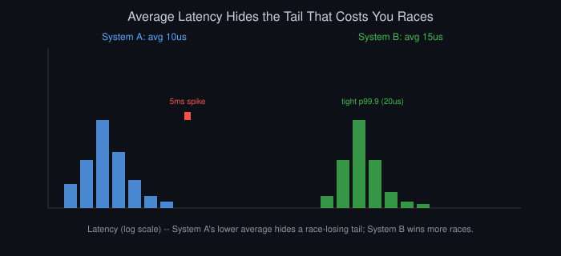
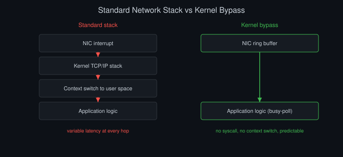
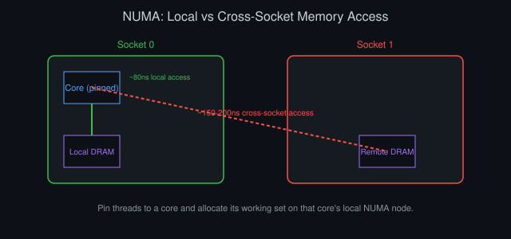
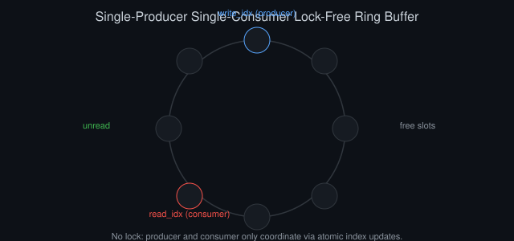

# Low-Latency Systems Engineering for Trading

*By Vizanix — Professional Level*

> A rigorous treatment of the engineering techniques that actually move the needle on tail latency in trading systems, and the failure modes that show up only under production load.


## Table of Contents

1. Why Tail Latency, Not Average Latency, Is the Real Metric
2. Kernel Bypass and the Network Stack
3. Memory Management: Avoiding the Allocator and the Garbage Collector
4. CPU Affinity, NUMA, and Cache Behavior
5. Lock-Free Data Structures and Their Real Costs
6. Time Synchronization and Measurement Discipline
7. Hardware Acceleration: FPGAs and Beyond
8. Testing and Benchmarking Under Realistic Load
9. Failure Modes Unique to Low-Latency Systems
10. When Low Latency Isn't Worth It

## 1. Why Tail Latency, Not Average Latency, Is the Real Metric

An average latency number hides the exact thing that matters in trading: how bad your worst moments are, and how often they happen. A system with a 10-microsecond average latency but a 5-millisecond 99.9th percentile spike will lose more trades to being late than a system with a 15-microsecond average and a tight 20-microsecond 99.9th percentile. In competitive, latency-sensitive strategies, the cost of being late isn't linear in how late you are. You either win the race for a fill or you don't, and the tail is exactly where you lose races.

Report and optimize for percentiles explicitly: p50, p99, p99.9, and p99.99 at minimum, plus the absolute maximum observed. A single anomalous spike can indicate a systemic issue (a garbage collection pause, a page fault, a lock contention event) that will recur unpredictably in production even if it's rare enough to vanish from an average.

```
def summarize_latency(samples_us):
    sorted_samples = sorted(samples_us)
    n = len(sorted_samples)
    return {
        'p50': sorted_samples[int(n * 0.50)],
        'p99': sorted_samples[int(n * 0.99)],
        'p99.9': sorted_samples[int(n * 0.999)],
        'max': sorted_samples[-1],
    }
```

The engineering discipline this implies is significant. Every optimization decision needs to be evaluated on its tail impact, not just its average impact, and some optimizations that help the average case (a cache that speeds up the common path) can actually worsen the tail (a cache miss handling path that's slower than the uncached baseline) if you're not careful to measure both.

Percentiles computed over too short a sampling window can also mislead you in a specific, dangerous way. A 99.9th percentile calculated over only a thousand samples is really just reporting the single worst observation, and a single outlier caused by an unrelated, transient condition (a one-off OS scheduling hiccup, a background process briefly stealing CPU) can dominate a report that then gets treated as representative system behavior. Compute tail percentiles over sample sizes large enough that individual outliers don't dominate the statistic, and separately track the true maximum and outlier frequency as their own metrics. A rare true outlier and a systemically elevated tail are different problems requiring different remediation, and conflating them into a single percentile number obscures which one you're actually looking at.



*Figure 1: System A's lower average hides a rare 5ms spike that loses races; System B's higher average but tight p99.9 wins more of them.*

## 2. Kernel Bypass and the Network Stack

The standard operating system network stack, sockets, the kernel's TCP/IP implementation, interrupt-driven packet delivery, adds latency and, more importantly for our purposes, latency variance that a low-latency trading system cannot tolerate. Every packet traversing the standard stack incurs a context switch from user space to kernel space, competes with other processes for CPU scheduling, and is subject to interrupt coalescing delays that trade average throughput for worse tail latency.

Kernel bypass techniques (such as using a user-space network driver framework that maps network interface card memory directly into your application's address space) eliminate this path entirely: your application polls the network interface card directly in a tight loop, reading packets as they arrive without any kernel involvement or context switch. This trades CPU efficiency (a dedicated core spins continuously polling, using 100% of that core's capacity even when idle) for latency predictability, which is exactly the trade a latency-sensitive strategy wants to make.

Beyond the network stack, the same bypass philosophy extends to storage when your system needs to persist data on the hot path, as a write-ahead log for order events typically does. Standard filesystem writes traverse the kernel's page cache and I/O scheduler, both of which introduce latency variance for reasons outside your application's control. A latency-sensitive persistence layer can use direct I/O to bypass the page cache entirely, combined with a pre-allocated, append-only file layout that avoids filesystem metadata updates on every write. This trades some of the convenience of standard file I/O for materially more predictable write latency, at the cost of needing to manage buffering and durability guarantees explicitly in application code rather than relying on the operating system's defaults.

```
// Conceptual polling loop structure, not tied to a specific framework
while (running) {
    packet = nic_ring_buffer.try_dequeue();  // non-blocking, no syscall
    if (packet != null) {
        process_packet(packet);  // application logic, no allocation
    }
    // no sleep, no yield — busy poll to avoid scheduler latency
}
```

The operational cost is real: kernel bypass setups require dedicated hardware, dedicated CPU cores that can never be shared with other work, and specialized operational knowledge (driver configuration, memory pinning, interrupt affinity) that most engineering teams don't need for the majority of their systems. Reserve this technique for the specific hot-path components where nanoseconds genuinely matter, typically the market data ingestion and order submission paths, and keep everything else on the standard, far simpler and more maintainable network stack.

Debuggability suffers under kernel bypass in ways worth planning for explicitly before you commit to the approach. Standard tools for inspecting network traffic (packet capture utilities that hook into the kernel's networking stack) see nothing when traffic bypasses that stack entirely, which means you need to build your own tap or mirroring capability at the application layer specifically to preserve the ability to inspect traffic during an incident. Budget this tooling as part of the initial kernel-bypass investment rather than discovering the gap during your first production incident involving the bypassed path, when the lack of visibility will cost you exactly the diagnostic time you can least afford to lose.



*Figure 2: Kernel bypass removes the interrupt, kernel stack, and context-switch hops entirely, trading a dedicated busy-polling core for predictable latency.*

## 3. Memory Management: Avoiding the Allocator and the Garbage Collector

Dynamic memory allocation in the hot path is a latency hazard for two related but distinct reasons. First, general-purpose allocators (malloc and its equivalents) have unpredictable worst-case latency depending on heap fragmentation and internal bookkeeping, which is exactly the kind of tail-latency risk this chapter is about. Second, in managed-runtime languages, any allocation contributes to garbage collector pressure, and even a well-tuned collector will eventually need to pause your application, sometimes for milliseconds, which is catastrophic for a system operating on microsecond budgets.

The standard mitigation is pre-allocation combined with object pooling: allocate all memory you will need up front, at startup or during a controlled warm-up phase, and reuse fixed-size buffers and objects from pools rather than allocating and freeing in the hot path.

```
class OrderPool:
    def __init__(self, capacity):
        self._pool = [Order() for _ in range(capacity)]
        self._free_indices = list(range(capacity))

    def acquire(self):
        if not self._free_indices:
            raise PoolExhausted()  # fail loudly, never silently allocate
        idx = self._free_indices.pop()
        return self._pool[idx]

    def release(self, order, idx):
        order.reset()
        self._free_indices.append(idx)
```

For garbage-collected languages used in latency-sensitive contexts, additional discipline is required: avoid boxing primitives, avoid creating short-lived objects in tight loops, and in the most demanding cases, use runtime flags or specialized collector modes designed to minimize pause times at the cost of throughput, or write the hottest path in a language without a garbage collector entirely and interface with it via a well-defined boundary from the rest of the system.

Warm-up matters as much as allocation avoidance for runtimes with just-in-time compilation. Code paths that haven't yet been optimized by the runtime's JIT compiler run through a slower, interpreted or lightly-optimized execution mode, and the first several thousand invocations of a hot function can show dramatically worse latency than its steady-state behavior once the JIT has kicked in. A production deployment needs an explicit warm-up phase, replaying synthetic traffic through every hot code path before accepting live traffic, or the very first orders your system processes after a deployment or restart will suffer this cold-path penalty, which is exactly the kind of tail-latency event this chapter's opening section warned against tolerating.

## 4. CPU Affinity, NUMA, and Cache Behavior

On modern multi-socket, multi-core hardware, memory access latency depends heavily on which physical CPU core is accessing which physical memory bank. Non-Uniform Memory Access (NUMA) means a core accessing "local" memory on its own socket sees meaningfully lower latency than a core accessing memory attached to a different socket. A latency-sensitive process that gets scheduled across cores unpredictably, or that allocates memory without NUMA awareness, pays this cross-socket penalty inconsistently, which shows up as unexplained tail latency variance.



*Figure 3: A core accessing its own socket's local memory pays a fraction of the latency of reaching across to another socket's DRAM.*

Pin your critical threads to specific physical cores using CPU affinity settings, and ensure the operating system scheduler never migrates them elsewhere. Migration itself costs cache-warming time even before considering NUMA effects, since a thread moved to a new core starts with cold L1 and L2 caches. Allocate memory for that thread's working set from the NUMA node local to its pinned core, and avoid any shared data structure that would force cross-socket cache coherency traffic on your hottest path.

```
# Conceptual: pinning a process to specific cores and NUMA node
taskset -c 4-7 numactl --cpunodebind=0 --membind=0 ./trading_engine
```

Cache line contention is a related, more subtle issue: two unrelated pieces of hot data that happen to sit on the same 64-byte cache line, if written by different cores, produce "false sharing." The cores repeatedly invalidate each other's cache line even though they're not logically touching the same data. Pad hot, frequently-written-to data structures to cache-line boundaries explicitly when profiling reveals this pattern.

```
// Padding to avoid false sharing between two hot counters on different cores
struct alignas(64) PaddedCounter {
    std::atomic<uint64_t> value;
    char padding[64 - sizeof(std::atomic<uint64_t>)];
};
```

Detecting false sharing in the first place requires hardware performance counter profiling, not just standard CPU sampling profilers, since the symptom (elevated cache-miss and cache-coherency-traffic counters on specific memory addresses) doesn't show up in a typical call-stack-based profile at all. Build a habit of periodically profiling your hottest data structures with a hardware counter tool specifically looking for cache-line contention, particularly after any change that adds a new frequently-written field to an existing hot struct, since that's exactly the kind of change likely to introduce this failure mode without any obvious code smell warning you it happened.

## 5. Lock-Free Data Structures and Their Real Costs

Traditional locks (mutexes) introduce latency risk beyond their nominal acquisition cost: a thread holding a lock can be preempted by the operating system scheduler while holding it, and any other thread waiting on that lock now waits for an arbitrary scheduling delay, not just the critical section's actual work time. This is priority inversion in its simplest form, and it's a recurring source of unexplained tail latency spikes in lock-based systems.

Lock-free data structures, built using atomic compare-and-swap operations instead of locks, avoid this specific failure mode: no thread ever "holds" anything that another thread must wait for indefinitely. A single-producer single-consumer ring buffer is the workhorse pattern for passing data between a network-receiving thread and a processing thread with minimal latency overhead.

```
class SPSCRingBuffer:
    def __init__(self, capacity):
        self.buffer = [None] * capacity
        self.capacity = capacity
        self.write_idx = AtomicInt(0)
        self.read_idx = AtomicInt(0)

    def try_push(self, item):
        next_write = (self.write_idx.get() + 1) % self.capacity
        if next_write == self.read_idx.get():
            return False  # full
        self.buffer[self.write_idx.get()] = item
        self.write_idx.set(next_write)
        return True

    def try_pop(self):
        if self.read_idx.get() == self.write_idx.get():
            return None  # empty
        item = self.buffer[self.read_idx.get()]
        self.read_idx.set((self.read_idx.get() + 1) % self.capacity)
        return item
```

Be honest about the cost of this approach: lock-free code is dramatically harder to reason about and verify correct than lock-based code, and subtle bugs (particularly around memory ordering on architectures with weaker memory models) can produce failures that only manifest under specific timing conditions in production, essentially never in testing. Reserve genuinely lock-free structures for the specific, narrow interfaces where they're proven necessary, and keep the rest of your system on well-understood, simpler concurrency primitives.



*Figure 4: A single-producer single-consumer ring buffer coordinates through atomic index updates alone, with no lock either side must wait on.*

Memory ordering deserves specific mention because it's the single most common source of subtle lock-free bugs. Modern CPUs and compilers are permitted to reorder memory operations for performance, as long as that reordering is invisible to a single-threaded observer, but a second thread genuinely can observe the reordering, seeing writes happen in a different order than the program text suggests. Explicit memory ordering annotations (acquire semantics on reads that must see a prior write, release semantics on writes that must be visible before a subsequent read) prevent this, but every single shared variable access in lock-free code needs its ordering requirement reasoned through individually and explicitly. Skipping this reasoning in favor of "it worked when I tested it" is exactly how a lock-free ring buffer accumulates a bug that surfaces only on a specific CPU architecture, under specific load, months after deployment.

## 6. Time Synchronization and Measurement Discipline

You cannot manage what you cannot measure accurately, and timestamp accuracy across distributed components is a frequently underestimated challenge. If your market data handler and your order gateway run on different machines with clocks that have drifted even a few hundred microseconds relative to each other, any latency calculation spanning both machines is measuring clock drift as much as it's measuring real processing latency.

Use a hardware-assisted time synchronization protocol (such as one providing sub-microsecond synchronization across machines on the same network segment) rather than relying on standard best-effort time synchronization, which typically only guarantees millisecond-level accuracy, utterly inadequate when your entire latency budget is measured in microseconds. Timestamp events as close to the physical layer as possible, ideally in hardware, at the network interface card, rather than in application code after several layers of software have already processed the packet, so your latency measurements reflect real end-to-end time rather than an artifact of where in your software stack you happened to insert a timer call.

Clock drift monitoring needs to run continuously in production, not just be verified once at deployment time. Hardware clocks drift relative to each other over time due to manufacturing tolerances and temperature variation, and even a synchronization protocol that achieves excellent instantaneous accuracy needs to correct for this ongoing drift repeatedly. Alert explicitly on synchronization quality degrading beyond your latency budget's tolerance, treating a clock sync issue with the same severity as a network outage. A system silently operating with drifted clocks will produce latency measurements that are quietly, systematically wrong in a way that's very difficult to detect from the measurements alone. The numbers will look plausible, just incorrect, which is a more dangerous failure mode than an obviously broken measurement that at least announces itself.

Cross-machine causality is a related trap: even with excellent clock synchronization, comparing timestamps generated on two different machines to establish a definitive event order carries residual uncertainty bounded by your synchronization accuracy. For latency measurements this residual uncertainty is usually acceptable, but for anything requiring a strict, provable ordering of events across machines (certain audit and compliance use cases, for instance), rely on a logical ordering mechanism, such as a sequence number issued by a single authoritative source, rather than trusting cross-machine wall-clock comparison to establish exact precedence.

## 7. Hardware Acceleration: FPGAs and Beyond

For the specific subset of latency-critical logic that's stable and well-defined enough to justify the engineering investment, market data parsing and normalization, simple pre-trade risk checks, order message construction, Field-Programmable Gate Arrays (FPGAs) can process logic directly in hardware, bypassing the entire software stack including the operating system, and achieve latencies an order of magnitude lower than even a highly optimized software implementation on a kernel-bypass network stack.

The tradeoff is substantial. FPGA development requires specialized hardware description language skills that are scarce and expensive relative to general software engineering talent, iteration cycles are dramatically slower than software (a logic change requires resynthesizing and reflashing, a process that can take significant time even for small changes), and debugging hardware logic in production is far harder than attaching a debugger to a software process. This makes FPGA acceleration appropriate for a narrow set of extremely stable, well-validated logic paths where the latency gain justifies the development and maintenance cost, and inappropriate for logic that changes frequently or is still being actively developed and tuned.

A common, more pragmatic middle-ground pattern develops logic in software first, deploys and validates it extensively there, and only ports the truly hot, stable subset to hardware once its behavior has been proven correct through extensive production experience. This staged approach costs some latency benefit during the software-only phase but dramatically reduces the risk of committing hardware development effort to logic that turns out to need frequent revision once real production edge cases surface. Teams that skip this staging and go straight to hardware for unproven logic tend to accumulate expensive rework as the "stable" logic turns out not to be stable at all once it meets live market conditions.

## 8. Testing and Benchmarking Under Realistic Load

Latency benchmarks measured on an idle system with no other load tell you almost nothing about production behavior, because contention effects (for CPU cache, for memory bandwidth, for network interface card queues) only appear under realistic concurrent load. Build your benchmark harness to replay realistic production-like traffic patterns, including bursts, not just steady-state average load, since tail latency behavior is often dominated by how a system handles the burst, not the steady state.

Run benchmarks on hardware and configuration that matches production exactly. A benchmark run on a developer laptop, or even a production-spec machine with different NUMA topology or a different kernel version, can produce meaningfully different tail latency characteristics than what you'll actually see live. Treat any latency-affecting change (a new dependency version, a kernel upgrade, a configuration change) as requiring a full benchmark re-run before deployment, since latency regressions from seemingly unrelated changes are common and easy to miss without disciplined, repeated measurement.

Build automated latency regression detection into your deployment pipeline as a hard gate, not an advisory report someone might glance at. Store historical benchmark distributions per release and compare each new candidate release's tail latency against a rolling baseline using a statistically sound comparison, not just a naive "is the new p99 higher than the old p99" check, which is highly sensitive to noise in any single benchmark run. A release that shows a statistically significant tail latency regression should fail the pipeline automatically, forcing an explicit decision to either fix the regression or consciously accept it, rather than letting it slip into production because nobody happened to notice a report that arrived alongside dozens of other CI outputs.

## 9. Failure Modes Unique to Low-Latency Systems

Low-latency systems fail in ways that don't show up in typical software failure taxonomies. A busy-polling thread pinned to a dedicated core will show 100% CPU utilization continuously, which is completely normal and expected, but it means your standard "high CPU usage" alerting logic, tuned for typical services, will misfire constantly unless you explicitly account for this pattern. A kernel-bypass network path that silently drops packets under sustained overload can fail invisibly, since there's no operating system layer generating the usual visible error signals you'd get from a standard socket-based approach.

Lock-free data structures that hit capacity (a full ring buffer, for instance) need an explicit, deliberate policy, drop the newest item, drop the oldest, or block, and the wrong choice for your specific use case can silently lose critical data (a fill notification, a risk check result) with no error thrown anywhere in the pipeline. Every one of these systems needs monitoring designed specifically for its unusual operating characteristics, not generic infrastructure monitoring built for typical request-response services.

A subtler failure mode specific to busy-polling architectures is thermal and power throttling: a core running at sustained 100% utilization for extended periods can trigger the processor's own thermal protection mechanisms, silently reducing clock frequency to manage heat, which directly and invisibly degrades your latency without any software-level error or log entry marking the event. Monitor CPU frequency and thermal state directly as a first-class metric for any core dedicated to busy-polling, since a gradual latency degradation with no corresponding change in your own code or configuration is a strong hint to check whether the hardware itself has begun throttling, a failure mode that's easy to overlook entirely if you're only watching software-level metrics.

## 10. When Low Latency Isn't Worth It

The most important professional judgment in this entire domain is knowing when not to apply these techniques. Kernel bypass, lock-free structures, FPGA acceleration, and aggressive NUMA tuning all add substantial engineering complexity, operational burden, and specialized-skill dependency. For strategies operating on multi-second or longer decision horizons, none of this matters, and applying it anyway is pure cost with no corresponding benefit. The latency difference between a naive and a heavily optimized implementation is utterly irrelevant to a strategy that only needs to act once every few minutes.

Reserve this investment for the specific components where the latency genuinely determines whether you win or lose economically meaningful races: the market data path and order submission path for strategies that compete on speed. Everywhere else in your system, risk reporting, reconciliation, back-office processing, most strategy logic, should be built with standard, simpler, more maintainable engineering practices, because the complexity cost of low-latency techniques is real and compounds across every system you apply it to unnecessarily.

Quantify this decision explicitly rather than deciding by instinct or by copying what a faster-moving competitor is rumored to be doing. Estimate the economic value of a given latency improvement, how much additional fill rate or price improvement a specific number of microseconds saved would realistically capture for your specific strategy and market, and compare that estimate honestly against the engineering cost of achieving it: the specialized talent required, the ongoing operational burden, the opportunity cost of not spending that same engineering effort elsewhere. Many teams pursue low-latency engineering as a matter of technical pride or competitive anxiety without ever running this calculation explicitly, and end up over-investing in latency for strategies where a few extra microseconds genuinely would not have changed a single trading outcome.

## Summary

- Optimize and report on tail latency percentiles (p99, p99.9, max), not averages, since races are won or lost in the tail.
- Use kernel bypass and lock-free structures only on the narrow hot-path components where nanoseconds genuinely determine outcomes.
- Eliminate hot-path allocation through pre-allocated object pools; avoid garbage collector pressure entirely in latency-critical code.
- Pin threads to specific cores with NUMA-aware memory allocation to avoid cross-socket latency and unpredictable scheduler migration.
- Synchronize clocks with hardware-assisted precision and timestamp as close to the physical layer as possible for trustworthy latency measurement.
- Apply low-latency engineering only where it's economically justified; most of a trading system should stay simple, maintainable, and standard.

---

*This book is part of the Vizanix Quant Engineering Library. Licensed under CC BY 4.0 — free to read, share, and adapt with attribution to Vizanix.*
