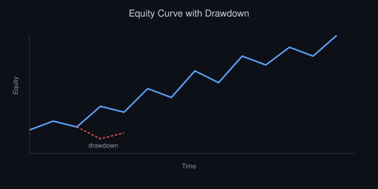

# Production Risk Systems: Kill Switches, Limits, and Circuit Breakers

*By Vizanix — Professional Level*

> An in-depth engineering treatment of the automated safety systems that stand between a software bug and a firm-ending loss, and the design discipline required to make them trustworthy.



## Table of Contents

1. The Asymmetry That Justifies This Entire Discipline
2. Kill Switch Architecture
3. Limit Hierarchies: Firm, Desk, Strategy, Instrument
4. Circuit Breakers and Rate-of-Change Controls
5. The Fail-Closed Principle and Its Costs
6. Testing Safety Systems Without Trusting Them Blindly
7. Human-in-the-Loop vs Fully Automated Response
8. Post-Incident: What a Near-Miss Actually Tells You
9. Common Anti-Patterns in Production Risk Systems

## 1. The Asymmetry That Justifies This Entire Discipline

A trading system that works correctly 99.99% of the time and, in the remaining 0.01%, sends an unbounded stream of erroneous orders can destroy more capital in minutes than the firm made in the preceding year of correct operation. This asymmetry — the cost of a rare catastrophic failure vastly exceeding the cumulative value of normal operation — is the entire justification for building dedicated, independent safety systems rather than trusting your primary trading logic to simply not fail.

The professional mindset shift required here is significant: you are not building risk controls to catch strategies that are "usually right but sometimes wrong" in a normal statistical sense. You are building controls specifically for the scenario where your software has a bug you have not yet discovered, doing something you never intended, potentially very fast and very persistently. Every design decision in this chapter follows from taking that scenario seriously as a near-certainty over a long enough time horizon, not a remote hypothetical.

This has a direct consequence for how you evaluate the cost of building and maintaining safety infrastructure. Engineers naturally gravitate toward measuring the cost of a control against the frequency of incidents it has actually caught, and by that measure a well-functioning safety system can look like wasted effort for long stretches, since its entire purpose is to prevent the rare, catastrophic event from happening at all. Evaluate the investment instead against the magnitude of the loss it prevents in the scenario it exists for, discounted by however low a probability you genuinely believe that scenario carries, and you will consistently find that even a modestly likely catastrophic scenario justifies a substantial ongoing investment in the controls meant to catch it, precisely because the potential loss dwarfs the ongoing cost of the safety infrastructure itself.

## 2. Kill Switch Architecture

A kill switch needs to halt trading activity reliably even when the system generating the erroneous behavior is itself malfunctioning in ways you didn't anticipate. This requirement — the kill switch must work even when the thing it's killing is broken — has a direct architectural consequence: the kill switch cannot be a mere flag checked by the same process that's misbehaving, because a sufficiently broken process might not check that flag correctly, or might be stuck in a state where checking it never happens.

Build kill switches at multiple, independent layers, each capable of halting activity without depending on the layers above it functioning correctly:

```
Layer 1 (application-level): strategy checks a shared kill flag before each order.
Layer 2 (gateway-level): the exchange gateway process itself refuses to forward
    orders when a kill flag is set, independent of whether upstream strategy
    logic checked it.
Layer 3 (exchange-level): many exchanges offer a "kill switch" API or a
    session-disconnect mechanism that immediately cancels all resting orders
    and rejects new ones for your firm ID, independent of your own infrastructure.
Layer 4 (physical): the ability to physically disconnect network connectivity
    to the exchange, as an absolute last resort when software-level controls
    have failed.
```

The gateway-level check (Layer 2) is the most important single layer in practice, because it sits at the narrowest point in your infrastructure — every order to a given exchange must pass through your gateway to that exchange, regardless of which strategy or process generated it, making it a natural chokepoint for enforcement that doesn't depend on cooperation from potentially-broken upstream code.

```
class ExchangeGateway:
    def send_order(self, order):
        if self.kill_switch.is_active(order.strategy_id, order.instrument):
            self.reject_locally(order, reason="KILL_SWITCH_ACTIVE")
            return
        self._transmit_to_exchange(order)
```

Design the kill switch check to be cheap and impossible to accidentally bypass through a code path that forgets to call it — ideally structured so that sending an order is architecturally impossible without passing through this check, rather than relying on every call site remembering to check manually.

Consider also the failure mode of the kill switch mechanism itself becoming unreachable — if the shared kill flag lives in a distributed coordination service and that service becomes unavailable, your gateway needs a defined behavior for that specific scenario, and per the fail-closed principle discussed later in this chapter, unavailability of the kill switch check itself should default to blocking new orders, not permitting them. Test this specific failure path deliberately: simulate the coordination service becoming unreachable while trading is active, and confirm the gateway actually halts rather than defaulting open, since this exact scenario — the safety mechanism's own dependency failing — is precisely the kind of interaction that's easy to overlook when each component is tested only in isolation against its own happy path.

## 3. Limit Hierarchies: Firm, Desk, Strategy, Instrument

Limits need to exist at multiple aggregation levels simultaneously, because a strategy operating within its own limit can still contribute to a firm-wide breach if enough strategies are correlated or if a single instrument's exposure aggregates dangerously across otherwise-independent strategies. Structure limits hierarchically: firm-wide gross and net exposure, desk-level sublimits within the firm limit, strategy-level sublimits within the desk limit, and instrument-level concentration limits that cut across the strategy hierarchy entirely.

```
class LimitHierarchy:
    def check_order(self, order, current_state):
        checks = [
            (order.strategy_id, current_state.strategy_exposure, self.strategy_limits),
            (order.desk_id, current_state.desk_exposure, self.desk_limits),
            ('FIRM', current_state.firm_exposure, self.firm_limits),
            (order.instrument, current_state.instrument_exposure, self.instrument_limits),
        ]
        for key, current_exposure_fn, limits in checks:
            projected = current_exposure_fn(key) + order.notional_impact()
            if projected > limits.get(key, float('inf')):
                return Rejection(f"LIMIT_BREACH:{key}")
        return Approval()
```

Every level of this hierarchy needs its own owner responsible for setting and reviewing that specific limit, and the limits need periodic review against realized usage — a limit set once at system launch and never revisited tends to either become meaninglessly loose (usage has grown but the limit never adjusted, providing false comfort) or artificially constraining (market conditions changed and the limit no longer reflects appropriate risk appetite), and neither state is safe to leave unaddressed for long.

Correlated breach risk across the hierarchy deserves specific attention during limit design: if a single market event (a sudden broad sell-off, a major index-level move) is likely to cause many strategies to simultaneously want to trade in the same direction, sizing each strategy's individual limit without considering this correlation can leave the firm-level limit dramatically under-protective relative to what happens when many individually-compliant strategies breach in the same direction at once. Explicitly model plausible correlated-breach scenarios during limit calibration, sizing firm and desk-level limits with an awareness that individual strategy limits summing to well below the aggregate limit provides false comfort if those strategies' risk-taking is likely to be highly correlated under exactly the stress conditions the limits exist to guard against.

## 4. Circuit Breakers and Rate-of-Change Controls

Static limits catch a strategy that has grown too large, but they don't catch a strategy that is rapidly generating losses within its limit, or a strategy sending orders at an anomalous rate that itself signals malfunction regardless of notional size. Circuit breakers monitor rate-of-change and velocity metrics, not just absolute levels: order submission rate per second compared to historical norms, P&L rate of change (losing a defined amount within a short window, regardless of whether cumulative loss is still within the daily limit), and fill rate anomalies (an unusually high rejection rate can indicate the strategy is sending malformed or otherwise problematic orders before a limit breach even triggers).

```
class CircuitBreaker:
    def __init__(self, window_seconds, max_orders_per_window, max_loss_rate_per_minute):
        self.order_timestamps = deque()
        self.window_seconds = window_seconds
        self.max_orders_per_window = max_orders_per_window
        self.max_loss_rate_per_minute = max_loss_rate_per_minute
        self.pnl_history = deque()

    def on_order_sent(self, timestamp, strategy_id):
        self.order_timestamps.append(timestamp)
        while self.order_timestamps and timestamp - self.order_timestamps[0] > self.window_seconds:
            self.order_timestamps.popleft()
        if len(self.order_timestamps) > self.max_orders_per_window:
            self.trip(strategy_id, "ORDER_RATE_ANOMALY")

    def on_pnl_update(self, timestamp, pnl, strategy_id):
        self.pnl_history.append((timestamp, pnl))
        recent = [p for t, p in self.pnl_history if timestamp - t <= 60]
        if recent and (max(recent) - recent[-1]) > self.max_loss_rate_per_minute:
            self.trip(strategy_id, "LOSS_RATE_ANOMALY")
```

The rate-of-change dimension is what catches a "stuck in a loop" bug — a strategy that has entered some pathological state and is now sending orders far faster than any legitimate trading logic would, well before that malfunction accumulates enough notional exposure to trip a static limit. Tune the thresholds against your own historical distribution of legitimate order rates and P&L volatility per strategy; a generic threshold copied from another firm's configuration will either trip constantly on your normal activity or fail to trip on your actual anomalies, since normal operating ranges vary enormously across strategy types.

Recalibrate these thresholds on a defined schedule rather than treating them as set-once configuration, since a strategy's legitimate operating range genuinely shifts as it evolves, as market conditions change, and as trading volume grows over time. A circuit breaker threshold calibrated when a strategy was new and trading small size will trip constantly once that strategy has scaled up its normal operation, training the team to treat trips from that strategy as routine noise, which defeats the entire purpose of having a circuit breaker in the first place. Build threshold recalibration into the same regular operational review cadence as limit review, so both evolve together and neither drifts silently out of sync with the trading activity it's meant to govern.

## 5. The Fail-Closed Principle and Its Costs

Every safety-critical decision point needs an explicit answer to "what happens if I can't determine the right answer confidently" — and for risk controls, that answer must always be to block, not to allow. A pre-trade risk check that can't retrieve current exposure (stale cache, a downstream service timeout) must reject the order rather than approving it on the assumption that nothing has changed; a kill switch check that can't reach its coordination service must default to treating the kill switch as active, not inactive.

This fail-closed discipline has a real, ongoing cost: it means your trading system will sometimes halt or reject legitimate activity due to a transient infrastructure hiccup that has nothing to do with an actual risk problem, and that cost is a deliberate, accepted tradeoff, not a design flaw to be optimized away.

Distinguish carefully between genuine uncertainty that warrants fail-closed behavior and mere latency that a slightly more patient design could absorb without sacrificing safety. If a risk check's data source is simply slow to respond under normal, healthy operation, the right fix is a faster data path or a tighter timeout budget for that specific dependency, not a blanket policy of failing closed on every momentary delay. Reserve fail-closed behavior specifically for genuine uncertainty about whether the answer is safe, not as a substitute for fixing an underlying performance problem that's better solved directly, since conflating the two leads teams to tolerate unnecessary trading halts that a proper latency fix would have eliminated without compromising the fail-closed principle at all. The alternative — fail-open, where uncertainty defaults to permitting activity — trades a bounded, recoverable cost (some missed trading opportunity during a transient outage) for an unbounded, potentially catastrophic one (unconstrained trading during exactly the moment your safety infrastructure is compromised). Any engineer proposing to relax a fail-closed check to reduce false-positive halts needs to explicitly justify why the specific failure mode being tolerated cannot coincide with a genuine risk event, which in practice is a very hard case to make convincingly.

Make this justification process a formal, documented gate in your engineering review culture, not an informal conversation that leaves no trace. Require any change that weakens a fail-closed safety check to go through a review specifically focused on the scenario where the weakened check would have mattered, with sign-off from someone in a risk-oversight role who is organizationally independent of the pressure to ship the underlying feature faster. This kind of structural separation between the people who feel the cost of a false-positive halt most acutely and the people responsible for evaluating a proposed weakening of the safety net protects against the natural, understandable pressure to erode fail-closed discipline gradually over time in the name of reducing operational friction.

## 6. Testing Safety Systems Without Trusting Them Blindly

A risk control that has never actually triggered in production is an unknown quantity, not a proven safety net — you genuinely don't know if it works correctly under real conditions until it fires for real, and you don't want the first real test to be during an actual incident. Schedule regular, deliberate drills: inject a synthetic condition designed to trip each control (a simulated limit breach in a test environment that mirrors production configuration, a deliberately triggered kill switch) and verify the entire chain of expected consequences occurs — orders actually stop flowing, alerts actually fire, the right people actually get notified within the expected time.

```
def drill_kill_switch(test_environment):
    test_environment.activate_kill_switch(strategy_id="test_strategy")
    order = generate_test_order(strategy_id="test_strategy")
    result = test_environment.gateway.send_order(order)
    assert result.rejected and result.reason == "KILL_SWITCH_ACTIVE"
    assert test_environment.alerting.received_page_within(seconds=5)
```

Extend this practice to production itself on a controlled, scheduled basis where feasible (a "game day" during low-activity market hours, with full team awareness and rollback readiness), because a staging environment inevitably differs from production in ways that can hide exactly the integration bug you most need to find — a monitoring pipeline that works in staging but silently fails to fire alerts against the production alerting service is a realistic and dangerous gap that only a production-realistic drill will reliably surface.

Rotate the specific scenario each drill covers rather than repeatedly testing the same, already-validated path. Teams naturally gravitate toward re-running the drill they already know works well, since it's comfortable and reliably produces a passing result, but the actual value of drilling comes from testing scenarios you're less confident about, including ones deliberately designed to be awkward: a kill switch triggered while a large order is mid-execution across multiple venues, a circuit breaker firing during a period of genuinely elevated but not clearly anomalous market activity, a limit breach detected simultaneously at two different levels of the hierarchy. Maintain a running list of untested or under-tested scenarios and work through it deliberately over time, rather than letting drill selection default to whatever is easiest to set up.

## 7. Human-in-the-Loop vs Fully Automated Response

Some responses should be fully automated with no human approval step required — a hard limit breach halting a single strategy, for instance, where the cost of a false-positive halt is small and bounded, and the cost of a delayed real response could be large and unbounded. Other responses, particularly ones with broad blast radius (halting an entire desk, or the entire firm), often warrant a human confirmation step even when automated detection triggers the alert, because the cost of an unnecessary firm-wide halt is itself significant and the false-positive rate at that level of severity needs to be very low before full automation is justified.

The design principle that resolves this tension in practice: automate the detection and the alerting fully and immediately regardless of blast radius, but calibrate the automated response threshold to the severity and reversibility of the action — cheap, reversible, narrow-scope actions (halt one strategy) get full automation; expensive, hard-to-reverse, broad-scope actions (halt the firm, unwind a large position at market) get automated detection plus a fast, well-rehearsed human decision point, with the automation already having done the hard work of gathering context so the human can decide in seconds rather than minutes.

## 8. Post-Incident: What a Near-Miss Actually Tells You

Every time a circuit breaker or kill switch actually fires, treat it as valuable information regardless of whether it turned out to be a genuine problem or a false positive, because both outcomes tell you something actionable. A genuine catch validates the control's value and its exact trigger threshold in a real scenario, which is worth more than any amount of drill-based testing. A false positive tells you either that your threshold calibration needs adjustment, or, more interestingly, that your definition of "normal" activity has shifted in a way your control hasn't kept up with — which is itself worth understanding, since it might indicate a broader monitoring gap.

Run a blameless review after every trigger event, focused specifically on two questions: did the control behave as designed given the conditions it saw, and were the conditions it saw actually the right conditions to have triggered on. Track trigger frequency and root cause categorization over time as its own metric — a safety system that never triggers might mean your operations are flawless, or it might mean your thresholds are too loose to ever catch anything, and without deliberate review of trigger history you cannot easily distinguish between these very different possibilities.

Feed lessons from these reviews back into your drill program explicitly, closing the loop between real incidents and future testing. If a real trigger event revealed a gap the drill program hadn't covered — a specific timing edge case, an unexpected interaction between two separate controls firing at once — add exactly that scenario to your rotating drill list, since a real occurrence is the strongest possible evidence that the scenario is worth testing for deliberately rather than waiting to encounter a similar variant again by chance. Over time, a mature safety program's drill library should read like a history of the firm's own near-misses and edge cases, refined and generalized into repeatable tests, rather than a generic checklist copied from an industry template that has no specific connection to how this particular system has actually failed or nearly failed in the past.

## 9. Common Anti-Patterns in Production Risk Systems

Several recurring mistakes are worth naming explicitly because they show up repeatedly across different teams and organizations. Building risk checks as an optional library that individual strategies must remember to call, rather than an architecturally enforced chokepoint, guarantees eventual bypass through a code path that forgot to integrate it. Setting limits once at launch and never revisiting them as trading volume and strategy count grow organically produces limits that provide false comfort long after they've stopped reflecting genuine risk appetite. Building a kill switch that depends on the same infrastructure (database, message queue, network path) as the system it's meant to halt creates a shared point of failure that defeats the entire purpose of having an independent safety layer. And treating a risk system's own uptime and correctness as less important than the trading system it protects — under-resourcing its development, testing, and monitoring relative to revenue-generating code — inverts the priority that this entire chapter argues for.

A final, related anti-pattern worth naming: designing safety controls in isolation from the people who will actually operate under them during a real incident. A kill switch that a trader has never practiced invoking, or a limit-breach alert that arrives without enough context for the receiving operator to make a fast, confident decision, adds friction and hesitation at exactly the moment speed matters most. Involve traders and risk managers directly in designing the operational interface to these controls, not just the engineering team building the underlying mechanism, and validate that interface through the same drilling discipline discussed earlier, since a technically correct safety system that its human operators don't trust or don't know how to use quickly under pressure delivers only a fraction of its intended protective value.

## Summary

- The catastrophic-tail asymmetry in trading justifies dedicated, independent safety infrastructure, not just careful primary system design.
- Build kill switches at multiple independent layers, with the exchange-gateway chokepoint as the most reliably enforceable layer.
- Structure limits hierarchically across firm, desk, strategy, and instrument, and review them on a schedule as trading activity evolves.
- Add rate-of-change circuit breakers alongside static limits to catch malfunctioning-loop bugs before they accumulate large notional exposure.
- Always fail closed on uncertainty in a risk decision, accepting bounded false-positive cost over unbounded tail risk.
- Drill safety systems regularly, including in production where feasible, and treat every real trigger as a mandatory blameless review, not just an incident to close.

---

*This book is part of the Vizanix Quant Engineering Library. Licensed under CC BY 4.0 — free to read, share, and adapt with attribution to Vizanix.*
