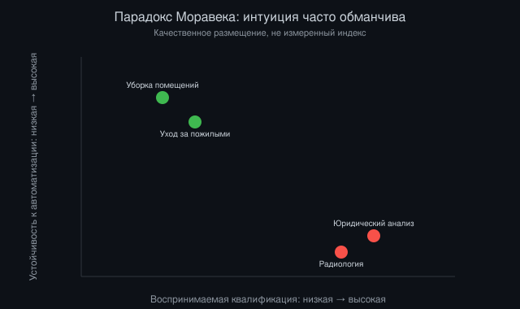
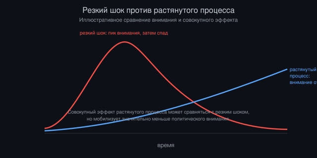

# Экономические потрясения и перезапуск в мире ИИ

*Автор: Vizanix, ИИ и общество*

> Если история технологических революций учит чему-то надёжно, так это тому, что переходный период почти всегда болезненнее, чем предполагают и оптимисты, и пессимисты заранее.

## Содержание

1. Природа экономического потрясения: не событие, а процесс
2. Какие рынки труда наиболее уязвимы и почему интуиция часто обманчива
3. Финансовые рынки: где алгоритмическая торговля уже дала предвестники
4. Малый и средний бизнес против крупных игроков
5. Геополитическое измерение: неравномерность потрясения между странами
6. Механизмы смягчения: что исторически работало, а что нет
7. Риск затяжной, а не резкой дезорганизации
8. Сценарии перезапуска: три правдоподобных траектории

## 1. Природа экономического потрясения: не событие, а процесс

Разговор об экономических потрясениях от ИИ часто представляет их как единое событие, момент, когда «роботы забирают работу». Эта рамка вводит в заблуждение по нескольким направлениям сразу. Реальные технологические потрясения в истории были распределёнными во времени процессами, растянутыми на годы и десятилетия, с неравномерной интенсивностью по секторам, регионам и категориям работников, и с обратными связями, которые сами по себе меняли темп и характер процесса по ходу дела.

Механизация сельского хозяйства в развитых странах заняла не одно десятилетие, а несколько, и сопровождалась массовой миграцией населения из сельской местности в города, созданием совершенно новых городских профессий, к которым мигрировавшие работники должны были адаптироваться, часто в условиях серьёзных лишений на протяжении жизни целого поколения. Автоматизация промышленного производства во второй половине двадцатого века точно так же растянулась на десятилетия, с концентрированным эффектом на конкретные промышленные регионы, которые в некоторых случаях так и не восстановили прежний уровень занятости, несмотря на общий рост экономики страны в целом.

Применительно к ИИ разумно ожидать похожей структуры процесса, а не единовременного шока: неравномерное по времени и по секторам вытеснение конкретных задач и профессий, сопровождаемое созданием новых видов деятельности, спрос на которые сложно предсказать заранее, с существенным лагом между тем, когда технология становится технически способной выполнять задачу, и тем, когда это реально массово меняет структуру занятости в экономике. Этот лаг определяется не только скоростью улучшения самой технологии, но и скоростью капитальных инвестиций в её внедрение, регуляторным одобрением там, где оно требуется, и, что часто недооценивается, инерцией организационных процессов. Компании и учреждения меняют устоявшиеся рабочие процессы значительно медленнее, чем допускает чисто техническая возможность.

Важное отличие потенциального ИИ-потрясения от предыдущих технологических волн, широта охватываемых профессий. Механизация в основном затрагивала физический и рутинный труд, оставляя относительно нетронутым широкий класс профессий, требующих образования, суждения и коммуникации. Если генеративные модели действительно способны выполнять значительную часть задач именно в этом классе профессий, юридический анализ, программирование, аналитика, часть медицинской диагностики, потрясение может оказаться шире по охвату профессиональных категорий, чем предыдущие волны, даже если по интенсивности в каждой отдельной профессии оно окажется сопоставимым или даже более постепенным.

## 2. Какие рынки труда наиболее уязвимы и почему интуиция часто обманчива

Интуитивное предположение состоит в том, что чем более рутинна и структурирована задача, тем легче её автоматизировать, и наоборот. Это предположение хорошо работало для описания предыдущих волн автоматизации, но применительно к современным генеративным моделям интуиция систематически подводит в обе стороны, и стоит разобрать почему.

С одной стороны, задачи, которые интуитивно кажутся требующими высокой квалификации и суждения, юридический анализ, медицинская диагностика по изображениям, финансовое моделирование, оказались во многих узких аспектах вполне поддающимися автоматизации моделями, обученными на большом корпусе прецедентов соответствующей области. Причина в том, что значительная часть работы «высококвалифицированных» профессий состоит не из уникального творческого суждения в каждом отдельном случае, а из распознавания паттернов, аналогичных тем, что уже встречались в прошлой практике данной профессии, а именно этот тип задачи хорошо подходит для статистического обучения на большом массиве прецедентов.

С другой стороны, задачи, которые интуитивно кажутся рутинными и низкоквалифицированными, но требуют физической манипуляции в неструктурированной, изменчивой среде, уборка помещений произвольной планировки, ремонт бытовой техники в домашних условиях, уход за пожилыми людьми, требующий физического контакта и эмпатии, оказались значительно более устойчивыми к автоматизации, чем предполагала интуиция полувековой давности, потому что физическая робототехника в неструктурированной среде остаётся значительно менее развитой областью, чем обработка текста и изображений. Этот парадокс иногда называют парадоксом Моравека: то, что легко для человека (физическая ловкость, сенсомоторная координация), часто оказывается труднее для машин, чем то, что для человека сложно (абстрактное логическое рассуждение).

Практическое следствие этого парадокса, распределение риска автоматизации по рынку труда не совпадает с распределением по уровню образования или дохода так прямолинейно, как предполагали более ранние волны индустриальной автоматизации. Часть высокооплачиваемых, требующих многолетнего образования профессий (некоторые виды юридической и финансовой аналитики начального уровня, часть программирования, диагностическая радиология) может оказаться под значительным давлением, тогда как часть менее оплачиваемых профессий, требующих физического присутствия и адаптации к неструктурированной среде (сантехники, электрики, работники по уходу), может оказаться относительно защищённой в среднесрочной перспективе, не потому что общество ценит эти профессии выше, а потому что они технически труднее поддаются автоматизации нынешним поколением технологий.

*Рисунок 1: Парадокс Моравека — высококвалифицированные, но структурированные задачи часто автоматизируются легче, чем неструктурированный физический труд, кажущийся простым.*

Это не означает, что традиционно уязвимые к автоматизации категории труда (рутинная обработка данных, часть административной работы, колл-центры) избегут давления, они, напротив, остаются одними из наиболее очевидных кандидатов на быструю автоматизацию. Речь о том, что структура риска стала более сложной и менее предсказуемой по простому критерию «уровень квалификации», чем в предыдущие технологические эпохи, и это делает планирование образовательной и трудовой политики заметно труднее, чем во времена, когда достаточно было ориентировать людей на «более квалифицированные» профессии как надёжную защиту от автоматизации.

## 3. Финансовые рынки: где алгоритмическая торговля уже дала предвестники

Финансовые рынки, единственная область экономики, где алгоритмическое принятие решений в масштабе уже действует на протяжении нескольких десятилетий, и это делает их полезным полигоном для понимания того, какие типы системных рисков возникают, когда значительная доля решений в сложной экономической системе принимается автоматизированными агентами, взаимодействующими друг с другом на высокой скорости.

Наиболее известный класс наблюдаемых явлений, эпизоды резкого, кратковременного обвала ликвидности, вызванные каскадом автоматических реакций торговых алгоритмов друг на друга: один алгоритм реагирует на движение цены продажей, что вызывает движение цены, на которое реагируют другие алгоритмы аналогичным образом, создавая петлю положительной обратной связи, которая может за считаные минуты вызвать резкое падение цены актива без какого-либо фундаментального изменения в его реальной стоимости, с последующим столь же быстрым восстановлением, как только паттерн распознаётся и появляются встречные силы. Такие эпизоды хорошо задокументированы и изучены регуляторами и исследователями рынков на протяжении многих лет, и они демонстрируют конкретный, эмпирически наблюдаемый механизм системного риска: не отдельная ошибка отдельного алгоритма, а эмерджентное поведение системы взаимодействующих алгоритмов, которое не было ни запланировано, ни легко предсказуемо заранее из анализа каждого алгоритма по отдельности.

Второй класс наблюдений касается изменения структуры рыночной ликвидности по мере роста доли алгоритмической торговли: ликвидность, предоставляемая алгоритмическими маркет-мейкерами, оказывается более условной и способной исчезать значительно быстрее в моменты стресса, чем ликвидность, исторически предоставляемая человеческими маркет-мейкерами, действовавшими по более медленным, но более институционально устойчивым обязательствам. Это не делает алгоритмическую торговлю однозначно хуже, в спокойные периоды она обеспечивает значительно более узкие спреды и более эффективное ценообразование, но иллюстрирует общий паттерн: автоматизированные системы могут улучшать среднюю эффективность процесса при одновременном увеличении хвостового риска редких, но острых сбоев.

Применимость этого прецедента к более широкой экономике, выходящей за пределы финансовых рынков, требует осторожности: финансовые рынки, необычно ликвидная, быстро реагирующая среда с непрерывным ценообразованием, тогда как большинство других экономических процессов (найм, ценообразование в розничной торговле, логистика) устроены значительно медленнее и с большим количеством институциональных буферов, замедляющих распространение каскадных эффектов. Тем не менее, по мере того как автоматизированное принятие решений внедряется в смежные области, алгоритмическое ценообразование в ритейле, автоматизированное управление цепочками поставок, аналогичная динамика непреднамеренной, эмерджентной каскадной реакции систем друг на друга становится теоретически более правдоподобной и в этих доменах, хотя пока с гораздо меньшей эмпирической базой наблюдений, чем на финансовых рынках.

## 4. Малый и средний бизнес против крупных игроков

Экономический эффект широкого внедрения ИИ, вероятно, будет асимметричным не только между работниками и владельцами капитала, но и между компаниями разного масштаба, и направление этой асимметрии не так однозначно предопределено, как иногда предполагается.

Один аргумент утверждает, что ИИ выравнивает игровое поле для малого бизнеса: раньше доступ к качественной юридической консультации, маркетинговой аналитике, программной разработке требовал штата специалистов или дорогих внешних консультантов, доступных в первую очередь крупным компаниям с достаточным бюджетом. Инструменты на основе ИИ, доступные по подписке за относительно скромную плату, потенциально дают малому бизнесу доступ к функциональности, которая раньше была прерогативой крупных игроков, снижая один из исторических барьеров конкурентоспособности небольших предприятий.

Противоположный аргумент указывает, что наиболее мощные и специализированные приложения ИИ, глубоко интегрированные в конкретные бизнес-процессы, обученные на собственных данных компании, требующие значительных инвестиций в интеграцию и адаптацию, доступны в первую очередь крупным компаниям с достаточными ресурсами для таких инвестиций. Более того, крупные компании обладают исторически накопленным массивом собственных данных (о клиентах, операциях, цепочках поставок), который является ценным сырьём для настройки специализированных моделей под их конкретные задачи, ресурсом, которым малый бизнес по определению обладает в существенно меньшем объёме. Это может увеличить, а не уменьшить структурное преимущество масштаба.

Эмпирически правдоподобно, что оба эффекта действуют одновременно, но на разных уровнях рынка: базовые, стандартизированные приложения ИИ (общего назначения текстовые и аналитические ассистенты) действительно относительно равнодоступны и могут временно выравнивать конкурентное поле в задачах, где раньше требовался найм специалиста начального уровня. Но передовые, наиболее ценные приложения, интегрированные глубоко в специфику конкретного бизнеса и его данные, вероятно, останутся преимущественно доступны компаниям с достаточным капиталом и объёмом собственных данных для их разработки и обучения, воспроизводя или даже усиливая существующую структуру конкурентного преимущества масштаба.

Итоговый эффект на структуру рынка, вероятно, будет сильно различаться по отраслям в зависимости от того, насколько в конкретной отрасли конкурентное преимущество исторически определялось доступом к специализированной экспертизе (где выравнивающий эффект сильнее) против доступа к уникальным проприетарным данным и капиталу для их использования (где эффект концентрации сильнее).

## 5. Геополитическое измерение: неравномерность потрясения между странами

Экономическое потрясение от широкого внедрения ИИ, вероятно, будет крайне неравномерным не только внутри отдельных экономик, но и между странами, и эта неравномерность заслуживает отдельного разбора, потому что она затрагивает вопросы, выходящие за рамки чисто экономического анализа отдельно взятой страны.

Страны, специализирующиеся на экспорте услуг, которые оказались относительно уязвимы к автоматизации ИИ, в частности аутсорсинг колл-центров, базовой обработки данных, некоторых видов начального программирования, сталкиваются с риском структурного давления на целые сектора экономики, которые исторически были важным источником занятости и валютной выручки для их развития. Этот риск особенно значим для стран, чья стратегия экономического развития в последние десятилетия строилась именно на конкурентном преимуществе в предоставлении относительно недорогого квалифицированного труда для таких услуг на глобальном рынке.

С другой стороны, страны с развитой инфраструктурой для разработки и обучения передовых моделей, доступ к капиталу, вычислительным мощностям, специализированным инженерным кадрам, потенциально захватывают непропорционально большую долю выигрыша от роста производительности, что может усилить, а не сгладить существующее неравенство в глобальном распределении технологического и экономического влияния между странами.

Третий геополитический аспект, зависимость от физической инфраструктуры, необходимой для разработки передовых моделей: специализированные полупроводники, энергетические мощности для дата-центров, редкоземельные материалы для производства аппаратного обеспечения. Концентрация производства этих компонентов в ограниченном числе стран и компаний создаёт потенциальные точки геополитической уязвимости и рычаги влияния, структурно отличные от предыдущих технологических волн, где ключевым ресурсом чаще была скорее квалифицированная рабочая сила, чем контроль над узким набором физических производственных цепочек.

Эти геополитические эффекты добавляют слой сложности к чисто экономическому анализу потрясения, потому что они означают, что реакция на потрясение, регуляторная, образовательная, промышленная политика, будет сильно различаться по странам не только из-за разных экономических условий, но и из-за разных стратегических интересов в глобальной конкуренции за контроль над ключевой инфраструктурой самой технологии.

## 6. Механизмы смягчения: что исторически работало, а что нет

История ответов на предыдущие технологические потрясения даёт смешанную картину эффективности различных механизмов смягчения, и полезно разобрать, что из исторического опыта может быть релевантно, а что не переносится напрямую.

Программы переобучения и профессиональной переквалификации имеют неоднозначную историю эффективности. Исследования эффективности государственных программ переобучения работников, потерявших работу из-за автоматизации или торговых сдвигов в предыдущие десятилетия, дают смешанные результаты: некоторые программы демонстрируют измеримый положительный эффект на последующую занятость и доход участников, другие показывают слабый или незначимый эффект, особенно для работников старшего возраста или с длительным стажем в узкоспециализированной, ныне устаревшей профессии, которым труднее переориентироваться на существенно иной вид деятельности. Это не аргумент против таких программ в принципе, а указание на то, что их дизайн критически важен для эффективности, и плохо спроектированная программа переобучения может дать значительно меньший эффект, чем предполагает интуитивная логика «просто обучите людей новым навыкам».

Системы социальной защиты, обеспечивающие доход в переходный период, пособия по безработице, более широкие предложения безусловного базового дохода, налоговые кредиты на трудовой доход, снижают немедленные страдания в переходный период, но экономисты труда расходятся во мнениях относительно их долгосрочного эффекта на стимулы к поиску новой занятости и переквалификации. Слишком щедрая и продолжительная поддержка теоретически может снижать срочность перехода к новой деятельности, тогда как слишком скудная или краткосрочная поддержка не даёт достаточного времени для качественной переориентации, особенно если переходный период объективно требует времени на приобретение существенно новых навыков.

Региональная экономическая политика, направленная на диверсификацию экономики регионов, сильно зависимых от одной уязвимой отрасли, исторически имела ограниченный успех. Множество примеров регионов, экономика которых зависела от одной отрасли, подвергшейся резкому технологическому или торговому шоку, так и не смогли полностью восстановить прежний уровень занятости и благосостояния на протяжении десятилетий после шока, несмотря на целенаправленные усилия по диверсификации. Это говорит о том, что региональная концентрация риска, один из наиболее трудно решаемых аспектов технологического потрясения, вне зависимости от конкретной политики смягчения.

Прогрессивное налогообложение прибыли, извлекаемой из автоматизации, с последующим перераспределением через социальные программы, механизм, теоретически способный направить часть выигрыша производительности на поддержку тех, кто несёт издержки перехода, но его практическая реализация сталкивается с классическими проблемами администрирования прогрессивного налогообложения капитала: мобильность капитала между юрисдикциями, сложность точного измерения того, какая часть прибыли конкретно связана с автоматизацией, а не с прочими факторами роста бизнеса, и политическое сопротивление со стороны тех, на кого такое налогообложение непосредственно ложится.

Общий вывод из этого исторического обзора, не существует единого механизма смягчения, доказавшего свою неизменную эффективность во всех контекстах. Наиболее вероятно, что эффективный ответ на потрясение потребует комбинации нескольких механизмов, адаптированных к специфике конкретных секторов и регионов, а не единого универсального решения, применяемого одинаково повсюду.

## 7. Риск затяжной, а не резкой дезорганизации

Отдельного внимания заслуживает риск, который часто недооценивается в разговоре об экономических потрясениях от ИИ: не резкий, драматичный коллапс конкретных отраслей, а затяжной, вялотекущий процесс структурной дезорганизации, растянутый на годы, при котором ни один отдельный момент не выглядит как явный кризис, требующий срочного политического ответа, но кумулятивный эффект оказывается сопоставим или даже больше, чем от резкого шока.

Этот сценарий особенно правдоподобен именно потому, что процесс внедрения ИИ в реальную экономику, как обсуждалось выше, скорее постепенный и неравномерный, чем резкий. Постепенность может парадоксальным образом затруднять политическую и институциональную реакцию: резкий, заметный кризис (например, одномоментное закрытие крупного завода) обычно мобилизует политическое внимание и ресурсы значительно быстрее, чем медленное, распределённое по годам и секторам вытеснение конкретных категорий труда, каждое отдельное проявление которого может выглядеть недостаточно драматичным, чтобы вызвать срочную реакцию, при том что совокупный эффект за десятилетие оказывается весьма значительным.

*Рисунок 2: Резкий шок мобилизует политическое внимание быстрее, чем растянутый во времени процесс с сопоставимым или большим совокупным эффектом.*

Аналогичный паттерн наблюдался в некоторых случаях предыдущей автоматизации промышленного производства, где постепенное сокращение занятости в отрасли на протяжении десятилетий не вызывало такого же уровня политической мобилизации, как отдельные резкие эпизоды закрытия крупных предприятий, хотя совокупный эффект постепенного сокращения по всей отрасли за тот же период мог быть сопоставим или больше. Это указывает на структурную проблему в том, как политические и институциональные системы реагируют на медленно нарастающие, распределённые издержки в сравнении с резкими, локализованными шоками, асимметрию внимания, которая может оказаться значимым фактором именно в контексте потенциально постепенного, но широкого по охвату эффекта ИИ на рынок труда.

## 8. Сценарии перезапуска: три правдоподобных траектории

Завершить анализ полезно рассмотрением трёх качественно различных траекторий того, как может выглядеть «перезапуск» экономики после значительного периода адаптации к широкому внедрению ИИ, без утверждения, что какая-либо из них более вероятна, чем остальные. Они представлены как логически различимые сценарии, каждый из которых опирается на правдоподобные, хотя и разные, предположения о скорости технологического прогресса и институциональной адаптации.

Первый сценарий, относительно плавная адаптация по аналогии с предыдущими крупными технологическими переходами: болезненный, но конечный переходный период в несколько десятилетий, в течение которого рынок труда постепенно перестраивается, появляются новые категории занятости, которые сегодня трудно точно предсказать, а институты постепенно адаптируют регулирование, налогообложение и социальную защиту к новой структуре экономики, в целом воспроизводя паттерн предыдущих технологических революций, хотя и с более широким охватом профессиональных категорий, чем в прошлые эпохи.

Второй сценарий, существенно более длительный и неравномерный переходный период, чем в предыдущих технологических волнах, из-за более широкого одновременного охвата множества профессиональных категорий сразу, что превышает способность рынка труда и образовательных институтов адаптироваться с прежней скоростью. Сценарий значительно более длительной структурной турбулентности, возможно, на протяжении жизни целого поколения, с существенным риском длительно повышенной структурной безработицы в определённых категориях труда и регионах, аналогично тому, что наблюдалось в некоторых деиндустриализированных регионах после автоматизации промышленности, но в существенно более широком масштабе.

Третий сценарий, значительный институциональный сдвиг в самой структуре организации труда и распределения дохода, выходящий за рамки простого «переобучения работников для новых профессий»: более широкое распространение форм гарантированного дохода, не привязанного напрямую к формальной занятости, переопределение социального статуса и смысла деятельности вне узкой рамки оплачиваемого труда, и существенно иная роль государства как перераспределителя выигрыша от автоматизации, чем это исторически было принято в большинстве развитых экономик. Этот сценарий требует наиболее значительных институциональных изменений из трёх и потому наименее предсказуем по срокам и вероятности реализации, но именно он лежит в основе разговора об «обществе после труда», который заслуживает отдельного, более глубокого разбора.

Ни один из этих трёх сценариев не является чисто гипотетическим упражнением, элементы каждого из них уже наблюдаются в разных секторах и странах одновременно, и вероятный реальный исход, скорее всего, окажется неоднородной комбинацией всех трёх, различающейся по секторам, регионам и временным горизонтам, а не единой, применимой ко всей глобальной экономике сразу траекторией.

## Что из этого следует

Экономическое потрясение от широкого внедрения ИИ, вероятно, будет больше похоже на растянутый, неравномерный процесс, чем на единовременное событие, и именно эта растянутость создаёт специфический институциональный риск: постепенные изменения хуже мобилизуют политическое внимание, чем резкие кризисы, даже когда их совокупный эффект сопоставим или больше.

История предыдущих технологических революций даёт основания и для осторожного оптимизма, и для серьёзной обеспокоенности одновременно. Общества в конечном счёте адаптировались к прошлым волнам автоматизации, но переходные периоды были долгими, болезненными для конкретных затронутых групп и регионов, и результат в существенной степени определялся не самой технологией, а качеством институциональной реакции на неё, реакции, которая исторически часто была недостаточно быстрой и недостаточно щедрой по отношению к тем, кто нёс основную тяжесть переходных издержек.

Наиболее полезный практический вывод, не пытаться точно предсказать, какой из сценариев перезапуска реализуется, а инвестировать в институциональную гибкость, способную распознавать и корректировать курс по мере того, как реальный характер потрясения проясняется: системы мониторинга рынка труда, способные заметить структурные сдвиги на ранней стадии, гибкие механизмы социальной защиты, способные масштабироваться в зависимости от реальной глубины потрясения, и готовность пересматривать прежние допущения об эффективности конкретных мер смягчения по мере накопления данных о том, что реально работает в новых условиях.

---

*Это эссе — часть библиотеки Vizanix Quant Engineering Library. Лицензия CC BY 4.0 — можно свободно читать, распространять и адаптировать с указанием авторства Vizanix.*
