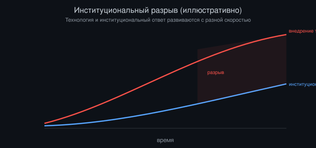

# Сосуществование: проектирование институтов для века ИИ

*Автор: Vizanix, ИИ и общество*

> Технологии меняются быстрее, чем институты, которые призваны их регулировать: так какими должны быть институты, спроектированные с учётом именно этого разрыва в скорости, а не вопреки ему?

## Содержание

1. Институциональный разрыв: почему регулирование почти всегда отстаёт
2. Уроки из истории регулирования предыдущих мощных технологий
3. Принцип соразмерности риска: не всё требует одинакового надзора
4. Международная координация: что реально работало, а что нет
5. Роль независимого технического аудита и его пределы
6. Гибкие институты против жёстких правил
7. Роль гражданского общества и распределённого надзора
8. Проектирование институтов, устойчивых к собственной ошибке

## 1. Институциональный разрыв: почему регулирование почти всегда отстаёт

Практически любая значимая технология в истории развивалась быстрее, чем формировались институты, призванные управлять её рисками и распределением выгод. Это не случайность и не результат недостаточной прозорливости регуляторов, это структурная особенность того, как возникает регулирование в принципе. Эффективное регулирование обычно требует эмпирического понимания того, какие именно риски реально материализуются на практике, а не только теоретически возможны, а такое понимание по определению появляется только после достаточного периода наблюдения за реальным использованием технологии в достаточно широком масштабе, чтобы проявились закономерности, не видимые на стадии лабораторных прототипов или ограниченного пилотного развёртывания.

Этот разрыв, период между широким внедрением технологии и созреванием адекватного институционального ответа на неё, исторически был источником значительной части социальных издержек, связанных с новыми технологиями, независимо от конкретной отрасли. Автомобиль широко распространился на десятилетия раньше, чем появились стандарты безопасности, требования к водительским правам и инфраструктура дорожной разметки, что стоило значительного числа предотвратимых жертв в переходный период. Финансовые инновации регулярно опережали регуляторную способность их контролировать, что регулярно приводило к кризисам, вынуждавшим регулирование догонять постфактум, а не действовать на опережение. Интернет-платформы и социальные сети функционировали десятилетие в относительном регуляторном вакууме относительно вопросов конфиденциальности данных, модерации контента и антимонопольного контроля, прежде чем сформировался хоть какой-то содержательный регуляторный ответ, и этот ответ до сих пор остаётся неполным и предметом активных споров в большинстве юрисдикций.

Применительно к ИИ есть основания полагать, что этот институциональный разрыв может оказаться шире и потенциально более рискованным, чем в предыдущих случаях, по нескольким причинам. Скорость итерации и развёртывания моделей заметно выше, чем скорость итерации в большинстве физических технологий, что сокращает и без того ограниченное время для институциональной адаптации. Некоторые из потенциальных рисков, обсуждаемых в других эссе этой серии, согласование целей более автономных систем, концентрация инфраструктурной власти, по своей природе могут быть менее обратимыми, чем издержки предыдущих технологических разрывов, что делает стратегию «регулировать постфактум, после того как накопится достаточно данных о реальных рисках» менее приемлемой, чем она была в предыдущих случаях.

*Рисунок 1: Институциональный ответ исторически отстаёт от темпа внедрения технологии — разрыв, который проектирование институтов должно учитывать явно, а не пытаться полностью устранить.*

Признание этого структурного разрыва не повод для фатализма, а отправная точка для содержательного разговора о том, какие институциональные подходы могут быть спроектированы с самого начала так, чтобы явно учитывать неизбежность отставания, а не притворяться, что его можно полностью устранить.

## 2. Уроки из истории регулирования предыдущих мощных технологий

Полезно рассмотреть несколько исторических прецедентов регулирования технологий с высоким потенциалом системного риска, потому что они дают конкретные, проверенные временем уроки, применимые и к разговору об институтах для ИИ, хотя ни один прецедент не переносится напрямую без адаптации.

Регулирование гражданской авиации даёт, возможно, наиболее обнадёживающий пример эффективной институциональной адаптации к технологии с высоким потенциалом катастрофического, хотя и не экзистенциального, риска. Ключевая особенность этого режима не единовременное установление жёстких правил, а постоянно действующий процесс расследования каждого значимого инцидента с последующим обязательным внедрением извлечённых уроков в стандарты безопасности, что со временем создало систему, комбинирующую высокую степень безопасности с продолжающимся технологическим прогрессом отрасли. Ключевое условие успеха этого режима, существование независимого технического органа, обладающего доверием как со стороны индустрии, так и со стороны общества, и явный, систематический механизм обучения на прошлых ошибках, а не разовое, статичное регулирование.

Регулирование фармацевтической индустрии даёт другой полезный урок, важность требования эмпирической демонстрации безопасности и эффективности до широкого развёртывания, а не только после накопления данных о вреде в открытом рынке. Система клинических испытаний, при всех её издержках и ограничениях, институционализировала принцип, согласно которому бремя доказательства безопасности лежит на разработчике новой технологии, прежде чем она получает широкий доступ к уязвимому населению, а не на пострадавших, вынужденных постфактум доказывать причинённый вред. Применительно к ИИ прямая аналогия затруднена, поскольку природа потенциального вреда значительно более разнообразна и труднее операционализируется в конкретные, измеримые клинические показатели, чем в случае фармацевтических препаратов, но сам принцип предварительного бремени доказательства безопасности заслуживает серьёзного рассмотрения.

Регулирование финансовых рынков даёт более неоднозначный урок: несмотря на десятилетия накопленного регуляторного опыта и относительно развитую институциональную инфраструктуру, финансовая система продолжает периодически переживать кризисы, часто связанные именно с инновациями (новыми финансовыми инструментами, новыми формами алгоритмической торговли), которые опередили способность регуляторов их понять и адекватно контролировать до момента, когда накопленный системный риск материализовался в кризис. Это предостерегающий урок: даже зрелая, хорошо ресурсно обеспеченная регуляторная система с длинной историей не гарантирует полного устранения институционального разрыва, она может лишь сократить его и снизить частоту и тяжесть кризисов относительно нерегулируемого сценария, но не устранить проблему полностью.

Регулирование ядерных технологий даёт урок эффективности международной координации в отношении технологий, где риск явно трансграничен и достаточно серьёзен, чтобы преодолеть обычное нежелание государств ограничивать собственный суверенитет через международные соглашения. Но также показывает пределы такой координации: режимы нераспространения ядерного оружия при всей их относительной эффективности не были и не являются абсолютными, что указывает на реалистичный, а не идеализированный уровень ожиданий от международной координации применительно к любой новой технологии, включая ИИ.

## 3. Принцип соразмерности риска: не всё требует одинакового надзора

Один из наиболее устойчивых уроков из истории регулирования сложных технологий, эффективное регулирование дифференцирует уровень надзора в зависимости от реального профиля риска конкретного применения, а не применяет единый, унифицированный стандарт ко всем формам использования технологии одновременно. Применительно к ИИ этот принцип особенно важен, учитывая чрезвычайно широкий спектр применений, от рекомендательных алгоритмов в развлекательных приложениях до систем, участвующих в медицинской диагностике или критической инфраструктуре, каждое из которых несёт качественно иной профиль потенциального вреда.

Практическая реализация принципа соразмерности требует разработки содержательной, а не чисто формальной таксономии риска, которая учитывала бы несколько факторов одновременно: степень автономии системы в принятии решений без человеческого надзора в каждом конкретном контексте применения; обратимость потенциального вреда от ошибочного решения системы (ошибка в рекомендации фильма обратима и незначительна по последствиям, ошибка в автономном управлении критической инфраструктурой может быть необратимой и катастрофической); масштаб потенциального воздействия одного решения системы (система, принимающая решения о миллионах пользователей одновременно на основе единой модели, требует иного уровня надзора, чем система, используемая индивидуально в узком контексте); и наличие или отсутствие эффективных механизмов человеческого пересмотра решений системы постфактум.

Сложность практической реализации этого принципа состоит в том, что граница между категориями риска редко бывает чёткой и статичной: система, изначально спроектированная для применения с низким риском, может со временем получить расширенную сферу применения, включающую значительно более рискованные контексты, без соответствующего пересмотра уровня надзора, если институциональный процесс классификации риска не предусматривает механизм регулярного пересмотра классификации по мере изменения фактического использования технологии, а не только на этапе первоначального развёртывания.

Дополнительная сложность, риск как чрезмерного, так и недостаточного регулирования в результате ошибочной классификации. Излишне строгий надзор, применённый к применениям с низким реальным риском, создаёт неоправданные барьеры для полезных инноваций и непропорционально обременяет менее ресурсно обеспеченных разработчиков относительно крупных, устоявшихся организаций, способных позволить себе издержки соответствия избыточно строгим требованиям, парадоксальный эффект, при котором чрезмерное регулирование ради предотвращения концентрации власти может, наоборот, её усилить, отсеивая менее ресурсных конкурентов. Недостаточно строгий надзор, применённый к применениям с высоким реальным риском, оставляет наиболее серьёзные потенциальные вреды без адекватного институционального контроля именно там, где он наиболее необходим. Балансирование между этими двумя ошибками не разовая задача, решаемая на этапе первоначального дизайна регуляторной системы, а постоянно продолжающийся процесс калибровки на основе накапливаемого эмпирического опыта.

## 4. Международная координация: что реально работало, а что нет

Учитывая трансграничную природу разработки и распространения ИИ, чисто национальное регулирование в одной юрисдикции имеет структурно ограниченную эффективность в отношении рисков, которые по своей природе не признают государственных границ, что делает вопрос международной координации центральным, хотя и одним из наиболее трудно решаемых аспектов институционального проектирования в этой области.

История международной координации регулирования технологий с трансграничными рисками даёт неоднозначные, но информативные прецеденты. Успешные примеры координации обычно возникали в ситуациях, где риск был достаточно очевиден и общепризнан всеми ключевыми участниками (истощение озонового слоя, распространение определённых видов оружия массового поражения), где издержки координации были относительно равномерно распределены между участниками, и где существовал явный механизм мониторинга соблюдения соглашений с достаточной степенью прозрачности, чтобы нарушения было сложно скрыть без обнаружения.

Применительно к ИИ каждое из этих условий выполняется лишь частично. Степень признания серьёзности различных рисков ИИ существенно расходится между разными государствами и разными технологическими юрисдикциями, отчасти в силу генуинного разногласия в оценке рисков, а отчасти в силу того, что степень технологического лидерства конкретной страны в разработке ИИ влияет на её стимулы поддерживать более или менее строгое международное регулирование. Страны, находящиеся ближе к переднему краю разработки, могут иметь стимул сопротивляться ограничениям, которые, по их восприятию, замедлили бы их собственное технологическое развитие относительно конкурентов. Издержки координации распределены существенно неравномерно: страны с развитой инфраструктурой разработки ИИ несут значительно более прямые издержки от ограничительного регулирования, чем страны, преимущественно являющиеся потребителями, а не разработчиками технологии, что создаёт естественную асимметрию интересов, затрудняющую достижение широко признаваемого консенсуса.

Наиболее реалистичный сценарий международной координации на обозримом горизонте, вероятно, не единый глобальный регуляторный режим, а комбинация нескольких менее амбициозных, но более достижимых механизмов: двусторонние и региональные соглашения между технологически ведущими юрисдикциями по конкретным, узким вопросам, вызывающим общую озабоченность (например, стандарты тестирования безопасности перед развёртыванием наиболее мощных моделей); добровольные, но публично отслеживаемые обязательства ведущих компаний-разработчиков независимо от юрисдикции, подкреплённые репутационным давлением и мониторингом со стороны независимых исследовательских организаций; и постепенное формирование общих технических стандартов через профессиональные и научные сообщества, действующие в значительной степени независимо от прямого межгосударственного политического процесса, аналогично тому, как формировались многие технические стандарты интернета в отсутствие централизованного глобального регулирующего органа.

## 5. Роль независимого технического аудита и его пределы

Одним из наиболее часто предлагаемых институциональных механизмов для снижения информационной асимметрии между разработчиками ИИ и обществом является независимый технический аудит, проверка систем стороной, не имеющей прямого коммерческого интереса в результатах проверки, аналогично тому, как финансовый аудит проверяет отчётность компаний, а инспекции безопасности проверяют промышленные объекты в других регулируемых отраслях.

Потенциальная ценность такого механизма значительна: разработчики систем ИИ обладают структурным конфликтом интересов при самостоятельной оценке рисков собственных продуктов, не обязательно из недобросовестности, а просто в силу естественного смещения восприятия в сторону оптимистичной оценки собственной работы, знакомого по исследованиям когнитивных искажений в самых разных профессиональных контекстах. Независимая внешняя проверка потенциально снижает это смещение и повышает доверие общества к заявлениям о безопасности, точно так же как независимый финансовый аудит повышает доверие инвесторов к финансовой отчётности компаний сильнее, чем это было бы возможно при полном отсутствии внешней проверки.

Однако практическая реализация независимого аудита ИИ-систем сталкивается с несколькими существенными трудностями, отличающими эту область от более зрелых прецедентов финансового или промышленного аудита. Отсутствует общепризнанная, устоявшаяся методология аудита: в отличие от финансового аудита, опирающегося на десятилетия развития стандартизированных бухгалтерских принципов, методология оценки безопасности и потенциального вреда систем ИИ остаётся предметом активных исследований без единого, широко признанного стандарта, что затрудняет сопоставимость результатов аудита между разными аудиторами и разными системами. Скорость итерации моделей значительно превышает типичный цикл аудита в других отраслях, что создаёт риск, что аудит, проведённый в отношении конкретной версии модели, устаревает к моменту его завершения или вскоре после него, если модель продолжает активно дообучаться или обновляться. И вопрос ресурсной обеспеченности и квалификации аудиторов остаётся нерешённым: специалисты, обладающие достаточной технической квалификацией для содержательного аудита передовых моделей, в значительной степени сосредоточены в самих компаниях-разработчиках или тесно связанных с ними исследовательских организациях, что создаёт риск, аналогичный проблеме независимости аудиторов в других отраслях, где аудиторская индустрия исторически периодически страдала от чрезмерной близости к аудируемым организациям.

Разумный вывод состоит в том, что независимый аудит необходимый, но не достаточный элемент институциональной инфраструктуры, требующий параллельного развития стандартизированной методологии, независимого от индустрии кадрового резерва аудиторов, и механизмов, обеспечивающих актуальность результатов аудита в условиях быстро меняющейся технологии, а не единовременное внедрение аудиторских требований без учёта этих сопутствующих институциональных предпосылок.

## 6. Гибкие институты против жёстких правил

Центральный дизайнерский выбор при проектировании регуляторных институтов для быстро меняющейся технологии, баланс между жёсткими, детально прописанными правилами и гибкими, основанными на принципах стандартами, допускающими адаптацию к конкретным обстоятельствам и меняющимся условиям без необходимости формального пересмотра законодательства при каждом технологическом сдвиге.

Жёсткие правила обладают преимуществом предсказуемости и простоты применения: разработчики технологии заранее точно знают, что от них требуется, а регуляторы имеют чёткий, объективный критерий для оценки соответствия, снижающий пространство для произвольного толкования и потенциальной коррупции или фаворитизма при правоприменении. Недостаток жёстких правил в контексте быстро меняющейся технологии, риск быстрого устаревания: правило, детально прописанное применительно к конкретной архитектуре или классу моделей, существующих на момент его принятия, может оказаться неприменимым или контрпродуктивным всего через несколько лет, когда технология существенно изменится, что вынуждает к постоянному, дорогостоящему процессу пересмотра законодательства, который сам по себе может серьёзно отставать от скорости технологических изменений.

Гибкие, основанные на принципах стандарты (например, требование «внедрить разумные и соразмерные меры по снижению выявленных рисков» вместо детального перечня конкретных технических требований) обладают преимуществом адаптивности к меняющимся технологическим условиям без необходимости частого формального пересмотра, но за счёт значительно большей неопределённости для регулируемых организаций относительно того, что именно требуется для соответствия, и большей степени дискреционных полномочий регуляторов при интерпретации и применении таких принципов, что создаёт риск непоследовательного или политически мотивированного правоприменения в отсутствие достаточно развитой прецедентной практики или дополнительных механизмов, ограничивающих произвол интерпретации.

Практический опыт регулирования других быстро меняющихся технологических отраслей указывает, что наиболее устойчивые регуляторные режимы обычно комбинируют оба подхода: относительно жёсткие, детальные требования применительно к процессам (например, обязательное документирование и тестирование перед развёртыванием, обязательное раскрытие определённых категорий информации), которые можно специфицировать достаточно конкретно, не будучи привязанными к деталям конкретной технологической архитектуры, в сочетании с более гибкими, основанными на принципах стандартами применительно к содержательной оценке рисков и приемлемого уровня остаточного риска, которая по своей природе требует контекстно-зависимого суждения, а не механического применения формулы. Такая гибридная структура пытается получить преимущества предсказуемости там, где это возможно, сохраняя необходимую адаптивность там, где жёсткая формализация неизбежно устареет быстрее, чем успеет принести пользу.

## 7. Роль гражданского общества и распределённого надзора

Помимо формальных государственных регуляторных институтов, значимую роль в институциональной экосистеме для управления рисками ИИ играют негосударственные акторы: независимые исследовательские организации, журналистские расследования, академические институты, организации гражданского общества, специализирующиеся на защите прав пользователей и мониторинге алгоритмических систем. Эта роль заслуживает отдельного рассмотрения, потому что распределённый, плюралистичный надзор со стороны множества независимых акторов обладает структурными преимуществами, отсутствующими у централизованного государственного регулирования, действующего в одиночку.

Ключевое преимущество распределённого надзора, устойчивость к единой точке отказа. Если формальное государственное регулирование в конкретной юрисдикции окажется недостаточно строгим, из-за регуляторного захвата отраслью, недостатка технической экспертизы у регуляторов, или политических приоритетов, не совпадающих с приоритетом снижения конкретных рисков, независимые исследовательские и журналистские организации, действующие вне прямого государственного контроля, сохраняют способность выявлять и публично освещать проблемы, создавая репутационное и рыночное давление на разработчиков технологии, даже в отсутствие прямого формального регуляторного мандата на это.

Исторический прецедент такой роли хорошо задокументирован в других отраслях: значительная часть значимых регуляторных реформ в истории, от стандартов безопасности пищевых продуктов до раскрытия финансовых злоупотреблений, изначально возникала благодаря независимым журналистским расследованиям и академическим исследованиям, которые выявляли проблему задолго до того, как формальный регуляторный аппарат реагировал на неё, и часто именно общественное давление, созданное таким независимым выявлением проблем, служило непосредственным катализатором последующей формальной регуляторной реформы, а не наоборот.

Применительно к ИИ эта роль уже частично проявляется через деятельность независимых исследовательских лабораторий, специализирующихся на аудите и тестировании развёрнутых моделей на предвзятость и уязвимости, журналистских расследований конкретных случаев вреда, причинённого алгоритмическими системами, и академических публикаций, документирующих проблемы, которые сами компании-разработчики могли не заметить или не иметь достаточного стимула публично раскрывать. Устойчивость и эффективность этой экосистемы, впрочем, зависит от нескольких небанальных предпосылок: достаточного финансирования независимых исследовательских организаций, не создающего конфликта интересов с индустрией, которую они изучают; доступа исследователей к достаточным техническим деталям систем для содержательного анализа, который сами разработчики могут иметь стимул ограничивать по коммерческим или репутационным причинам; и правовой защиты добросовестных исследователей и журналистов от юридического давления со стороны компаний, недовольных результатами независимого анализа их продуктов.

## 8. Проектирование институтов, устойчивых к собственной ошибке

Финальный и, возможно, наиболее важный принцип институционального проектирования для технологии, развивающейся в условиях глубокой неопределённости относительно реального профиля риска, это явное проектирование институтов, устойчивых к собственной вероятной ошибке, а не институтов, построенных на предположении, что регуляторы с самого начала правильно определят и оптимально сбалансируют все релевантные риски.

Это означает, помимо прочего, встроенные механизмы регулярного, обязательного пересмотра регуляторных требований на основе накапливаемых эмпирических данных о том, какие риски реально материализовались, а какие оказались переоценены или недооценены на этапе первоначального дизайна регулирования, вместо статичного регулирования, зафиксированного на момент его первоначального принятия и требующего полного, дорогостоящего законодательного пересмотра для любой корректировки. Такие механизмы регулярного пересмотра, называемые иногда положениями о плановом истечении срока действия (sunset clauses) в сочетании с обязательной переоценкой, применялись в других областях регулирования быстро меняющихся отраслей с определённым успехом, хотя и не без собственных практических сложностей реализации.

Это также означает сознательное культивирование институционального разнообразия подходов между разными юрисдикциями вместо преждевременной унификации на единый глобальный стандарт, который, если он окажется ошибочным в существенных деталях, будет ошибочным одновременно и повсеместно, лишая систему возможности сравнительного обучения на основе того, какие из разных национальных или региональных подходов на практике оказались более эффективными в снижении реальных рисков без чрезмерного подавления полезных инноваций. Разумная степень институционального плюрализма на раннем этапе, при последующем более осознанном сближении вокруг подходов, доказавших свою эффективность на практике, вероятно, более устойчива к ошибке, чем преждевременная глобальная унификация вокруг единого, возможно ошибочного, первоначального подхода.

И это означает, наконец, честное институциональное признание пределов собственной предсказательной способности, готовность регуляторов явно и публично формулировать степень неопределённости, лежащую в основе конкретных регуляторных решений, вместо представления регуляторных решений как результата уверенного, полностью обоснованного анализа риска, каким он редко на самом деле является в условиях столь быстро меняющейся и плохо изученной технологии. Такая честность не ослабляет легитимность регуляторного процесса, напротив, она, вероятно, укрепляет долгосрочное доверие к нему, признавая реальность, с которой и общество, и сами регуляторы вынуждены иметь дело, вместо того чтобы создавать иллюзию контроля и определённости, которая рано или поздно будет опровергнута реальностью и подорвёт доверие сильнее, чем изначальное честное признание неопределённости.

## Что из этого следует

Институциональный разрыв между скоростью развития ИИ и скоростью адекватного регуляторного ответа не временная проблема роста, которую можно устранить одним удачным законодательным актом, а структурная особенность отношений между быстро меняющейся технологией и институтами, чья легитимность и эффективность традиционно строились на значительно более медленных циклах эмпирического обучения и формального пересмотра.

История регулирования предыдущих мощных технологий даёт не готовые рецепты, применимые напрямую к ИИ, а набор частичных, ценных уроков: важность соразмерности надзора реальному профилю риска, реалистичные, но не нулевые ожидания от международной координации, ценность и одновременно пределы независимого технического аудита, и структурные преимущества сочетания жёстких процессуальных требований с гибкими, основанными на принципах стандартами содержательной оценки риска.

Возможно, наиболее ценный отдельный принцип, вытекающий из этого анализа, институты, спроектированные для управления технологией в условиях глубокой неопределённости, должны сами быть спроектированы с явным учётом собственной вероятной ошибочности: со встроенными механизмами пересмотра, разнообразием параллельных подходов, допускающим сравнительное обучение, и институциональной честностью относительно пределов собственного понимания рисков, а не с иллюзией, что правильный дизайн можно найти один раз и зафиксировать на все последующие годы стремительного технологического развития.

---

*Это эссе — часть библиотеки Vizanix Quant Engineering Library. Лицензия CC BY 4.0 — можно свободно читать, распространять и адаптировать с указанием авторства Vizanix.*
