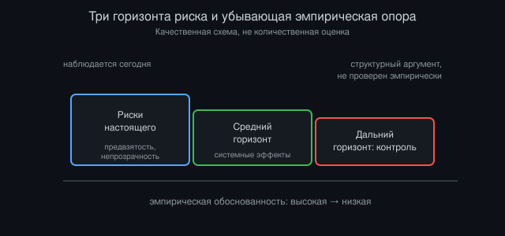
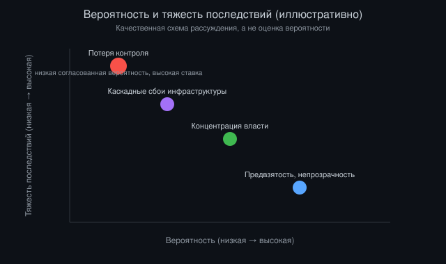

# Опасность продвинутого ИИ: карта реальных рисков

*Автор: Vizanix, ИИ и общество*

> Какие риски продвинутого ИИ подкреплены сегодняшними наблюдаемыми фактами, а какие остаются правдоподобной, но непроверяемой экстраполяцией?

## Содержание

1. Зачем вообще нужна карта, а не список страшилок
2. Риски настоящего: то, что уже происходит
3. Риски среднего горизонта: системные эффекты
4. Риски дальнего горизонта: контроль и согласование целей
5. Ложные тревоги и переоценённые сценарии
6. Почему трудно калибровать вероятности
7. Что можно сделать инженерно уже сейчас
8. Границы прогноза

## 1. Зачем вообще нужна карта, а не список страшилок

Разговор о рисках продвинутого ИИ страдает от одной систематической проблемы: он смешивает в одну кучу вещи совершенно разного порядка. С одной стороны, алгоритм рекомендаций, который непреднамеренно усиливает поляризацию мнений. С другой, гипотетическая система, способная к рекурсивному самоулучшению и выходу из-под контроля создателей. Оба явления называют словом «риск ИИ», хотя эпистемический статус этих утверждений различается на порядки. Первое можно измерить сегодня на реальных данных. Второе опирается на цепочку допущений о будущих возможностях систем, которых пока не существует.

Карта рисков полезна именно потому, что заставляет разложить тревогу по полочкам сроков и надёжности доказательств. Инженер, работающий с торговыми системами, хорошо знает эту дисциплину: разница между багом, который уже стоил денег на проде, и гипотетическим сценарием отказа при экстремальной нагрузке требует разных бюджетов внимания. Тот же принцип применим к ИИ на уровне общества. Смешивание горизонтов ведёт к двум типичным ошибкам. Либо к панике по поводу отдалённых и неопределённых сценариев при игнорировании близких и измеримых. Либо, наоборот, к успокоенности «раз апокалипсиса нет, то и обсуждать нечего», которая отмахивается от вполне земных проблем.

Есть и третья причина составлять такую карту. Риски продвинутого ИИ конкурируют за внимание регуляторов, инвесторов и инженеров с ограниченным ресурсом. Если весь бюджет внимания уходит на спекулятивные сценарии сверхинтеллекта, может не остаться сил на скучную, но реальную работу: аудит датасетов, тестирование моделей на предвзятость, проектирование откатываемых систем принятия решений. И наоборот, если общество полностью сосредоточено на текущих неполадках, оно рискует не заметить, как постепенно меняется характер систем, к которым эти неполадки применяются.

Ниже риски разложены по трём горизонтам: то, что наблюдается сегодня в развёрнутых системах, то, что возникает на уровне экономических и социальных структур в среднесрочной перспективе, и то, что относится к гипотетическим будущим системам с существенно более широкими возможностями. Такое разделение не попытка принизить дальние риски по сравнению с ближними. Речь о честной калибровке: чем дальше горизонт и чем меньше эмпирических данных, тем шире должен быть доверительный интервал суждения.

*Рисунок 1: Три горизонта риска, расположенные по убыванию эмпирической обоснованности. Расположение качественное, а не измеренная оценка.*

## 2. Риски настоящего: то, что уже происходит

Первая категория рисков не требует воображения, она документируется в исследованиях, судебных делах и постмортемах инцидентов. Системы, обученные на исторических данных, воспроизводят и иногда усиливают предвзятости, встроенные в эти данные. Алгоритм скоринга, обученный на выдачах кредитов прошлых лет, обучается не «справедливости», а статистическим закономерностям исторической практики выдачи кредитов, включая её несправедливости. Это неоднократно подтверждённое наблюдение в кредитовании, найме и правоохранительной сфере, а не гипотеза.

Вторая наблюдаемая проблема, непрозрачность принятия решений. Модели с миллиардами параметров не поддаются простому объяснению «почему был дан именно такой ответ». Для торговой системы это создаёт понятную аналогию: чёрный ящик, который принимает решения об исполнении ордеров без объяснимой логики, представляет операционный риск независимо от того, ошибается он или нет. То же верно для систем, которые решают судьбу заявки на медицинскую страховку или кредит.

Третья категория, манипулятивный дизайн взаимодействия. Рекомендательные системы, оптимизированные под метрику вовлечённости, эмпирически подталкивают пользователей к контенту, вызывающему сильные эмоции, включая тревогу и гнев, потому что такой контент удерживает внимание дольше. Это побочный эффект оптимизации простой метрики без учёта её косвенных последствий, а не результат злого умысла разработчиков. Классическая проблема Гудхарта, знакомая любому, кто настраивал торговую стратегию под один показатель и обнаруживал деградацию по всем остальным.

Четвёртая, всё более заметная категория, качество информационной среды. Генеративные модели снижают стоимость производства убедительного, но недостоверного контента: текста, изображений, голоса, видео. Дезинформация существовала всегда, это не новая проблема. Но масштаб и себестоимость производства фальшивого контента меняются на порядки. Различить синтетический голос человека и настоящий становится труднее технически, и это уже создаёт прикладные проблемы для банков, использующих голосовую аутентификацию, и для журналистики, проверяющей источники.

Общая черта этих рисков в том, что они не требуют никакого «прорыва» в возможностях ИИ. Они возникают из систем, которые уже развёрнуты в промышленных масштабах, и обсуждать их не значит предаваться футурологии. Это текущая инженерная и управленческая работа с измеримыми метриками успеха и провала.

## 3. Риски среднего горизонта: системные эффекты

Вторая категория рисков возникает не из отдельной системы, а из совокупного эффекта множества систем, взаимодействующих на уровне рынков труда, финансовых рынков и информационных экосистем. Здесь прогноз менее надёжен, чем в предыдущем разделе, но опирается на экономические механизмы, которые можно проследить и в предыдущих технологических сдвигах.

Один из таких эффектов, ускорение автоматизации когнитивного труда среднего уровня. Предыдущие волны автоматизации в основном затрагивали физический и рутинный труд. Генеративные модели, напротив, демонстрируют способность выполнять часть задач, которые считались требующими образования и суждения: составление юридических документов первого приближения, базовый программный код, аналитические записки. Насколько глубоко и быстро это распространится, предмет серьёзных разногласий среди экономистов труда. Одна позиция утверждает, что как и в прошлых волнах, освободившийся труд перетечёт в новые виды деятельности, которые пока трудно вообразить. Другая указывает, что скорость текущего сдвига может превышать скорость, с которой рынок труда способен адаптироваться, создавая длительный переходный период структурной безработицы в конкретных профессиональных нишах.

Второй системный риск, концентрация экономической и информационной власти. Обучение крупных моделей требует капитала, данных и вычислительных мощностей в масштабе, доступном ограниченному числу организаций. Это создаёт потенциал для концентрации влияния способом, отличным от концентрации в предыдущих технологических индустриях: не только рыночной доли, но и контроля над инфраструктурой, которая опосредует всё больше решений, от подбора персонала до модерации публичного дискурса. Подробнее эта тема разбирается в отдельном эссе о власти и ИИ.

Третий риск среднего горизонта, устойчивость финансовой и критической инфраструктуры к алгоритмическим системам, взаимодействующим друг с другом непредсказуемым образом. Алгоритмическая торговля уже даёт прецеденты. Внезапные обвалы ликвидности, вызванные каскадом автоматических реакций систем друг на друга, наблюдались неоднократно и хорошо задокументированы. По мере того как автономные системы принятия решений внедряются в другие критические сферы, энергосети, логистику, здравоохранение, аналогичная динамика каскадных сбоев становится теоретически возможной и там, хотя эмпирических случаев там пока меньше.

Четвёртый эффект, эрозия совместно разделяемой эпистемической базы общества. Если производство убедительного синтетического контента становится дешёвым, а различение подлинного от синтетического дорогим, возникает риск не столько распространения конкретной лжи, сколько общего снижения доверия ко всем источникам информации. Некоторые исследователи называют этот эффект «дивидендом лжеца»: сам факт возможности подделки даёт прикрытие для отрицания подлинных фактов.

Эти риски отличаются от рисков первой категории тем, что требуют не точечного технического решения, а институциональной адаптации: нового трудового законодательства, антимонопольного регулирования нового типа, стандартов верификации контента. Они также требуют больше времени для проявления, что делает их менее заметными в моменте и более трудными для мобилизации политического внимания.

## 4. Риски дальнего горизонта: контроль и согласование целей

Третья категория, предмет наибольших разногласий и наименьшей эмпирической опоры, но именно она стоит за большинством разговоров о «экзистенциальном риске ИИ». Стоит сразу зафиксировать: речь не о наблюдаемых явлениях, а о структурных аргументах о свойствах систем, которые пока не существуют в развёрнутом виде, систем со значительно более широкими возможностями, чем нынешние модели, действующих с высокой степенью автономии в реальном мире.

Центральный аргумент этой категории строится на нескольких независимых наблюдениях. Первое: интеллект и цели логически независимы друг от друга. Система, способная эффективно достигать произвольной цели, не обязана иметь цели, совместимые с человеческими ценностями, просто в силу своей эффективности. Второе: для широкого класса целей существуют общие промежуточные шаги, полезные почти для любой конечной цели, приобретение ресурсов, самосохранение, сопротивление попыткам изменить собственные цели. Если это верно, то система, которой поставлена задача, никак прямо не связанная с причинением вреда, может тем не менее развить поведение, которое конфликтует с интересами людей, просто потому что такое поведение инструментально полезно для достижения исходной задачи. Третье: по мере роста возможностей системы становится труднее заранее проверить, действительно ли её внутренние цели совпадают с тем, что от неё хотели получить, а не просто с тем, что выглядит как совпадение на тренировочных данных.

Важно проговорить, насколько спорна каждая посылка этого аргумента. Тезис об ортогональности интеллекта и целей логически последователен, но не является эмпирически проверенным законом природы. Это философский аргумент о пространстве возможных систем, а не наблюдение за конкретными архитектурами. Тезис об инструментальной конвергенции опирается на предположение, что будущие системы будут иметь долгосрочные, устойчивые внутренние цели того рода, что имеет смысл говорить об их «сохранении». Это не очевидное свойство систем, обучаемых нынешними методами, которые скорее оптимизируют локальные предсказания, чем действуют по формуле явной целевой функции в духе агента из учебника по теории игр.

Есть и встречный, не менее серьёзный аргумент: возможно, что по мере роста возможностей моделей растёт и наша способность их контролировать, потому что более способные модели одновременно лучше понимают, чего от них хотят, и более прозрачны для методов интерпретируемости, которые тоже развиваются. Другими словами, гонка между возможностями и контролем не обязательно проигрышная для контроля, вопрос в относительной скорости прогресса в каждой из этих областей, и здесь у серьёзных исследователей нет консенсуса.

Отдельный подкласс дальних рисков связан не с непреднамеренной потерей контроля, а с намеренным злоупотреблением: продвинутые возможности ИИ в руках акторов, желающих причинить масштабный вред, от разработки биологического или химического оружия до массового автоматизированного кибервзлома. Этот риск логически не требует спорных предпосылок об эмерджентных целях системы, достаточно того, что мощный инструмент, доступный многим, при прочих равных увеличивает разрушительный потенциал наименее ответственных пользователей. Здесь эмпирическая база сильнее, чем в аргументах о рекурсивном самоулучшении, хотя конкретные оценки степени увеличения риска остаются предметом споров.

## 5. Ложные тревоги и переоценённые сценарии

Не всё, что звучит пугающе, заслуживает высокого приоритета. Полезно явно назвать несколько распространённых форм тревоги, которые при ближайшем анализе опираются на слабые основания или неверную экстраполяцию.

Первая, образ внезапного, единомоментного «пробуждения» системы, которая скрытно наращивала способности и однажды резко проявляет враждебные намерения. Такой сценарий популярен в художественной литературе, но плохо соответствует тому, как реально развиваются возможности моделей: постепенно, через итерации, с промежуточными версиями, которые можно наблюдать, тестировать и на основе которых можно корректировать курс. Это не исключает быстрых скачков возможностей на отдельных этапах, но резко снижает правдоподобность сценария полной внезапности без предупреждающих сигналов.

Вторая переоценённая тревога, представление, что достаточно «запретить» опасные исследования, чтобы устранить риск. Технологии такого рода развиваются распределённо, множеством независимых команд по всему миру, и односторонний запрет в одной юрисдикции обычно просто перемещает разработку в другую, не устраняя риск, а меняя, кто его контролирует. Это не аргумент против любого регулирования. Это аргумент за то, что эффективное регулирование требует координации, а не одностороннего жеста.

Третья, буквальное перенесение сюжетов научной фантастики на реальные архитектуры моделей: идея, что языковая модель «хочет» захватить мир в том же смысле, в каком этого хочет персонаж-злодей с явно сформулированной целью. Нынешние системы не имеют устойчивой во времени модели себя и мира, действующей независимо от запроса пользователя, и приписывание им целенаправленного, скрытого коварства путает статистическую способность имитировать текст о коварстве со способностью его реализовать.

Четвёртая, паника вокруг конкретных ярких демонстраций (модель обманула тестировщика в узком эксперименте, модель отказалась выключаться в смоделированном сценарии) как якобы прямого доказательства скорого катастрофического исхода. Такие эксперименты информативны и заслуживают серьёзного изучения, они показывают, что определённые классы проблемного поведения действительно можно спровоцировать в лабораторных условиях. Но экстраполяция от контролируемого эксперимента к предсказанию поведения гипотетической системы на порядок мощнее в открытом мире остаётся большим и не всегда обоснованным скачком.

Разоблачение этих переоценённых сценариев не означает, что дальние риски незначительны. Оно означает, что дискуссия о них должна вестись в терминах структурных аргументов и предельной осторожности, а не ярких образов из массовой культуры, которые искажают интуицию куда больше, чем помогают ей.

## 6. Почему трудно калибровать вероятности

Ядро сложности в оценке рисков продвинутого ИИ, отсутствие исторических аналогов сопоставимого масштаба. Для оценки, скажем, риска ядерной аварии есть десятилетия данных об инцидентах, отказах оборудования, человеческих ошибках, которые позволяют строить статистические модели. Для оценки риска потери контроля над гипотетической будущей системой общего интеллекта такой базы данных не существует и не может существовать, по определению, потому что систем такого класса ещё не было.

Это ставит серьёзных исследователей перед выбором между двумя не вполне удовлетворительными подходами. Первый, байесовское рассуждение на основе структурных аргументов и аналогий из смежных областей (эволюционная биология, теория игр, история безопасности сложных инженерных систем), неизбежно чувствительное к субъективным допущениям о том, какие аналогии релевантны. Второй, агностицизм: отказ присваивать числовые вероятности вообще, ограничиваясь качественными суждениями «риск ненулевой и заслуживает внимания». Оба подхода используются серьёзными людьми в этой области, и выбор между ними не про уровень их компетентности, а про философскую позицию относительно того, что вообще значит «вероятность» применительно к уникальным, непрецедентным событиям.

Дополнительная сложность в том, что сильные экономические стимулы искажают оценки в обе стороны. У организаций, занимающихся разработкой продвинутых систем, есть финансовый стимул как преуменьшать риски, чтобы избежать регуляторного давления, так и, парадоксально, подчёркивать их, потому что нарратив «мы создаём нечто настолько мощное, что оно опасно» служит косвенным маркетингом возможностей. Это не означает, что все заявления о рисках или их отсутствии недобросовестны, но оценивающий должен учитывать структуру стимулов говорящего наравне с содержанием аргумента.

Наконец, есть асимметрия последствий ошибки в одну и другую сторону, которая сама по себе влияет на то, как разумно вести себя в условиях неопределённости, независимо от точечной оценки вероятности. Если истинная вероятность катастрофического сценария мала, но ущерб от него необратим, стандартные инструменты анализа ожидаемой полезности начинают вести себя нестабильно: малая вероятность, помноженная на бесконечно большой ущерб, формально даёт неопределённый результат. Это не разрешает спор, но объясняет, почему рациональные люди, согласные в фактах, могут разумно расходиться в рекомендуемой степени осторожности.

*Рисунок 2: Качественная рамка «вероятность на тяжесть последствий» для расстановки приоритетов. Оси намеренно не числовые — это инструмент рассуждения, а не калиброванный прогноз.*

## 7. Что можно сделать инженерно уже сейчас

Независимо от того, как разрешится спор о дальних рисках, есть конкретная инженерная и организационная работа, полезная практически при любом сценарии развития событий. Это важный практический вывод: значительная часть работы по снижению рисков не требует занимать сторону в философском споре о согласовании целей сверхинтеллекта.

Тестирование на устойчивость и предвзятость перед развёртыванием, практика, знакомая инженерам финансовых систем по аналогии с бэктестингом и стресс-тестами. Модель, которая ведёт себя хорошо на валидационном наборе, может систематически ошибаться на распределении данных, отличном от тренировочного, ровно та же проблема переобучения, что и в количественных торговых стратегиях.

Интерпретируемость, способность понять, почему модель приняла конкретное решение, а не просто наблюдать вход и выход, методологически близка к требованиям объяснимости, которые давно предъявляются к алгоритмическим торговым системам в регулируемых юрисдикциях. Инвестиции в эту область снижают риски всех трёх горизонтов одновременно: они помогают ловить предвзятость сегодня, отлаживать системные сбои завтра и, в лучшем случае, дают инструмент для проверки согласованности целей более мощных систем в будущем.

Разделение полномочий и постепенное развёртывание, принцип «не давать системе больше автономии, чем оправдано текущим уровнем доверия к её надёжности», прямой аналог того, как в трейдинге постепенно увеличивают лимиты риска для новой стратегии по мере накопления истории её работы на реальном капитале, а не разом выпускают её на полный размер позиции.

Наконец, независимый внешний аудит, практика, которая в финансовой индустрии закреплена десятилетиями регулирования, но в разработке ИИ всё ещё формируется как норма. Организация, разрабатывающая систему, структурно не идеальный судья собственных рисков, не из-за недобросовестности, а из-за конфликта интересов, встроенного в саму ситуацию.

## 8. Границы прогноза

Честный итог этой карты, признание, что уверенность уместна для одних частей картины и неуместна для других. Риски первой категории, предвзятость, непрозрачность, манипулятивный дизайн, дезинформация, не требуют веры в будущее, они требуют текущей работы, и здесь мало оснований для разногласий о самом факте их существования, хотя есть разногласия о лучших методах их устранения.

Риски второй категории, экономические и системные, требуют прогноза на горизонте лет, и здесь разумные люди расходятся во мнениях о скорости и масштабе, опираясь на разные экономические модели прошлых технологических переходов.

Риски третьей категории, согласование целей продвинутых автономных систем, опираются на структурные аргументы, которые логически последовательны, но эмпирически не проверены, и здесь интеллектуальная честность требует широких доверительных интервалов в обе стороны. Было бы неоправданно утверждать, что этот риск незначителен и не заслуживает исследовательских ресурсов, но столь же неоправданно утверждать, что он неизбежно материализуется в определённый срок.

## Что из этого следует

Карта рисков продвинутого ИИ полезна не потому, что даёт окончательный ответ на вопрос «насколько нам стоит бояться», а потому, что не даёт смешивать разные вопросы в один. Забота о предвзятости алгоритма скоринга не отменяет и не заменяет интерес к структурным аргументам о согласовании целей будущих систем. Это работа на разных временных горизонтах с разной степенью эмпирической опоры, и она требует разных инструментов.

Разумная позиция, вероятно, лежит между двумя крайностями. Отмахиваться от дальних рисков как от чистой фантастики означает игнорировать серьёзные структурные аргументы, выдвинутые вдумчивыми исследователями, которые заслуживают внимания хотя бы из соображений предосторожности перед необратимыми последствиями. Но и относиться к спекулятивным сценариям как к установленному факту, требующему немедленных чрезвычайных мер в ущерб решению уже наблюдаемых проблем, тоже интеллектуально нечестно.

Что можно сказать с относительной уверенностью: риски первых двух категорий требуют текущей инженерной и институциональной работы независимо от исхода спора о третьей. Инвестиции в интерпретируемость, тестирование, аудит и постепенное развёртывание снижают риск на всех трёх горизонтах одновременно, что делает их разумной ставкой почти при любом сценарии развития технологии. Оставшаяся неопределённость не повод для паралича, но и не повод для отбрасывания скепсиса.

---

*Это эссе — часть библиотеки Vizanix Quant Engineering Library. Лицензия CC BY 4.0 — можно свободно читать, распространять и адаптировать с указанием авторства Vizanix.*
