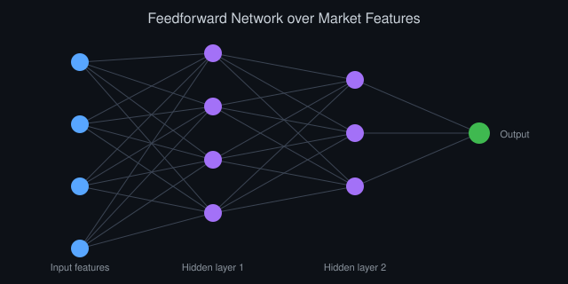

# Процветание с ИИ: реалистичный взгляд на изобилие

*Автор: Vizanix, ИИ и общество*

> Если ИИ действительно резко снижает стоимость интеллектуального труда, что должно произойти в экономике, чтобы это превратилось в широко разделяемое благополучие, а не в очередной виток концентрации выигрыша?

## Содержание

1. Разница между производительностью и процветанием
2. Исторический прецедент: чему учат предыдущие технологические скачки
3. Механизм изобилия: где именно возникает выигрыш
4. Условия, при которых выигрыш распределяется широко
5. Условия, при которых выигрыш концентрируется
6. Сценарий для конкретных секторов: здравоохранение, наука, производство
7. Ловушки оптимистичного нарратива
8. Что реально измеримо уже сейчас

## 1. Разница между производительностью и процветанием

Разговор об «изобилии» благодаря ИИ часто путает два разных утверждения. Первое, техническое: системы ИИ могут резко снизить предельную стоимость определённых видов интеллектуального труда, от составления юридического документа до диагностики заболевания по снимку. Это утверждение относительно легко проверить, и во многих узких доменах оно уже подтверждено эмпирически. Второе утверждение, социально-экономическое: снижение стоимости труда автоматически транслируется в широко разделяемое повышение благосостояния. Это утверждение куда менее очевидно, и история технологических революций даёт смешанные примеры в обе стороны.

Разница принципиальна. Производительность, это техническая характеристика системы: сколько единиц полезного результата производится на единицу затраченного труда или капитала. Процветание, это распределительная характеристика общества: как этот прирост результата делится между теми, кто владеет технологией, теми, кто её применяет, и теми, чей труд она заменяет. Между ростом первого и ростом второго не существует автоматической связи, она опосредована конкретными институтами: трудовым законодательством, налоговой системой, структурой рынков, антимонопольной политикой, доступом к образованию.

Мировая экономика двадцатого века дала оба вида примеров. Механизация сельского хозяйства резко подняла производительность на одного работника, и в сочетании с индустриализацией, профсоюзным движением и системами перераспределения это в итоге привело к повышению уровня жизни в развитых странах на протяжении нескольких поколений, хотя переходный период для конкретных вытесненных фермерских хозяйств был болезненным и растянутым на десятилетия. В то же время отдельные технологические сдвиги, от контейнеризации грузоперевозок до автоматизации отдельных производств, приводили к резкому росту прибыли компаний-инноваторов при стагнации доходов вытесненных категорий работников, чей труд не был легко переориентирован на новые ниши.

Применительно к ИИ вопрос не в том, вырастет ли производительность. По многим направлениям это уже наблюдаемый факт, а не прогноз. Вопрос в том, какие институциональные условия определят, пойдёт ли этот прирост на широкое повышение уровня жизни, концентрированное обогащение узкого круга владельцев инфраструктуры, или на что-то среднее и неравномерное по секторам и географии. Это эссе, попытка разобрать механизм, а не просто зафиксировать надежду.

## 2. Исторический прецедент: чему учат предыдущие технологические скачки

Полезно рассмотреть три предыдущих технологических перехода и то, чем каждый из них отличался структурно от нынешнего.

Промышленная революция автоматизировала физический труд с помощью механических устройств, которые требовали больших капитальных вложений в физическую инфраструктуру: заводы, станки, транспортные сети. Это создавало естественный барьер для входа новых игроков, но также означало, что выигрыш от автоматизации в значительной степени концентрировался у владельцев капитала на протяжении первых десятилетий, пока политическая борьба, трудовое законодательство, право на организацию профсоюзов, прогрессивное налогообложение, не привела к более широкому распределению выигрыша через заработную плату и социальные программы. Этот процесс занял не годы, а десятилетия, и сопровождался реальными социальными потрясениями.

Компьютерная революция и последующая интернет-революция автоматизировали значительную часть рутинного информационного труда и радикально снизили стоимость распространения информации. Барьер входа для создания программного продукта был относительно низким, в отличие от промышленной революции, и это позволило возникнуть широкому классу новых компаний и, в некоторых секторах, более широко распределённому выигрышу. Но одновременно эта же революция создала беспрецедентную концентрацию ценности в руках нескольких платформенных компаний, чья экономика характеризуется сетевыми эффектами: чем больше пользователей, тем ценнее платформа, что создаёт естественную тенденцию к олигополии.

ИИ на основе крупных моделей структурно ближе ко второму прецеденту, чем к первому, но с важным отличием: обучение самых мощных моделей требует капитальных затрат на вычисления, данные, специализированные кадры, сопоставимых по масштабу с промышленными, в то время как их последующее применение имеет структуру предельных издержек, близкую к программному обеспечению. Это гибридная структура, которая не имеет точного исторического аналога: высокий барьер входа на уровне создания фундаментальной технологии, но потенциально низкий барьер на уровне её прикладного использования через открытые интерфейсы и, для некоторых моделей, открытые веса.

Это гибридное сочетание, ключ к пониманию, почему прогнозы о процветании с ИИ так сильно расходятся у разных аналитиков. Один взгляд фокусируется на уровне создания технологии и предсказывает концентрацию, аналогичную индустриальной эпохе. Другой фокусируется на уровне применения и предсказывает широкое распространение выигрыша, аналогичное программной индустрии. Оба взгляда описывают реальный, но частичный аспект той же системы.

## 3. Механизм изобилия: где именно возникает выигрыш

Чтобы понять, кому достаётся выигрыш, полезно проследить конкретный механизм, через который ИИ создаёт экономическую ценность, а не рассуждать об «изобилии» абстрактно.

Первый механизм, снижение предельной стоимости конкретных задач. Если модель может выполнить черновой перевод документа, первичный анализ юридического контракта или базовую диагностику по медицинскому изображению за секунды и на порядки дешевле человеческого труда, стоимость выполнения этой конкретной задачи падает. Кто получает выигрыш от этого падения, зависит от структуры рынка данной задачи. Если рынок конкурентный, выигрыш в основном переходит к потребителю услуги через снижение цены. Если рынок концентрированный, например услугу предоставляет единственный поставщик с патентованной технологией, выигрыш в основном остаётся у поставщика.

Второй механизм, расширение доступа к экспертизе, которая раньше была дефицитной и дорогой. Юридическая консультация базового уровня, персонализированное образовательное сопровождение, первичная медицинская консультация: эти услуги традиционно были ограничены количеством квалифицированных специалистов и, соответственно, дороги. Если ИИ способен предоставить приемлемое качество этих услуг по значительно более низкой цене, выигрыш достаётся в первую очередь тем, кто раньше не мог себе позволить доступ к этой экспертизе вообще. Потенциально мощный эффект выравнивания, а не концентрации, при условии, что технология действительно доступна широко, а не только состоятельным пользователям премиальных продуктов.

Третий механизм, ускорение научного и инженерного прогресса за счёт автоматизации части исследовательского цикла: генерации гипотез, анализа данных, симуляции. Здесь выигрыш проявляется не сразу и не напрямую в виде цены конкретного продукта, а опосредованно, через более быстрое появление новых лекарств, материалов, технологий, эффект от которых распределяется по всей экономике с задержкой в годы.

Четвёртый механизм, о котором часто забывают в оптимистичных нарративах, это перераспределение ренты от труда к капиталу в задачах, где ИИ заменяет, а не дополняет человеческий труд. Здесь выигрыш достаётся владельцам технологии и капитала, применяющего эту технологию, а не тем, чей труд был вытеснен, если только не существует институционального механизма перераспределения этого выигрыша, через налоги, социальные программы или переговорную силу работников.

Важно, что все четыре механизма действуют одновременно, в разных секторах и с разной интенсивностью, что делает единый прогноз для «экономики в целом» довольно грубым упрощением. Реалистичный анализ требует смотреть сектор за сектором.

## 4. Условия, при которых выигрыш распределяется широко

История и экономическая теория дают несколько условий, при которых технологический прирост производительности исторически транслировался в широко разделяемое повышение уровня жизни, а не только в рост прибыли узкого круга владельцев.

Первое условие, конкурентная структура рынка на уровне применения технологии. Если множество компаний могут применять одну и ту же базовую технологию, например через открытые API или открытые модели, для конкуренции друг с другом за клиентов, конкуренция снижает цены и переносит часть выигрыша к потребителям, а не удерживает его целиком у поставщика базовой технологии.

Второе условие, гибкость рынка труда и наличие механизмов переобучения. Если работники, чей труд был автоматизирован, могут относительно быстро переместиться в смежные виды деятельности с помощью доступного образования и переквалификации, переходный период социальных издержек короче, а совокупный эффект автоматизации на общество ближе к чистому выигрышу, чем к перераспределению убытков на конкретную группу людей.

Третье условие, наличие институтов перераспределения, которые направляют часть прироста производительности на социальные программы, инфраструктуру и общественные блага, доступные широкому кругу населения, а не только тем, кто непосредственно владеет капиталом или обладает навыками работы с новой технологией. Прогрессивное налогообложение, государственное образование, системы социального страхования исторически выполняли эту функцию в разных странах с разным успехом.

Четвёртое условие, политический процесс, способный корректировать распределение выигрыша по мере того, как становится ясно, кто оказывается в выигрыше, а кто в проигрыше. Это условие часто недооценивается в чисто экономическом анализе, но исторически именно политическая борьба, а не автоматическое действие рынка, определяла, будет ли выигрыш от промышленной революции распределён через рост заработной платы и трудовое законодательство или останется сконцентрированным.

Применительно к ИИ ни одно из этих условий не выполняется автоматически. Каждое требует сознательного институционального выбора со стороны компаний, регуляторов, образовательных систем, и результат далеко не предопределён технологией самой по себе.

## 5. Условия, при которых выигрыш концентрируется

Симметрично полезно назвать условия, при которых прирост производительности от новой технологии исторически вёл к концентрации выигрыша, а не к его широкому распространению.

Первое, высокий и растущий барьер входа на уровне создания базовой технологии. Если обучение самых способных моделей требует вычислительных ресурсов, доступных лишь горстке организаций с достаточным капиталом, и если разрыв в возможностях между лидерами и остальными не сокращается, а увеличивается со временем, это создаёт структуру рынка, близкую к олигополии на уровне инфраструктуры, даже если применение технологии выглядит конкурентным на поверхности.

Второе, сетевые эффекты и эффекты данных. Модели, обученные на большем объёме данных пользовательского взаимодействия, могут становиться качественнее, что привлекает больше пользователей, что даёт больше данных. Самоусиливающийся цикл, знакомый по платформенной экономике интернета. Если этот эффект силён для ИИ-продуктов, он благоприятствует ранним лидерам и затрудняет вход новых конкурентов независимо от того, насколько открыт доступ к базовой технологии.

Третье, скорость автоматизации, превышающая скорость институциональной адаптации. Если рынок труда, образовательные системы и системы социальной защиты не успевают адаптироваться к темпу вытеснения конкретных профессий, возникает продолжительный переходный период структурной безработицы, в течение которого выигрыш производительности реализуется в первую очередь как рост прибыли, а издержки перехода несут вытесненные работники непропорционально.

Четвёртое, политическая экономия влияния. Компании, контролирующие критическую инфраструктуру ИИ, приобретают не только экономическое, но и политическое влияние: способность формировать регуляторную среду в свою пользу. Это может создать самоусиливающуюся динамику, в которой концентрация экономической власти конвертируется в способность предотвращать те самые регуляторные меры, антимонопольные, налоговые, трудовые, которые исторически были нужны для более широкого распределения выигрыша от предыдущих технологических революций.

Оба набора условий, благоприятствующих широкому распределению и благоприятствующих концентрации, действуют одновременно в реальной экономике, и итоговый баланс, вероятно, будет сильно варьироваться по странам и секторам в зависимости от конкретной регуляторной и рыночной среды, а не определится единым глобальным исходом.

## 6. Сценарий для конкретных секторов: здравоохранение, наука, производство

Абстрактные рассуждения об «изобилии» становятся конкретнее, если проследить их через несколько отраслей, где потенциальный эффект ИИ уже начинает проявляться в конкретных прикладных данных, а не только в прогнозах.

В здравоохранении системы анализа медицинских изображений уже демонстрируют качество диагностики, сопоставимое с опытными специалистами в отдельных узких задачах, например в выявлении определённых типов патологий на рентгеновских снимках или снимках сетчатки. Гипотетический сценарий изобилия здесь выглядит так: диагностическая помощь такого уровня становится доступной в регионах, где сегодня остро не хватает квалифицированных специалистов, значительно расширяя доступ к раннему выявлению заболеваний. Но реализация этого сценария зависит от регуляторного одобрения, интеграции в существующую систему здравоохранения и, что немаловажно, от того, будет ли эта диагностика действительно дешёвой и доступной, или превратится в премиальный платный сервис, доступный только тем, кто уже имеет хороший доступ к медицине.

В научных исследованиях модели, способные предлагать гипотезы о структуре белков или свойствах материалов, потенциально ускоряют цикл открытия в областях, где раньше требовались годы экспериментального перебора. Признанный публично прогресс в предсказании структуры белков показывает, что такое ускорение реально достижимо в конкретных узких доменах. Гипотетический эффект изобилия здесь, ускорение появления новых лекарств и материалов, эффект от которого, однако, реализуется с задержкой в годы клинических испытаний и производственного масштабирования, а не мгновенно.

В производстве и логистике оптимизация цепочек поставок и предиктивное обслуживание оборудования с помощью моделей ИИ уже даёт измеримое снижение издержек в компаниях, внедривших эти системы. Эффект здесь ближе к традиционной автоматизации: выигрыш достаётся в первую очередь владельцам капитала и, косвенно, потребителям через снижение цен на конечные товары, при этом создавая переходные издержки для работников, чьи задачи автоматизируются напрямую.

Общий вывод из этих трёх примеров: эффект изобилия реален и уже частично наблюдаем, но крайне неравномерен по секторам, темпу реализации и по тому, кто именно захватывает выигрыш в каждом конкретном случае. Единая нарративная линия «ИИ принесёт изобилие» скрывает эту существенную неоднородность.

## 7. Ловушки оптимистичного нарратива

Есть несколько типичных логических ошибок, которые часто встречаются в оптимистичных прогнозах об изобилии с ИИ, и их стоит явно назвать.

Первая, экстраполяция лабораторных демонстраций на массовое внедрение без учёта времени и издержек интеграции. Впечатляющая демонстрация того, что модель способна решить сложную задачу в контролируемых условиях, не означает автоматического и быстрого внедрения этой способности в реальные рабочие процессы, которые требуют надёжности, регуляторного одобрения, доверия пользователей и интеграции с существующей инфраструктурой, процесс, который исторически занимает годы даже для однозначно полезных технологий.

Вторая, предположение, что снижение стоимости производства автоматически означает снижение цены для потребителя. Это верно только в условиях достаточной конкуренции на рынке. Если рынок конкретного приложения ИИ монополизирован или олигополизирован, компания-поставщик может удерживать высокую цену, захватывая разницу между снижением себестоимости и ценой как дополнительную прибыль, а не передавая выигрыш потребителю.

Третья, игнорирование распределительного вопроса под лозунгом «пирог станет больше для всех». Рост совокупного экономического пирога не гарантирует, что доля каждой группы в этом пироге не уменьшится. Теоретически возможен сценарий, в котором абсолютное благосостояние большинства людей немного растёт, а неравенство при этом резко увеличивается, потому что выигрыш узкой группы растёт непропорционально быстрее.

Четвёртая, недооценка переходных издержек. Даже если долгосрочный эффект технологии положителен для общества в целом, конкретные люди, чьи навыки обесцениваются в процессе перехода, несут реальные, немедленные и часто необратимые издержки: потерю дохода, статуса, идентичности, связанной с профессией. Оптимистичный долгосрочный прогноз не отменяет реальность этих краткосрочных издержек для конкретных людей.

## 8. Что реально измеримо уже сейчас

При всей неопределённости долгосрочных прогнозов, есть несколько показателей, которые можно и нужно отслеживать уже сегодня, чтобы понимать, в какую сторону движется баланс между широким распределением и концентрацией выигрыша.

Динамика концентрации рынка в отраслях, где ИИ внедряется наиболее активно: растёт ли доля рынка нескольких лидеров или, наоборот, появляются новые конкуренты, использующие ту же базовую технологию. Динамика реальной заработной платы и структуры занятости в профессиях, наиболее подверженных автоматизации: насколько быстро высвобождаемые работники находят новую занятость и на каких условиях. Доступность и цена ИИ-опосредованных услуг в секторах вроде здравоохранения и образования: становятся ли они действительно дешевле и доступнее для широких слоёв населения или остаются премиальным продуктом. И, наконец, институциональная адаптация: появляются ли новые формы трудового регулирования, налогообложения капитала, социальной защиты, соразмерные масштабу происходящего сдвига, или регуляторный процесс отстаёт от скорости технологических изменений.

Эти показатели не дадут окончательного ответа на вопрос «принесёт ли ИИ процветание», потому что ответ, вероятно, не будет единым для всей экономики сразу. Он будет разным для разных секторов, стран и социальных групп, и будет формироваться постепенно, а не проявится как единое событие.

## Что из этого следует

Заявление, что ИИ автоматически приведёт к всеобщему процветанию, столь же необоснованно, как и заявление, что он автоматически приведёт к массовому обнищанию большинства при обогащении немногих. Оба исхода технически возможны, оба имеют исторические прецеденты в предыдущих технологических революциях, и то, какой из них реализуется, определяется не самой технологией, а институциональными решениями, которые общество делает в процессе её внедрения.

Ключевое отличие ИИ от предыдущих технологических скачков, гибридная структура затрат, при которой создание базовой технологии концентрировано, а её применение потенциально широко распределено. Это делает исход менее предопределённым, чем в случае чисто капиталоёмких технологий индустриальной эпохи, но не гарантирует широкого распределения выигрыша само по себе.

Честная позиция состоит в том, что реальный эффект ИИ на процветание будет крайне неравномерным, по секторам, по географии, по временному горизонту, и что этот эффект в значительной степени формируется решениями, которые ещё не приняты: о структуре рынков, о трудовом регулировании, о доступе к переобучению, о налогообложении капитала, высвобождаемого автоматизацией. Оптимизм и пессимизм здесь менее полезны, чем внимание к конкретным институциональным рычагам, которые определят фактический исход в ближайшие годы.

---

*Это эссе — часть библиотеки Vizanix Quant Engineering Library. Лицензия CC BY 4.0 — можно свободно читать, распространять и адаптировать с указанием авторства Vizanix.*
