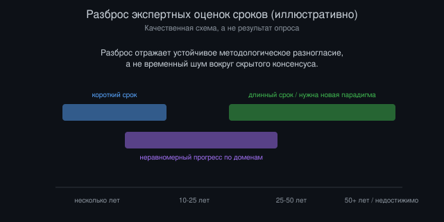

# Сверхинтеллект: сроки, неопределённость и скромность прогнозов

*Автор: Vizanix, ИИ и общество*

> Почему серьёзные, компетентные люди, глядя на одни и те же данные о прогрессе ИИ, дают оценки срока появления сверхинтеллекта, различающиеся на десятилетия, и что это расхождение само по себе говорит нам?

## Содержание

1. Что вообще имеется в виду под «сверхинтеллектом»
2. Методы прогнозирования и почему все они несовершенны
3. Разброс экспертных оценок: что он означает на самом деле
4. Аргументы за более короткие сроки
5. Аргументы за более длинные сроки или принципиальную недостижимость
6. Ловушка точечных прогнозов и польза сценарного мышления
7. Как жить и планировать в условиях глубокой неопределённости сроков
8. Что было бы разумно наблюдать, чтобы обновлять оценку

## 1. Что вообще имеется в виду под «сверхинтеллектом»

Прежде чем обсуждать сроки появления сверхинтеллекта, нужно разобраться, что именно подразумевается под этим термином, потому что расплывчатость определения одна из главных причин, по которой споры о сроках оказываются настолько бесплодными. В самом широком смысле термин обозначает гипотетическую систему, интеллектуальные способности которой значительно превосходят способности самого способного человека практически во всех значимых областях когнитивной деятельности, а не только в узких, специализированных задачах.

Это определение сразу же ставит несколько концептуальных проблем. «Интеллект» не единая, скалярная величина, которую можно измерить одним числом и по которой можно однозначно ранжировать системы разной природы. Человеческий интеллект сам по себе многомерен: способность к абстрактному математическому рассуждению, социальному пониманию, творческому синтезу, долгосрочному стратегическому планированию, разные способности, которые не всегда коррелируют друг с другом даже у людей, и нет очевидных оснований полагать, что они будут развиваться синхронно и у искусственных систем. Уже сегодня существуют узкие системы, значительно превосходящие любого человека в конкретных задачах, игре в шахматы или го, предсказании структуры белков, при этом радикально уступающие человеку в других задачах, требующих физического взаимодействия с неструктурированным миром или долгосрочного социального суждения. Вопрос не в том, существуют ли уже сегодня системы со сверхчеловеческими способностями в узком смысле, они существуют, а в том, возможна ли и когда именно система с сопоставимо превосходящими способностями одновременно по широкому спектру доменов, включая те, что сегодня остаются трудными для машин.

Важно также различать превосходство по скорости и объёму обработки информации от превосходства по качеству суждения в условиях неопределённости и плохо определённых целей. Компьютерные системы уже давно превосходят человека по скорости арифметических вычислений, это не считается «сверхинтеллектом» в интересующем нас смысле, потому что задача чётко определена и решается алгоритмически без необходимости в суждении в условиях неопределённости. Сверхинтеллект в интересующем нас смысле подразумевает превосходство именно в задачах, требующих суждения, стратегического планирования, генерации оригинальных идей в открытых, плохо определённых предметных областях, качественно иной класс способностей, чем чистая скорость вычислений.

Учитывая эту многомерность и концептуальную нечёткость, разумно с самого начала признать: вопрос «когда появится сверхинтеллект» на самом деле распадается на множество более узких вопросов о сроках достижения сверхчеловеческих способностей в разных конкретных доменах, и единый ответ на объединённый, размытый вопрос неизбежно будет менее осмысленным, чем ответы на составляющие его более узкие вопросы.

## 2. Методы прогнозирования и почему все они несовершенны

Существует несколько методологических подходов к прогнозированию сроков появления продвинутых возможностей ИИ, и полезно рассмотреть сильные и слабые стороны каждого, потому что понимание методологических ограничений необходимое условие для калиброванной оценки любого конкретного прогноза.

Экстраполяция трендов вычислительных мощностей и производительности моделей на бенчмарках, наиболее количественно строгий метод, опирающийся на наблюдаемые исторические темпы роста вычислительных ресурсов, используемых для обучения моделей, и соответствующего улучшения производительности на стандартизированных тестах способностей. Сильная сторона метода в том, что он опирается на реальные, измеримые данные, а не на субъективное мнение. Слабая сторона: экстраполяция предполагает, что исторический тренд продолжится с той же скоростью в будущем, что не гарантировано. Рост вычислительных мощностей может замедлиться из-за физических, энергетических или экономических ограничений, а улучшение бенчмарков может замедлиться, если дальнейший прогресс требует не просто больше вычислений, а качественно новых архитектурных или алгоритмических идей, темп появления которых сложнее экстраполировать количественно, чем темп роста вычислительных мощностей.

Опросы экспертов в области машинного обучения о их субъективных оценках сроков, метод, агрегирующий качественное суждение людей с наибольшей непосредственной экспертизой в разработке современных систем. Сильная сторона в том, что эксперты обладают инсайдерским знанием о текущих ограничениях технологии, недоступным сторонним наблюдателям. Слабая сторона: исторически прогнозы экспертов в области ИИ относительно сроков достижения значимых вех неоднократно оказывались как излишне оптимистичными (недооценка сложности задачи), так и излишне пессимистичными (недооценка скорости прогресса) в разные периоды истории области, и нет устойчивого паттерна систематического смещения в одну определённую сторону, который позволял бы просто скорректировать текущие оценки экспертов на известную поправку.

Структурные аргументы о необходимых предпосылках для достижения определённого уровня способностей, метод, опирающийся не на экстраполяцию текущих трендов, а на анализ того, какие принципиальные технические или научные прорывы необходимы для перехода от текущего состояния к сверхинтеллекту, и на оценку сложности достижения этих прорывов. Сильная сторона в том, что метод способен учитывать качественные, а не только количественные скачки, которые чисто количественная экстраполяция может пропустить. Слабая сторона: оценка сложности недостигнутого научного прорыва по самой своей природе крайне ненадёжна. История науки полна примеров, когда проблемы, казавшиеся сторонним наблюдателям неразрешимо сложными, решались неожиданно быстро после случайного инсайта, и наоборот, проблемы, казавшиеся близкими к решению, оставались нерешёнными десятилетиями.

*Рисунок 2: Три основных метода прогнозирования сроков, каждый с реальным преимуществом и реальным, задокументированным ограничением.*

Ни один из этих трёх методов не даёт надёжного, точного прогноза сам по себе, и это методологическое наблюдение не техническая деталь, а центральный факт, который должен формировать степень уверенности в любом конкретном прогнозе сроков, вне зависимости от того, кто именно его высказывает.

## 3. Разброс экспертных оценок: что он означает на самом деле

Опросы исследователей в области машинного обучения относительно сроков достижения различных порогов продвинутых возможностей ИИ систематически демонстрируют чрезвычайно широкий разброс индивидуальных оценок. Медианные оценки разных опрошенных групп специалистов по срокам достижения сопоставимых с человеческими широких когнитивных способностей варьируются от периода в считаные годы до периода в несколько десятилетий или дольше, при этом все респонденты обладают сопоставимым уровнем формальной экспертизы в данной области.

Такой широкий разброс среди компетентных наблюдателей заслуживает отдельного анализа, потому что он сам по себе информативен, причём информативен не в том смысле, что «правильный» ответ где-то посередине этого разброса. Медиана мнений экспертов не обязательно ближе к истине, чем крайние позиции, если разброс отражает не случайный шум вокруг общего согласия, а систематические, устойчивые разногласия по существенным методологическим и концептуальным вопросам.

Разброс в оценках сроков сверхинтеллекта в значительной части объясняется именно такими систематическими разногласиями, а не случайной неопределённостью вокруг общего консенсуса. Эксперты расходятся во мнениях о том, является ли текущий подход к разработке моделей (масштабирование объёма данных и вычислительных ресурсов при относительно консервативных архитектурных изменениях) достаточным путём к широким когнитивным способностям, или требуются принципиально новые архитектурные или алгоритмические идеи, отсутствующие в текущем инструментарии. Они расходятся во мнениях о том, насколько хорошо прогресс на стандартизированных бенчмарках предсказывает прогресс в реальных, плохо определённых, открытых задачах, которые сложнее операционализировать в измеримые тесты. И они расходятся в базовых философских интуициях о природе интеллекта и о том, достаточно ли статистического предсказания паттернов в данных для достижения способностей, качественно неотличимых от человеческого суждения в открытых ситуациях, или для этого требуется нечто принципиально иное в архитектуре системы.

*Рисунок 1: Качественная схема разброса экспертных оценок сроков. Полосы иллюстративны, это не результат конкретного опроса.*

Практический вывод из этого наблюдения: широкий разброс экспертных оценок сроков не является временным артефактом недостатка информации, который со временем сойдётся к консенсусу по мере накопления новых данных. Он отражает реальное, устойчивое философское и методологическое разногласие о природе самой задачи, и разумный наблюдатель должен относиться к любому конкретному точечному прогнозу, будь то оптимистичному или пессимистичному, с осторожностью, соразмерной этому разбросу, а не выбирать одну сторону спора просто потому, что она более убедительно или уверенно сформулирована.

## 4. Аргументы за более короткие сроки

Полезно явно изложить сильнейшую версию аргумента в пользу относительно короткого срока, измеряемого годами, а не десятилетиями, до достижения сверхчеловеческих широких когнитивных способностей, потому что этот аргумент опирается на реальные наблюдаемые тренды, а не только на энтузиазм.

Первый довод, наблюдаемое ускорение темпов улучшения производительности моделей на всё более широком классе задач за последние несколько лет, включая задачи, которые ещё недавно казались значительно более трудными для машин, чем оказались на практике: сложное математическое рассуждение, написание функционального программного кода, синтез информации из множества источников. Этот наблюдаемый темп прогресса, по мнению сторонников короткого срока, если экстраполировать его на несколько лет вперёд без предположения о скором замедлении, приводит к достижению широких сверхчеловеческих способностей в обозримом будущем.

Второй довод касается механизма ускоряющейся отдачи от инвестиций в разработку ИИ: по мере того как модели становятся более способными, они сами всё активнее используются как инструмент для ускорения разработки следующего поколения моделей, в написании кода, в анализе экспериментальных данных, в автоматизации части исследовательского процесса, что теоретически создаёт петлю положительной обратной связи, ускоряющую темп прогресса относительно чисто линейной экстраполяции, основанной только на росте вычислительных ресурсов и человеческого исследовательского труда.

Третий довод, экономический стимул: беспрецедентный объём капитала, вкладываемого ведущими организациями в разработку передовых моделей, привлекает значительно больше исследовательского таланта, вычислительных ресурсов и институционального внимания к этой области, чем когда-либо в истории, что само по себе является фактором, способным ускорить темп прогресса относительно исторических аналогов, где сопоставимый уровень ресурсов не концентрировался в такой степени на решении одной конкретной научно-технической задачи.

Слабость этого набора аргументов, отмечаемая даже некоторыми исследователями, в целом симпатизирующими более короткому сроку, состоит в том, что экстраполяция впечатляющего прогресса на конкретных, измеримых бенчмарках не гарантированно транслируется в столь же быстрый прогресс в способностях, которые труднее операционализировать в виде чёткого теста: долгосрочное стратегическое планирование в условиях реальной, неструктурированной неопределённости, физическая интуиция, требующая взаимодействия с реальным, а не только текстовым и визуальным миром, и надёжность суждения в ситуациях, принципиально отличающихся от чего-либо, встречавшегося в обучающих данных.

## 5. Аргументы за более длинные сроки или принципиальную недостижимость

Симметрично стоит изложить сильнейшую версию скептического аргумента, согласно которому широкий сверхинтеллект либо значительно дальше во времени, чем предполагают оптимистичные прогнозы, либо принципиально не достижим текущим классом методов машинного обучения без качественно иного технологического подхода.

Первый довод, упомянутая ранее проблема убывающей отдачи от масштабирования. Значительная часть впечатляющего прогресса последних лет объясняется масштабированием объёма данных и вычислительных ресурсов при относительно скромных архитектурных изменениях, а исторический опыт других инженерных областей (например, миниатюризация полупроводников) показывает, что подходы, основанные на масштабировании одного конкретного параметра, рано или поздно сталкиваются с убывающей отдачей и физическими или экономическими пределами. Нет твёрдой гарантии, что дальнейшее чистое масштабирование продолжит давать сопоставимые темпы улучшения способностей, а не столкнётся с замедлением, требующим качественно новых, пока не найденных идей для дальнейшего прогресса.

Второй довод касается разрыва между способностями, хорошо измеряемыми стандартизированными бенчмарками (математика, программирование, тесты по общим знаниям), и способностями, критически важными для реальной автономной деятельности в открытом мире: устойчивое долгосрочное планирование в условиях меняющихся обстоятельств, надёжное суждение в редких, ранее не встречавшихся ситуациях, физическое взаимодействие с неструктурированной средой. Скептики указывают, что прогресс в первой категории способностей, где легче измерить и оптимизировать результат, не гарантированно предсказывает сопоставимый прогресс во второй категории, которая исторически оказывалась значительно более трудной для машинного обучения, чем предполагала интуиция полувековой давности (парадокс Моравека, обсуждавшийся в другом эссе этой серии).

Третий довод, исторический паттерн неоправдавшихся оптимистичных прогнозов в самой истории области искусственного интеллекта. На протяжении второй половины двадцатого века периоды заметного технического прогресса неоднократно сопровождались оптимистичными прогнозами скорого достижения широкого интеллекта, сравнимого с человеческим, за которыми следовали периоды разочарования, когда реальный прогресс оказывался значительно медленнее, чем предсказывала экстраполяция текущих на тот момент трендов, паттерн, известный как чередование «вёсен» и «зим» в истории области. Это исторический прецедент, обязывающий к определённой доле скепсиса в отношении текущих оптимистичных экстраполяций, даже если текущий период прогресса объективно отличается по масштабу инвестиций и наблюдаемых результатов от предыдущих периодов оптимизма.

Четвёртый, более философский довод ставит под вопрос саму достижимость широкого сверхинтеллекта в рамках парадигмы обучения на статистических закономерностях в данных, произведённых людьми: если система обучается предсказывать и имитировать паттерны, присутствующие в человеческих данных, остаётся открытым концептуальный вопрос, может ли такая система в принципе превзойти качество суждения, представленное в её обучающих данных, в широком, а не только узком смысле, или её способности асимптотически ограничены качеством и разнообразием данных, на которых она обучена, что создаёт принципиальный, а не только количественный, предел для чисто статистического подхода к достижению широкого сверхчеловеческого интеллекта.

## 6. Ловушка точечных прогнозов и польза сценарного мышления

Учитывая широкий и устойчивый разброс экспертных мнений, разобранный в предыдущих разделах, разумно спросить, есть ли вообще смысл в попытках дать точечный прогноз срока появления сверхинтеллекта, или более продуктивным подходом было бы явное сценарное мышление, признающее множественность правдоподобных траекторий вместо единого прогноза.

Ловушка точечного прогноза психологическая и коммуникативная, а не только эпистемологическая. Конкретная дата или узкий диапазон дат звучит более убедительно и более пригодно для практического планирования, чем расплывчатое «где-то между несколькими годами и несколькими десятилетиями», и это создаёт стимул для прогнозирующих, исследователей, комментаторов, институтов, формулировать более точные оценки, чем реально оправдано их уровнем уверенности, просто потому что точные оценки лучше воспринимаются аудиторией и лучше конвертируются в заголовки, финансирование или политическое внимание. Это не обвинение в недобросовестности, это структурный стимул, действующий независимо от личных намерений конкретного прогнозирующего, и его стоит учитывать при оценке любого встреченного точечного прогноза.

Альтернативный подход, явное сценарное мышление, рассматривающее несколько качественно различных, но одинаково правдоподобных траекторий развития технологии, каждая из которых опирается на разные, явно сформулированные предположения о том, какие из перечисленных выше спорных методологических вопросов разрешатся тем или иным образом. Сценарий быстрого прогресса, в котором текущие темпы масштабирования продолжаются без существенного замедления в течение следующих нескольких лет и приводят к сверхчеловеческим широким способностям в этот же период. Сценарий существенного замедления, в котором масштабирование сталкивается с убывающей отдачей, а дальнейший прогресс требует новых, пока не найденных архитектурных идей, что растягивает временную шкалу на десятилетия. Сценарий неравномерного прогресса, в котором сверхчеловеческие способности достигаются быстро в одних узких доменах (например, математическое рассуждение и программирование), но остаются значительно более длинными по срокам в других (физическое взаимодействие с миром, долгосрочное автономное планирование), создавая длительный переходный период частично сверхчеловеческих, частично субчеловеческих систем, а не единый момент достижения широкого сверхинтеллекта сразу по всем направлениям.

Такое сценарное мышление не даёт точного ответа на вопрос «когда», но даёт значительно более полезную и интеллектуально честную рамку для планирования, чем ложная точность единого прогноза, скрывающего за собой реальную глубину методологической неопределённости.

## 7. Как жить и планировать в условиях глубокой неопределённости сроков

Практический вопрос, следующий из всего вышесказанного: как разумно действовать индивидуально и институционально в условиях, где надёжный прогноз срока появления сверхинтеллекта попросту недоступен, а не просто пока не вычислен более тщательным анализом.

Один принцип, робастность решений к широкому диапазону возможных сроков, а не оптимизация под конкретный точечный прогноз. Институциональные и исследовательские инвестиции в безопасность и согласование целей ИИ (обсуждаемые подробнее в отдельном эссе), например, разумны почти при любом сценарии сроков, они приносят пользу и если продвинутые системы появятся быстро, и если процесс растянется на десятилетия, потому что фундаментальные методы интерпретируемости и тестирования полезны для систем любого уровня возможностей, а не только для гипотетического финального сверхинтеллекта.

Второй принцип, избегание как излишней срочности, оправданной только самым агрессивным из правдоподобных сценариев сроков, так и излишней расслабленности, оправданной только самым консервативным сценарием. Решения, которые имеют смысл только при предположении, что сверхинтеллект появится в течение ближайших нескольких лет, рискуют оказаться неоправданными потраченными ресурсами, если реальный срок окажется значительно больше. Но и решения, откладывающие любую подготовку до появления более определённых сигналов, рискуют оказаться слишком запоздалыми, если реальный срок окажется на более коротком конце распределения правдоподобных оценок.

Третий принцип, сохранение эпистемической готовности пересматривать оценки по мере поступления новых наблюдений, а не фиксация на однажды сформированном мнении. Учитывая, что разброс мнений в значительной степени объясняется реальной научной неопределённостью, а не просто недостатком анализа, разумно ожидать, что собственная оценка срока должна меняться по мере того, как проясняются ответы на конкретные методологические вопросы, разобранные выше (продолжится ли эффективность чистого масштабирования, насколько хорошо прогресс на бенчмарках предсказывает прогресс в реальной автономной деятельности), а не оставаться статичной вне зависимости от новых данных.

## 8. Что было бы разумно наблюдать, чтобы обновлять оценку

Завершить этот разбор полезно перечислением конкретных, наблюдаемых индикаторов, которые давали бы основания для обновления оценки сроков в ту или иную сторону, вместо того чтобы оставлять вопрос чисто умозрительным.

Признаком, указывающим на более короткий срок, было бы устойчивое продолжение темпов улучшения на всё более широком классе задач, включая задачи, требующие долгосрочного автономного планирования в открытых, слабо структурированных условиях, а не только на задачах с чётко определённым, легко проверяемым правильным ответом, переход от впечатляющих узких демонстраций к устойчивой, воспроизводимой способности к автономной, многошаговой деятельности в разнообразных реальных контекстах.

Признаком, указывающим на более длинный срок или существенное замедление, было бы наблюдаемое снижение отдачи от дальнейшего масштабирования вычислительных ресурсов, то есть ситуация, когда сопоставимые по величине увеличения вычислительных затрат на обучение дают всё меньший прирост измеримых способностей, что указывало бы на приближение к пределу эффективности текущего архитектурного и алгоритмического подхода без появления новых прорывных идей для его преодоления.

Признаком, требующим специфического внимания независимо от общего направления пересмотра оценки, было бы появление задокументированных случаев, когда модели вносят существенный, самостоятельный вклад в исследования и разработку следующего поколения моделей без интенсивного прямого человеческого руководства на каждом шаге, конкретное наблюдение, которое напрямую относится к аргументу о рекурсивном самоулучшении, разбираемому в эссе о сингулярности, и которое давало бы более прямое, эмпирическое основание для оценки, чем чисто теоретические аргументы о такой возможности.

## Что из этого следует

Широкий, устойчивый разброс экспертных оценок сроков появления сверхинтеллекта не признак некомпетентности прогнозирующих и не повод игнорировать всю область прогнозирования как бесполезную. Это честное отражение реальной, глубокой методологической и философской неопределённости относительно природы интеллекта и того, достаточен ли текущий подход к машинному обучению для достижения широких, а не только узких сверхчеловеческих способностей.

Любой конкретный точечный прогноз, будь то через несколько лет или через несколько десятилетий, заслуживает скепсиса, соразмерного этому разбросу, и должен восприниматься не как установленный факт, а как одна из нескольких правдоподобных точек в широком распределении возможных траекторий, каждая из которых опирается на конкретные, явно проверяемые предположения о нерешённых научных и методологических вопросах.

Наиболее интеллектуально честная позиция состоит не в выборе одной стороны спора о сроках, а в признании, что решения о безопасности, регулировании и институциональной подготовке должны быть достаточно устойчивы к широкому диапазону возможных сроков, чтобы не терять ценность, если реальность окажется существенно более быстрой или существенно более медленной, чем предполагает любой конкретный сегодняшний прогноз.

---

*Это эссе — часть библиотеки Vizanix Quant Engineering Library. Лицензия CC BY 4.0 — можно свободно читать, распространять и адаптировать с указанием авторства Vizanix.*
