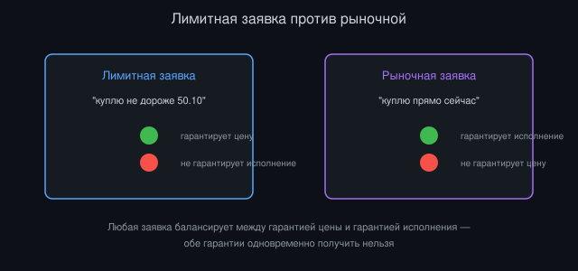
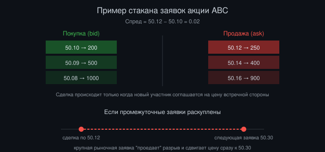
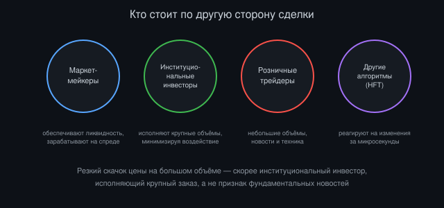

# Как устроены рынки: заявки, цены, участники

*Автор: Vizanix, уровень: начинающий*

> Вы разберётесь, как формируется цена на бирже, какие типы заявок существуют и почему рынок вообще движется.

## Содержание

1. Биржа как механизм сопоставления
2. Заявки: лимитные, рыночные и их разновидности
3. Как формируется цена сделки
4. Спред, ликвидность и глубина рынка
5. Кто выставляет заявки и зачем
6. Разные типы рынков: акции, фьючерсы, крипта
7. Что двигает цену на самом деле
8. Частые заблуждения новичков о ценообразовании

## 1. Биржа как механизм сопоставления

Биржа, это, по сути, программа для сведения покупателей и продавцов вместе. Она не устанавливает цену сама и не решает, кому и что продать. Она принимает от участников заявки на покупку и продажу и по чётким правилам сопоставляет их друг с другом. Представьте доску объявлений, где одни люди пишут "хочу продать велосипед за 100 у.е.", а другие "хочу купить велосипед за 95 у.е.". Биржа мгновенно ищет, есть ли на доске пара объявлений, чьи цены совпадают или пересекаются, и оформляет сделку между ними.

Механизм, которым большинство современных бирж сопоставляет заявки, называется centralized limit order book, или централизованная книга лимитных заявок. В разговорной речи это называют просто "стакан заявок". Все заявки на покупку и продажу конкретного актива стекаются в одну очередь, отсортированную по цене и, при равенстве цены, по времени поступления. Первая заявка по выгодной цене исполняется первой: этот принцип называется "цена-время приоритет" и лежит в основе честности биржевой торговли.

Биржа не покупает и не продаёт активы сама, стоит держать это в голове. Она только сопоставляет заявки друг с другом. Даже когда вы видите единую "текущую цену" актива на графике, за ней стоит последняя реально совершённая сделка между двумя конкретными участниками, а не решение какого-то центрального органа.

## 2. Заявки: лимитные, рыночные и их разновидности

Заявка, это инструкция бирже совершить сделку на определённых условиях. Два базовых типа заявок покрывают большинство ситуаций. Лимитная заявка (limit order) говорит: "куплю не дороже такой-то цены" или "продам не дешевле такой-то цены". Она гарантирует цену, но не гарантирует, что сделка вообще произойдёт: если никто не согласится на ваши условия, заявка просто будет ждать в очереди.

Рыночная заявка (market order) говорит: "куплю прямо сейчас по любой доступной цене" или "продам прямо сейчас по любой доступной цене". Она гарантирует, что сделка произойдёт немедленно, но не гарантирует конкретную цену. Если ликвидности мало, вы можете купить по цене значительно хуже той, что видели на экране секунду назад.

Кроме этих двух базовых типов, биржи предлагают множество производных. Стоп-заявка исполняется как рыночная, как только цена достигает заданного уровня. Стоп-лимит работает похоже, но превращается в лимитную заявку, а не в рыночную. Заявка с исполнением "всё или ничего" требует полного объёма сразу, иначе отменяется. Для начинающего важно усвоить главное различие: любая заявка балансирует между гарантией цены и гарантией исполнения, обе гарантии одновременно получить нельзя.

*Рисунок 2: лимитная заявка гарантирует цену, но не исполнение, рыночная заявка гарантирует исполнение, но не цену.*

## 3. Как формируется цена сделки

Представьте, что в стакане сейчас лучшая заявка на покупку акции ABC стоит 50.10, а лучшая заявка на продажу, 50.12. Это означает, что прямо сейчас никто не готов купить по 50.12 и никто не готов продать по 50.10. Сделка происходит только тогда, когда появляется новый участник, готовый принять существующую цену: например, кто-то отправляет рыночную заявку на покупку, и она автоматически сопоставляется с лучшей заявкой на продажу по цене 50.12.

Цена сделки всегда равна цене одной из уже стоявших в очереди заявок, а не какому-то среднему значению. Если новый покупатель согласен на цену продавца, сделка происходит по цене продавца. График цены, который вы видите, это последовательность таких точечных сделок, соединённых линией для наглядности. Между сделками цена не "существует" в буквальном смысле, есть только диапазон цен, на который согласны текущие участники по обе стороны стакана.

Отсюда и важный факт: цена актива может резко "прыгнуть", если между двумя последовательными сделками в стакане не было заявок на промежуточных уровнях. Представьте, что после сделки по 50.12 следующая лучшая заявка на продажу стоит уже 50.30, потому что все промежуточные заявки были быстро раскуплены. Крупная рыночная заявка на покупку в этот момент "проест" весь этот промежуток и сдвинет цену сделки сразу к 50.30.

*Рисунок 1: конкретный стакан заявок ABC со спредом в два цента и сценарий резкого скачка цены при исчезновении промежуточных заявок.*

## 4. Спред, ликвидность и глубина рынка

Разницу между лучшей ценой покупки и лучшей ценой продажи называют спредом (spread). В нашем примере спред между 50.10 и 50.12 равен двум центам. Узкий спред обычно говорит о высокой ликвидности актива: многие участники готовы торговать им прямо сейчас, конкуренция за лучшую цену высока. Широкий спред, наоборот, говорит о низкой ликвидности. Желающих торговать мало, разница между ценой покупки и продажи растёт, а вместе с ней растёт и стоимость входа и выхода из позиции для любого участника.

Ликвидность это не только про спред, но и про глубину рынка (market depth): сколько объёма стоит на каждом уровне цены в стакане. Представьте два актива с одинаковым узким спредом в один цент. У первого на лучшем уровне цены стоит заявка на миллион долларов объёма, у второго на тысячу долларов. Захотите купить актив на десять тысяч долларов, в первом случае цена почти не сдвинется, во втором вы "проедите" несколько уровней цены и заплатите значительно больше средней цены.

Для алгоритмического трейдера понимание глубины рынка критично, потому что размер вашей собственной заявки может сам по себе двигать цену против вас. Это явление называется рыночным воздействием (market impact), и ему посвящена отдельная часть материала о читании стакана заявок в этой библиотеке.

## 5. Кто выставляет заявки и зачем

Полезно перестать думать о "рынке" как об одной абстрактной сущности и начать думать о нём как о множестве участников с разными целями. Кто-то выставляет лимитные заявки на покупку и продажу постоянно, пытаясь заработать на разнице цен и обеспечивая ликвидность для остальных: такую роль обычно играют маркет-мейкеры. Кто-то отправляет рыночные заявки, потому что срочно нужно выйти из позиции или зайти в неё, а конкретная цена не важна. Часто это институциональные инвесторы, реагирующие на новости, или частные трейдеры, паникующие при резком движении.

Есть и участники, которые выставляют заявки, чтобы обмануть остальных. Например, выставить крупную заявку на продажу, создав впечатление избытка предложения, а затем отменить её перед исполнением. Такая практика во многих юрисдикциях запрещена и называется спуфингом (spoofing), но начинающему важно знать, что не все заявки в стакане искренние намерения совершить сделку.

Понимание мотивации участника по другую сторону сделки помогает не только в анализе рынка, но и в дизайне собственной стратегии. Если вы всегда торгуете рыночными заявками, вы всегда платите спред и рыночное воздействие тем, кто стоит в очереди лимитных заявок. Осознанный выбор между лимитными и рыночными заявками, пожалуй, один из первых практических навыков квант-разработчика.

*Рисунок 3: четыре типа участников рынка с разными целями по разные стороны от вашей сделки.*

## 6. Разные типы рынков: акции, фьючерсы, крипта

Механизм стакана заявок, описанный выше, в целом одинаков для акций, фьючерсов, облигаций и криптовалют, но детали различаются существенно. Рынок акций обычно работает в фиксированные часы торговой сессии и регулируется государственным регулятором, а значит подчиняется строгим правилам по раскрытию информации и предотвращению манипуляций.

Фьючерсный рынок торгует контрактами на будущую поставку актива по заранее оговорённой цене, и здесь важную роль играет механизм маржи, залога, который нужно держать на счету для открытия и удержания позиции. Криптовалютные биржи часто работают круглосуточно без выходных, имеют менее унифицированное регулирование и включают как централизованные биржи с классическим стаканом заявок, так и децентрализованные протоколы с принципиально другим механизмом ценообразования, основанным на автоматизированных пулах ликвидности, а не на стакане.

Для начинающего важнее понять общий скелет, чем пытаться выучить все нюансы сразу: где бы вы ни торговали, есть покупатели, продавцы, механизм сопоставления их заявок и правила, по которым устроен этот механизм. Дальше начинаются детали конкретного рынка, и книга о криптобиржах в этой библиотеке разбирает их отдельно.

## 7. Что двигает цену на самом деле

Начинающие часто задают вопрос: что заставляет цену расти или падать? Короткий и честный ответ: дисбаланс между желающими купить и желающими продать по текущим ценам. Если больше участников готовы покупать агрессивно (рыночными заявками) на текущих уровнях, чем продавцов, готовых удерживать свои лимитные заявки, цена вынуждена двигаться вверх, чтобы найти новое равновесие спроса и предложения.

Причины этого дисбаланса могут быть какими угодно: новости о компании, макроэкономические данные, слухи, крупная сделка институционального инвестора, или просто случайный шум от множества мелких участников. Цена не "знает" правильную стоимость актива в каком-то абсолютном смысле. Она отражает текущий консенсус участников рынка о том, сколько актив стоит прямо сейчас, и этот консенсус постоянно меняется под действием новой информации.

Для квант-разработчика это означает, что задача прогнозирования цены по сути сводится к задаче прогнозирования будущего дисбаланса спроса и предложения. Она чрезвычайно сложна на коротких горизонтах и лишь немного проще на длинных, где можно опираться на фундаментальные факторы.

## 8. Частые заблуждения новичков о ценообразовании

Первое заблуждение: цена актива представляет его "истинную" стоимость. На самом деле цена это результат сиюминутного соглашения между покупателем и продавцом, и она может значительно отклоняться от любой разумной оценки фундаментальной ценности актива, особенно на коротких горизонтах.

Второе заблуждение: за каждым движением цены стоит понятная причина, которую можно найти в новостях. На практике значительная часть краткосрочных колебаний цены это результат случайного потока заявок от множества независимых участников, и попытка найти "новость", объясняющую каждое движение, часто приводит к выдумыванию причинно-следственных связей там, где их нет.

Третье заблуждение: если вы видите выгодную цену на экране, вы можете купить именно по ней в нужном объёме. Как обсуждалось выше, доступный объём на лучшей цене может быть значительно меньше, чем вам нужно, и попытка купить больше сдвинет цену против вас же. Эти три заблуждения стоит держать в уме: осознание их, важный шаг от наивного взгляда на рынок к инженерному пониманию его механики.

## Итоги

- Биржа, это механизм сопоставления заявок на покупку и продажу, а не орган, устанавливающий цену.
- Лимитная заявка гарантирует цену, но не исполнение; рыночная заявка гарантирует исполнение, но не цену.
- Спред и глубина рынка вместе определяют ликвидность актива и стоимость входа и выхода из позиции.
- За каждой заявкой в стакане стоит участник со своей мотивацией, и не все заявки искренние.
- Цена движется из-за дисбаланса спроса и предложения, а не из-за какой-то абсолютной "истинной стоимости".

---

*Эта книга — часть библиотеки Vizanix Quant Engineering Library. Лицензия CC BY 4.0 — можно свободно читать, распространять и адаптировать с указанием авторства Vizanix.*
