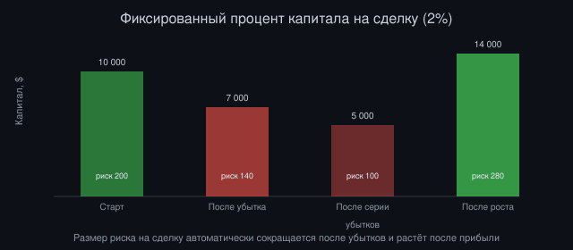
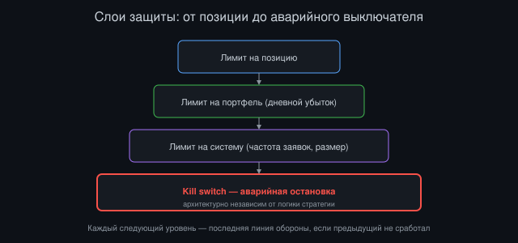

# Основы риск-менеджмента для начинающего квант-разработчика

*Автор: Vizanix, уровень: начинающий*

> Вы освоите базовый набор понятий и практик управления риском, без которых ни одна алгоритмическая стратегия не готова к реальным деньгам.

## Содержание

1. Почему риск-менеджмент важнее самой стратегии
2. Размер позиции: сколько ставить на одну идею
3. Стоп-лосс и его ограничения
4. Диверсификация и корреляция
5. Лимиты на уровне портфеля и на уровне системы
6. Автоматические выключатели: kill switch
7. Психология риска для разработчика
8. Построение собственного риск-чеклиста

## 1. Почему риск-менеджмент важнее самой стратегии

Начинающие в алгоритмической торговле почти всегда фокусируют всё внимание на поиске "хорошей" стратегии, способной предсказывать движение цены, и почти всегда недооценивают важность управления риском. Это обратный порядок приоритетов по сравнению с тем, как рассуждают опытные практики в этой индустрии. Причина проста: даже посредственная стратегия с дисциплинированным управлением риском может пережить длинную серию неудачных сделок и остаться в игре достаточно долго, чтобы отыграться. Отличная стратегия без управления риском может быть полностью уничтожена одной катастрофической ошибкой или одним неудачным периодом на рынке.

Есть полезная аналогия из инженерной практики. Риск-менеджмент, это как обработка исключений и защитное программирование в обычном софте. Вы можете написать прекрасный алгоритм для основного happy path, но если он не обрабатывает нештатные ситуации, ввод сервера, отвал сети или переполнение памяти, вся система рано или поздно упадёт в самый неподходящий момент. Точно так же торговая стратегия, оптимальная в обычных рыночных условиях, но без защиты от экстремальных ситуаций, рано или поздно столкнётся с условиями, для которых не была спроектирована.

Ключевая мысль, которую стоит унести из этой книги: цель риск-менеджмента, гарантировать выживание системы достаточно долго, чтобы стратегия успела реализовать свой статистический потенциал на длинной дистанции, а вовсе не максимизировать прибыль. Стратегия, которая теоретически прибыльна в среднем, но может полностью обнулить счёт с ненулевой вероятностью на коротком горизонте, практически бесполезна, потому что "в среднем" в реальности не наступает, если вы уже потеряли весь капитал.

## 2. Размер позиции: сколько ставить на одну идею

Определение размера позиции (position sizing), это решение о том, какую долю доступного капитала выделить на конкретную сделку или идею. Это, возможно, самое недооценённое решение в алгоритмической торговле, потому что даже прибыльная в среднем стратегия может привести к разорению при неправильном размере позиции, и наоборот, посредственная стратегия с разумным размером позиции способна пережить длинную серию убытков.

Самый простой подход, фиксированный процент капитала на сделку: например, никогда не рисковать больше чем двумя процентами текущего капитала в одной сделке. Это означает, что размер позиции автоматически уменьшается после серии убытков (когда капитал сократился) и увеличивается после серии прибылей, что создаёт естественную защиту от полного разорения даже при затяжной полосе неудач, потому что абсолютный размер риска на сделку сокращается вместе с капиталом.

Более продвинутый математический подход, известный как критерий Келли, вычисляет теоретически оптимальную долю капитала для ставки на основе вероятности выигрыша и соотношения размера выигрыша к размеру проигрыша. На практике полный размер по критерию Келли считается слишком агрессивным даже профессиональными управляющими: реальные оценки вероятности выигрыша всегда содержат ошибку, и небольшая переоценка этой вероятности при полном размере Келли может привести к катастрофическим потерям. Общепринятая практика, использовать долю от расчётного значения Келли, часто от четверти до половины, сохраняя математическую логику подхода, но с запасом на неопределённость собственных оценок.

*Рисунок 1: пример того, как риск на сделку (2% от капитала) автоматически адаптируется вслед за размером капитала.*

## 3. Стоп-лосс и его ограничения

Стоп-лосс, заранее установленный уровень цены, при достижении которого позиция автоматически закрывается, чтобы ограничить убыток по этой конкретной позиции заранее известной величиной. Идея интуитивно понятна: если цена движется против вас, вы не хотите ждать бесконечно в надежде на разворот, накапливая всё больший убыток, а закрываете позицию при заранее определённом пороге боли.

Но стоп-лосс не панацея, и начинающему важно понимать его ограничения. В условиях резкого разрывного движения цены (гэпа), особенно на низколиквидном активе или в момент выхода важной новости, реальная цена исполнения стоп-заявки может оказаться значительно хуже установленного уровня, потому что между уровнем срабатывания и моментом фактического исполнения цена может успеть пройти большое расстояние без остановки на промежуточных уровнях. Это уже обсуждалось в книге о механике рынков применительно к обычным стоп-заявкам, превращающимся в рыночные при срабатывании.

Слишком узкий стоп-лосс, установленный близко к текущей цене, может к тому же срабатывать на обычном рыночном шуме, закрывая позицию до того, как первоначальная идея успела реализоваться, даже если сама идея в итоге оказалась правильной. Слишком широкий стоп-лосс, напротив, допускает крупный убыток прежде, чем сработает защита. Разумная практика, калибровать ширину стоп-лосса на основе исторической волатильности актива, а не произвольного фиксированного процента, применяемого одинаково ко всем активам независимо от их типичного диапазона движения.

## 4. Диверсификация и корреляция

Диверсификация, распределение капитала между несколькими независимыми стратегиями или активами, чтобы убыток по одной позиции не определял судьбу всего портфеля. Интуиция здесь простая: если у вас десять независимых источников риска, каждый из которых может независимо привести к убытку с некоторой вероятностью, вероятность того, что все десять одновременно принесут крупный убыток, значительно ниже, чем вероятность крупного убытка от единственной концентрированной позиции.

Ключевое слово в этом рассуждении, "независимых". Диверсификация работает только тогда, когда источники риска действительно слабо связаны друг с другом, то есть имеют низкую корреляцию. Если вы держите десять разных криптовалютных активов, но все они имеют тенденцию двигаться синхронно во время общего падения рынка (высокая корреляция в кризисные моменты), формальная диверсификация по числу активов не даёт реальной защиты именно тогда, когда защита нужнее всего.

Важный и часто болезненный урок для практиков: корреляция между активами имеет свойство резко возрастать именно во время рыночных кризисов, даже если в спокойные периоды эти активы вели себя достаточно независимо друг от друга. Это явление иногда описывают фразой "в кризис всё коррелирует к единице". Практический вывод: не стоит слепо доверять исторически измеренной низкой корреляции как гарантии защиты в будущем стрессовом сценарии, и разумно дополнительно тестировать портфель на гипотетических сценариях синхронного движения всех активов в неблагоприятную сторону.

## 5. Лимиты на уровне портфеля и на уровне системы

Помимо управления риском на уровне отдельной позиции, зрелая торговая система нуждается в лимитах на более высоком уровне: на уровне всего портфеля и на уровне всей системы в целом. Лимит на уровне портфеля может ограничивать, например, максимальную суммарную экспозицию к одному сектору или классу активов, максимальную суммарную стоимость всех открытых позиций относительно капитала, или максимальный дневной убыток по всему портфелю, при достижении которого торговля на этот день автоматически останавливается.

Лимит на уровне системы защищает от инфраструктурных и программных сбоев, а не только от рыночного риска. Лимит на максимальное число заявок, отправляемых в единицу времени, например, защищает от сценария, когда ошибка в коде запускает бесконечный цикл отправки заявок ("зацикленный робот"), способный за короткое время нанести огромный ущерб, прежде чем человек успеет вмешаться. Лимит на максимальный размер одной отдельной заявки защищает от банальной опечатки в коде или конфигурации, например случайно добавленного лишнего нуля в размер позиции.

Хорошая практика, реализовывать эти лимиты на как можно более низком, независимом от основной логики стратегии уровне системы, чтобы ошибка в самой стратегии не могла случайно обойти защитный механизм. Иными словами, модуль риск-контроля должен быть архитектурно отделён от модуля принятия торговых решений и иметь право заблокировать или отменить любое действие, которое нарушает установленные лимиты, независимо от того, насколько "уверен" в своём сигнале модуль стратегии.

## 6. Автоматические выключатели: kill switch

Kill switch, или аварийный выключатель, это механизм, способный немедленно остановить всю торговую активность системы и, если нужно, закрыть все открытые позиции, при обнаружении аномального поведения либо рынка, либо самой системы. Это последняя линия обороны, к которой прибегают, когда более тонкие лимиты, обсуждённые выше, не сработали или ситуация развивается быстрее, чем эти лимиты успевают среагировать.

Причины для срабатывания kill switch могут включать аномально быстрое движение рынка, выходящее далеко за пределы исторически наблюдавшейся волатильности; серию отклонённых или ошибочных заявок за короткий промежуток времени, что может сигнализировать о сбое в логике или в соединении с биржей; резкое расхождение между ожидаемым и фактическим состоянием портфеля, что может говорить об ошибке в учёте позиций; или простое превышение установленного дневного лимита убытка.

Важный инженерный принцип для kill switch: он должен быть максимально простым и надёжным механизмом, физически или логически независимым от основной, потенциально сложной и потенциально содержащей ошибки логики стратегии. Чем сложнее логика самого выключателя, тем выше вероятность, что в критический момент он тоже откажет из-за собственной ошибки. Разумная практика, реализовывать kill switch как отдельный, максимально простой сторожевой процесс, работающий независимо от основной торговой системы и способный принудительно остановить её, даже если основная система зависла или ведёт себя непредсказуемо.

*Рисунок 2: иерархия лимитов риска от отдельной позиции до аварийного выключателя.*

## 7. Психология риска для разработчика

Управление риском, это не только код и математика, но и дисциплина самого разработчика или трейдера, стоящего за системой. Одна из самых распространённых психологических ловушек, искушение вручную вмешаться в работу автоматической системы в момент, когда она несёт убыток, отменив стоп-лосс или увеличив размер позиции в надежде "отыграться" быстрее. Это разрушает всю логику заранее продуманного риск-менеджмента и часто превращает управляемый убыток в неуправляемую катастрофу.

Другая распространённая ловушка, постепенное, малозаметное самому разработчику ослабление установленных лимитов после серии успешных сделок, из растущей уверенности в собственной стратегии. Серия удач часто интерпретируется как подтверждение того, что риск был излишне консервативным, хотя на самом деле она может быть просто следствием благоприятного, но временного рыночного режима, который рано или поздно закончится.

Практическая защита от обеих ловушек, фиксировать все правила риск-менеджмента в коде, а не полагаться на ручное соблюдение дисциплины в моменте сильных эмоций, будь то паника при убытке или эйфория при серии удач. Правила, зашитые в автоматическую систему, не поддаются эмоциональному давлению момента так же легко, как решения человека, наблюдающего за колеблющимся балансом счёта в реальном времени.

## 8. Построение собственного риск-чеклиста

Полезное практическое упражнение для начинающего, составить собственный письменный чеклист правил риск-менеджмента, прежде чем запускать любую стратегию с реальными деньгами, и явно сверяться с ним при каждом запуске новой стратегии или значимом изменении существующей. Хороший чеклист отвечает как минимум на следующие вопросы, обсуждённые выше в этой книге: какой процент капитала выделен на одну сделку и как этот процент был рассчитан, какой уровень стоп-лосса используется и как он калибруется относительно волатильности актива, какой максимальный дневной и максимальный совокупный убыток допустим, прежде чем система автоматически остановится.

Также стоит явно прописать, какие независимые лимиты на уровне системы защищают от программных сбоев, независимо от логики стратегии, и при каких именно условиях сработает аварийный выключатель kill switch, а также кто и как получает уведомление о его срабатывании. Стоит явно решить и зафиксировать, наконец, при каких обстоятельствах допустимо ручное вмешательство человека в работу системы, а при каких категорически нет, чтобы не принимать это решение импульсивно в момент стресса.

Такой чеклист не гарантирует прибыльность стратегии, и это не его задача. Его задача, гарантировать, что даже при неудачном исходе конкретной стратегии или конкретного рыночного периода потери останутся в заранее продуманных и приемлемых границах, оставляя капитал и возможность попробовать снова с исправленной или улучшенной версией стратегии в будущем.

## Итоги

- Задача риск-менеджмента, обеспечить выживание системы, а не максимизировать прибыль отдельной сделки.
- Размер позиции стоит рассчитывать как долю от текущего капитала, а не фиксированную сумму, чтобы риск автоматически снижался после серии убытков.
- Стоп-лосс не гарантирует исполнение по заданной цене в условиях резкого движения рынка, и его ширину стоит калибровать по исторической волатильности.
- Диверсификация защищает только при реально низкой корреляции активов, которая имеет свойство резко расти именно во время рыночных кризисов.
- Лимиты на уровне портфеля и системы, а также независимый аварийный выключатель, должны быть архитектурно отделены от логики самой стратегии.

---

*Эта книга — часть библиотеки Vizanix Quant Engineering Library. Лицензия CC BY 4.0 — можно свободно читать, распространять и адаптировать с указанием авторства Vizanix.*
