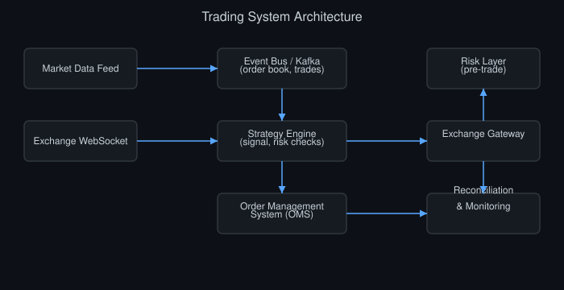

# От таблицы Excel до системы: ваш первый торговый бот

*Автор: Vizanix — уровень: начинающий*

> Вы пройдёте практический путь эволюции от ручного анализа в таблице до работающего автоматического торгового бота, шаг за шагом.

## Содержание

1. Зачем начинать с таблицы, а не сразу с кода
2. Этап первый: ручной анализ в электронной таблице
3. Этап второй: скрипт, который считает вместо вас
4. Этап третий: скрипт, который сам получает данные
5. Этап четвёртый: полуавтоматический помощник
6. Этап пятый: полностью автоматический бот с контролем
7. Типичные ошибки при переходе между этапами
8. Как понять, что вы готовы к следующему этапу

## 1. Зачем начинать с таблицы, а не сразу с кода

Программисту без опыта в трейдинге легко поддаться искушению сразу сесть писать полноценную автоматическую торговую систему, потому что это кажется естественным и интересным инженерным проектом. Но опыт индустрии показывает, что такой подход часто приводит к переусложнённому коду, построенному вокруг непроверенных предположений о рынке, которые проще было бы обнаружить и исправить на гораздо более простом инструменте.

Электронная таблица, будь то Excel, Google Sheets или любой похожий инструмент, — прекрасная отправная точка именно потому, что она заставляет вас явно увидеть каждое число и каждую формулу, без скрытой абстракции, которую даёт код. Когда вы вручную считаете, например, скользящее среднее цены в таблице, вы физически видите каждое промежуточное значение и с гораздо большей вероятностью заметите ошибку в логике, чем если бы та же формула была скрыта внутри функции в коде, которую вы просто вызываете и доверяете результату.

Эта книга описывает путь постепенной автоматизации в пять этапов: от полностью ручного анализа в таблице до полностью автоматического бота. Идея в том, чтобы на каждом этапе добавлять ровно один новый уровень автоматизации, полностью понимая и проверив предыдущий, вместо того чтобы пытаться построить весь стек сразу и потом долго разбираться, какая именно часть работает неправильно.

## 2. Этап первый: ручной анализ в электронной таблице

На первом этапе вы вручную вставляете исторические цены актива в таблицу, обычно скопированные из бесплатного источника данных или экспортированные в формате CSV, и строите формулы, реализующие простую торговую идею. Например, столбец со скользящим средним за пять периодов, столбец со скользящим средним за двадцать периодов, и столбец с условной формулой, которая помечает моменты, когда короткое среднее пересекает длинное снизу вверх, как потенциальный сигнал на покупку.

На этом этапе вы вручную прослеживаете каждую такую отметку по строкам таблицы и записываете, что случилось бы с ценой актива через определённое число периодов после сигнала: выросла она или упала, и насколько. Это, по сути, ручной, крайне упрощённый прототип бэктестинга, о котором подробнее рассказывает отдельная книга в этой библиотеке, но выполненный настолько прозрачно, что ошибку логики почти невозможно не заметить.

Основная ценность этого этапа не в статистической значимости результата, которая на небольшой выборке, просмотренной вручную, неизбежно низкая, а в формировании интуиции о том, как ведёт себя ваша идея на реальных данных, и в выявлении неочевидных проблем формулировки самой идеи ещё до того, как вы вложили время в написание кода. Многие идеи, звучащие убедительно в теории, оказываются неработающими или тривиально бесполезными уже на этом простом этапе, и это хороший, дешёвый способ отсеять их.

## 3. Этап второй: скрипт, который считает вместо вас

Как только ручной анализ подтвердил, что идея заслуживает более глубокой проверки, разумный следующий шаг — написать простой скрипт, обычно на Python с использованием библиотеки pandas, который автоматизирует те же самые вычисления, что вы делали вручную в таблице, но теперь на значительно большем объёме исторических данных, охватывающем месяцы или годы, а не десятки строк, которые реально можно просмотреть глазами.

На этом этапе скрипт всё ещё не отправляет никаких реальных заявок и не подключается к бирже в реальном времени. Его единственная задача — загрузить сохранённый локально исторический файл с ценами, применить ту же логику сигнала, что вы формализовали на предыдущем этапе, и посчитать, как бы повела себя стратегия на всей доступной истории, включая базовые метрики оценки результата, такие как суммарная доходность и максимальная просадка, о которых рассказывает книга о бэктестинге.

Ключевая инженерная задача этого этапа — убедиться, что логика скрипта на самом деле воспроизводит именно то, что вы делали вручную в таблице, а не какую-то похожую, но отличающуюся версию идеи из-за случайной ошибки в коде. Хорошая практика — сверить результат скрипта на том же небольшом наборе данных, что вы анализировали вручную на первом этапе, и убедиться, что сигналы и промежуточные значения полностью совпадают, прежде чем доверять скрипту анализ на большем объёме данных.

## 4. Этап третий: скрипт, который сам получает данные

На третьем этапе скрипт перестаёт полагаться на однажды вручную скачанный статический файл и начинает сам запрашивать актуальные данные через API биржи, как описано в книге о биржевых API этой библиотеки. На этом этапе стратегия всё ещё не торгует реальными деньгами, но теперь она может, например, автоматически обновлять свой анализ каждое утро на самых свежих данных и сообщать вам, есть ли сигнал на сегодня, оставляя решение об отправке реальной заявки за человеком.

Это важный промежуточный этап, потому что он вводит целый новый класс инженерных задач, не существовавших на предыдущих этапах: обработку сетевых ошибок, ограничений скорости запросов, некорректных или неполных данных от API, о которых подробно рассказывает книга о биржевых API. Разумно потратить достаточно времени именно на этом этапе, чтобы код надёжно и предсказуемо получал данные, прежде чем переходить к следующему этапу, где ошибка в данных может привести не просто к неверному отчёту, а к реальной ошибочной сделке.

Практический совет: на этом этапе стоит запустить скрипт как регулярную, но полностью автоматическую задачу (например, через планировщик задач операционной системы), которая присылает вам отчёт о текущем состоянии сигнала, не требуя от вас ручного запуска каждый раз. Это ценно само по себе, потому что учит вас доверять или не доверять автоматизации постепенно, наблюдая за её работой в реальном времени, прежде чем передать ей право реально распоряжаться деньгами.

## 5. Этап четвёртый: полуавтоматический помощник

Четвёртый этап вводит первую реальную связь с деньгами, но всё ещё с человеком в контуре принятия финального решения. Скрипт теперь не просто сообщает о сигнале, но и готовит конкретную заявку — актив, направление, объём, цену — и показывает её вам для утверждения, прежде чем отправить на биржу. Только после вашего явного подтверждения, например нажатия кнопки в простом интерфейсе или ответа "да" в telegram-боте, заявка реально уходит на биржу через торговый API.

Этот полуавтоматический режим часто называют "человек в контуре" (human in the loop), и он ценен по нескольким причинам. Во-первых, он позволяет проверить весь путь от сигнала до реальной заявки на бирже, включая аутентификацию, формат запроса и обработку ответа биржи, обсуждённые в книге о биржевых API, но оставляет последний рубеж защиты в виде здравого смысла человека, способного заметить явную аномалию (например, нереалистичный размер заявки из-за ошибки в коде) прежде, чем она станет реальной сделкой.

Во-вторых, этот этап даёт психологически более плавный переход к полной автоматизации: вы накапливаете доверие к системе постепенно, наблюдая, как предложенные ею заявки соответствуют вашим собственным ожиданиям в течение достаточно длительного периода, прежде чем отдать ей полный контроль. Разумная практика — оставаться на этом этапе до тех пор, пока вы не переставали находить ни одного случая, когда предложенная ботом заявка была явно неверной или неожиданной для вас.

## 6. Этап пятый: полностью автоматический бот с контролем

Пятый и финальный этап убирает человека из контура принятия решения по каждой отдельной сделке, но не убирает человеческий контроль вообще. Теперь система сама отправляет заявки на биржу без запроса подтверждения на каждую отдельную сделку, но обязательно снабжена всеми механизмами защиты, обсуждёнными в книге о риск-менеджменте этой библиотеки: лимитами на размер позиции, лимитами на дневной убыток и независимым аварийным выключателем, способным немедленно остановить всю активность при аномальном поведении рынка или самой системы.

Переход на этот этап стоит делать с минимально возможным объёмом реального капитала, в точности как описано в книге о биржевых API применительно к переходу от тестовой среды к реальному счёту. Задача этого начального периода полной автоматизации — не заработать много денег, а проверить, что система ведёт себя предсказуемо и в соответствии с ожиданиями, сформированными на предыдущих четырёх этапах, в условиях реального, неотредактированного человеком потока рыночных событий.

Важно понимать: полностью автоматический не означает "без мониторинга человеком". Даже зрелая автоматическая система нуждается в постоянном наблюдении, логировании всех действий и регулярном сравнении фактических результатов с ожидаемыми, о котором стоит помнить как о непрерывной, а не разовой задаче на протяжении всего времени работы бота, а не только в первые дни после запуска.

## 7. Типичные ошибки при переходе между этапами

Первая типичная ошибка — пропуск этапов ради скорости: попытка сразу перейти от идеи в голове к полностью автоматическому боту, минуя постепенную проверку на предыдущих, более простых и более прозрачных этапах. Это резко увеличивает риск того, что скрытая ошибка в логике или в коде обнаружится только тогда, когда она уже привела к реальному убытку, а не на дешёвом этапе ручной или полуавтоматической проверки.

Вторая ошибка — недостаточная сверка результатов между этапами. Переходя от ручного анализа к скрипту, от скрипта на исторических данных к скрипту на живых данных, от полуавтоматического режима к полностью автоматическому, важно на каждом переходе явно убедиться, что новый уровень автоматизации воспроизводит то же поведение, что и предыдущий, а не просто предполагать это без проверки, потому что "код выглядит правильным".

Третья ошибка — застревание на слишком раннем этапе из чрезмерной осторожности, что тоже своего рода крайность. Если ваша идея прошла достаточно длительную и убедительную проверку на этапах ручного анализа, скрипта на исторических данных и живых данных без реальных денег, чрезмерно долгое затягивание перехода к реальной торговле лишает вас возможности проверить гипотезу в единственных условиях, которые реально важны, — в условиях реального рынка с реальными деньгами, хотя бы и в минимальном объёме.

## 8. Как понять, что вы готовы к следующему этапу

Универсального точного правила для перехода между этапами не существует, но несколько практических критериев помогают принять более осознанное решение. Готовность перейти от ручного анализа к скрипту: вы уверенно проверили логику сигнала на достаточном числе примеров вручную и не находите в ней явных логических ошибок или противоречий.

Готовность перейти от исторических данных к живому подключению: код скрипта стабильно и предсказуемо воспроизводит результаты бэктестинга на исторических данных, и вы готовы потратить время на обработку сетевых ошибок и особенностей реального API биржи. Готовность перейти к полуавтоматическому режиму: скрипт стабильно работает на живых данных достаточно длительное время без сбоев, и вы понимаете формат и логику отправки реальной заявки на биржу.

Готовность перейти к полной автоматизации: вы накопили достаточный период наблюдения за полуавтоматическим режимом без единого случая, когда предложенное системой действие вас удивило или показалось ошибочным, и вы реализовали все базовые механизмы риск-контроля, обсуждённые в отдельной книге этой библиотеки, включая независимый аварийный выключатель. Если на любом из этих критериев вы чувствуете неуверенность, разумнее остаться на текущем этапе дольше, чем поспешить дальше, потому что цена ошибки растёт с каждым следующим этапом автоматизации.

## Итоги

- Постепенный путь от ручной таблицы до полностью автоматического бота снижает риск скрытых ошибок и переусложнения на раннем этапе.
- Ручной анализ в электронной таблице — дешёвый и прозрачный способ отсеять заведомо нежизнеспособные идеи до написания кода.
- Каждый новый уровень автоматизации стоит явно сверять с результатами предыдущего этапа, а не предполагать их согласованность.
- Полуавтоматический режим с человеком в контуре — ценный промежуточный шаг перед полным доверием системе.
- Полная автоматизация не отменяет необходимость постоянного мониторинга человеком и работающих механизмов риск-контроля.

---

*Эта книга — часть библиотеки Vizanix Quant Engineering Library. Лицензия CC BY 4.0 — можно свободно читать, распространять и адаптировать с указанием авторства Vizanix.*
