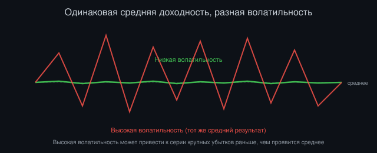
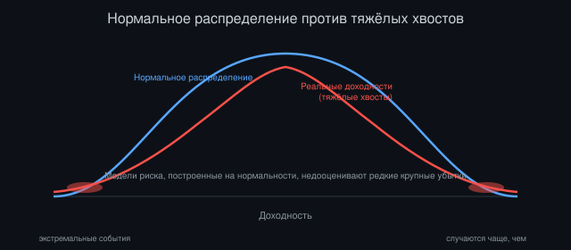
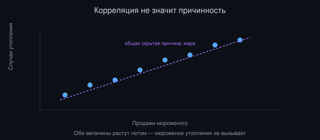

# Статистика для трейдинга: что действительно нужно знать

*Автор: Vizanix, уровень: начинающий*

> Вы получите минимально необходимый набор статистических понятий, без которых нельзя честно оценивать торговые стратегии.

## Содержание

1. Зачем программисту статистика, если есть код
2. Случайность и почему рынок её не лишён
3. Среднее и разброс: доходность и волатильность
4. Распределения и почему "нормальное" не всегда нормально
5. Корреляция и почему она не причинность
6. Статистическая значимость и размер выборки
7. Автокорреляция и иллюзия паттернов
8. Практическое применение: от интуиции к проверке

## 1. Зачем программисту статистика, если есть код

Программист без опыта в финансах может резонно спросить: если я умею писать код и тестировать гипотезы на данных, зачем мне отдельно изучать статистику как дисциплину? Ответ в том, что статистика это способ мышления о неопределённости, а не набор формул, и неопределённость составляет саму суть рыночных данных. Код без статистического мышления способен выполнить любые вычисления совершенно корректно и при этом привести к абсолютно неверным выводам, если сами вычисления построены на ошибочных статистических предпосылках.

Возьмём классический пример. Код может безупречно посчитать, что стратегия дала прибыль на исторических данных, но без статистического мышления невозможно ответить на гораздо более важный вопрос: является ли эта прибыль результатом реальной закономерности рынка, которая, вероятно, продолжится в будущем, или результатом случайного везения на конкретном историческом периоде, которое не имеет никакого предсказательного значения вперёд. Это различие лежит в основе всей количественной торговли, и без базового статистического аппарата его невозможно даже корректно сформулировать, не то что проверить.

Эта книга не претендует на замену полноценного курса статистики. Она даёт минимальный, но достаточный набор понятий, которые непосредственно применимы к оценке торговых идей и без которых начинающий квант-разработчик рискует принимать серьёзные решения на основе интуиции, замаскированной под строгий анализ.

## 2. Случайность и почему рынок её не лишён

Одна из самых важных ментальных перестроек для программиста, приходящего в трейдинг, это принятие того, что значительная, а иногда и подавляющая часть краткосрочного движения цены на рынке статистически неотличима от случайного процесса. Рынок не работает буквально как генератор случайных чисел без всякой структуры, но предсказуемая, устойчивая структура в ценовых данных составляет обычно небольшую долю от общей изменчивости, а остальное шум, вызванный огромным числом независимых решений множества участников рынка.

Полезная модель для интуиции, хотя и упрощённая, представление цены актива как случайного блуждания (random walk), где каждое следующее изменение цены статистически независимо от предыдущих и не поддаётся предсказанию на основе одной лишь истории цены. Реальные рынки отклоняются от этой идеализированной модели в разной степени, и именно в этих отклонениях ищут возможность для прибыльных стратегий. Но полезно всегда держать эту модель в голове как разумную нулевую гипотезу, с которой нужно сравнивать любую предполагаемую закономерность, прежде чем поверить в её реальность.

Практическое следствие для начинающего: если вы видите на графике убедительный, на первый взгляд, визуальный паттерн, задайте себе вопрос: отличим ли этот паттерн статистически от того, что могло бы случайно возникнуть в чисто случайном ряде данных того же объёма и той же общей изменчивости? Человеческий мозг эволюционно склонен находить паттерны даже там, где их нет, и это одна из главных причин, почему количественный, а не визуальный подход к анализу рынка так важен.

## 3. Среднее и разброс: доходность и волатильность

Два самых базовых статистических понятия, применяемых к финансовым данным, это среднее значение доходности и мера её разброса, обычно называемая волатильностью. Средняя доходность за период показывает, сколько в среднем зарабатывал или терял актив за единицу времени, например за день. Волатильность, обычно измеряемая стандартным отклонением доходности, показывает, насколько сильно фактическая доходность в отдельные периоды отклоняется от этого среднего значения.

Важно понимать взаимную роль этих двух чисел при оценке актива или стратегии. Актив с высокой средней доходностью, но и с очень высокой волатильностью, может показать серию крупных убытков задолго до того, как проявится его положительное среднее значение на длинной дистанции. Именно поэтому в предыдущей книге о бэктестинге упоминались метрики вроде коэффициента Шарпа, соотносящие среднюю доходность именно с волатильностью, а не рассматривающие среднюю доходность в отрыве от разброса вокруг неё.

Есть и полезная практическая деталь: волатильность финансовых активов имеет тенденцию образовывать кластеры и вовсе не постоянна во времени. Периоды высокой волатильности сменяются периодами относительного спокойствия, и наоборот, причём переход между этими режимами не всегда предсказуем заранее. Это явление, известное как кластеризация волатильности, одна из немногих устойчивых статистических закономерностей, которую действительно наблюдают в реальных рыночных данных практически на любом рынке и любом активе.

*Рисунок 1: одинаковое среднее значение доходности может скрывать совершенно разный уровень риска.*

## 4. Распределения и почему "нормальное" не всегда нормально

Многие базовые статистические методы, изученные в стандартных курсах, опираются на предположение, что анализируемая величина следует нормальному распределению (той самой колоколообразной кривой, симметричной вокруг среднего значения). Это предположение удобно математически, но для финансовых доходностей оно систематически нарушается одним важным образом: реальные распределения доходностей имеют "тяжёлые хвосты" (fat tails), то есть экстремальные события (очень крупные движения цены в любую сторону) случаются заметно чаще, чем предсказывало бы нормальное распределение с теми же средним и стандартным отклонением.

Практическое следствие тяжёлых хвостов: любая оценка риска, построенная на предположении нормальности распределения, скорее всего, систематически недооценивает вероятность и масштаб редких, но крупных убытков. Это одна из причин, по которой чисто статистические модели риска стоит дополнять сценарным анализом ("что произойдёт с моим портфелем, если случится движение цены такого масштаба, какого не было в моей исторической выборке, но теоретически возможно") и консервативными запасами прочности в размере позиции, о которых говорит книга о риск-менеджменте.

Для начинающего практический вывод простой: относитесь с осторожностью к любому анализу или методу, который неявно предполагает нормальность распределения доходностей финансового актива, особенно на коротких временных горизонтах, где эффект тяжёлых хвостов проявляется наиболее заметно. Всегда, когда возможно, проверяйте фактическое распределение своих данных визуально (например, гистограммой) или формальными статистическими тестами на нормальность, вместо того чтобы принимать это предположение как данность по умолчанию.

*Рисунок 2: реальные доходности чаще дают экстремальные значения, чем предсказывает нормальное распределение.*

## 5. Корреляция и почему она не причинность

Корреляция измеряет, насколько два ряда данных склонны двигаться совместно: положительная корреляция означает, что оба ряда обычно растут и падают одновременно, отрицательная означает, что рост одного обычно сопровождается падением другого. Корреляция чрезвычайно полезная и часто используемая мера в количественном анализе, включая, как уже упоминалось, оценку диверсификации портфеля в книге о риск-менеджменте.

Но корреляция ничего не говорит о причинно-следственной связи между двумя величинами. Возьмём классический пример из статистики за пределами финансов: количество проданных мороженых и количество утоплений на пляжах положительно коррелируют, но очевидно, что мороженое утопления не вызывает: оба явления просто одновременно растут летом из-за жаркой погоды, общей скрытой причины для обоих. В финансовых данных подобные обманчивые корреляции встречаются постоянно, особенно при анализе большого числа активов, где случайно найдётся немало пар с высокой исторической корреляцией, не имеющей под собой никакой реальной экономической связи.

Практический совет для начинающего: обнаружив сильную корреляцию между двумя рядами данных, прежде чем строить на ней торговую идею, задайте себе вопрос, есть ли разумное экономическое объяснение, почему эта связь должна существовать и продолжиться в будущем, а не просто статистическое совпадение на конкретном историческом периоде. Отсутствие такого объяснения, веский повод для дополнительной осторожности и более строгой проверки на независимых, более свежих данных, прежде чем довериться найденной закономерности.

*Рисунок 3: обе величины растут летом из-за общей скрытой причины (жары), а не потому что одна вызывает другую.*

## 6. Статистическая значимость и размер выборки

Статистическая значимость, формальный способ ответить на вопрос: насколько вероятно, что наблюдаемый результат (например, положительная средняя доходность стратегии на историческом периоде) мог возникнуть просто по случайности, даже если на самом деле у стратегии нет никакого реального предсказательного преимущества. Чем больше размер выборки (число независимых наблюдений, например число совершённых сделок) и чем сильнее наблюдаемый эффект относительно его изменчивости, тем выше уверенность в том, что результат не случаен.

Ключевая практическая проблема для начинающего квант-разработчика в том, что финансовые данные часто дают меньше по-настоящему независимых наблюдений, чем кажется на первый взгляд. Если ваша стратегия совершает одну сделку в день на протяжении года, у вас формально около двухсот пятидесяти сделок, но соседние по времени дни часто статистически зависимы друг от друга (например, из-за той же кластеризации волатильности, упомянутой выше), а значит, реальное число независимой информации в этих данных меньше, чем простое число сделок.

Практический вывод: относитесь скептически к стратегиям, показавшим впечатляющий результат на небольшом числе сделок, даже если формальные вычисления показывают "статистически значимый" результат, потому что при малом числе наблюдений случайность может легко создать видимость закономерности. Разумная практика, требовать от идеи достаточно длинной истории и достаточно большого числа реально независимых наблюдений, прежде чем доверять её результату, и явно закладывать эту осторожность в процесс отбора стратегий, обсуждавшийся в книге о бэктестинге применительно к проблеме подгонки под данные.

## 7. Автокорреляция и иллюзия паттернов

Автокорреляция измеряет, насколько значение ряда данных в один момент времени связано с его же значениями в предыдущие моменты. Применительно к ценам активов положительная автокорреляция доходности означала бы, что после роста цены с большей вероятностью следует ещё один рост (тренд), а отрицательная автокорреляция означала бы, что после роста с большей вероятностью следует падение (возврат к среднему, mean reversion).

Многие популярные технические индикаторы и торговые идеи, по сути, представляют собой неявные ставки на существование той или иной формы автокорреляции в ценовых данных. Проблема в том, что для большинства ликвидных, активно торгуемых финансовых активов на большинстве временных горизонтов автокорреляция доходности статистически очень слаба или практически отсутствует, что согласуется с обсуждавшейся выше моделью случайного блуждания цены. Это не означает, что абсолютно никакая автокорреляция никогда не существует ни на одном рынке ни на одном горизонте. Но найти реальную, устойчивую и достаточно сильную автокорреляцию, способную покрыть издержки исполнения, обсуждённые в книге о бэктестинге, задача заметно сложнее, чем может показаться начинающему, глядя на убедительный на вид график.

Практический совет: прежде чем строить стратегию на предположении об автокорреляции цены, явно измерьте её статистически на достаточно длинной и разнообразной исторической выборке, а не полагайтесь на визуальное впечатление от одного конкретного участка графика, который мог случайно показать желаемый паттерн просто по случайности выборки.

## 8. Практическое применение: от интуиции к проверке

Все понятия, обсуждённые в этой книге, служат одной общей практической цели: превратить интуитивное, часто эмоционально окрашенное впечатление о поведении рынка в формальную, проверяемую гипотезу, которую можно измерить, оспорить и отбросить, если данные её не подтверждают. Это, по сути, применение общего научного метода к специфической предметной области финансовых рынков.

Практический рабочий процесс для начинающего может выглядеть так: сформулируйте идею максимально конкретно и измеримо (например, "после падения цены более чем на пять процентов за день, средняя доходность на следующий день положительна"), явно определите, как вы будете измерять эту гипотезу статистически (например, среднюю доходность на следующий день после всех таких падений за достаточно длинный исторический период и её статистическую значимость), и явно определите заранее, какой результат вы сочтёте подтверждением идеи, а какой опровержением, до того как посмотрите на фактические данные, чтобы избежать неосознанной подгонки интерпретации под желаемый результат постфактум.

Эта дисциплина требует определённого усилия и первое время может казаться избыточно формальной по сравнению с более интуитивным, визуальным подходом к анализу графиков. Но именно эта дисциплина отличает устойчивый, воспроизводимый количественный подход от подхода, который лишь выглядит количественным благодаря использованию кода и данных, но по сути остаётся тем же интуитивным угадыванием паттернов, которым человеческий мозг склонен заниматься естественным образом, часто ошибочно.

## Итоги

- Статистика, это способ отличить реальную закономерность рынка от случайного шума, а не просто набор формул поверх кода.
- Финансовые доходности плохо описываются нормальным распределением из-за тяжёлых хвостов, что систематически недооценивает риск редких крупных движений.
- Корреляция между рядами данных не доказывает причинно-следственную связь и требует разумного экономического объяснения, прежде чем ей доверять.
- Малое число реально независимых наблюдений делает "статистически значимые" результаты на коротких исторических периодах менее надёжными, чем они выглядят.
- Автокорреляция цены на большинстве ликвидных рынков слаба, и любую идею, построенную на её существовании, стоит явно измерять, а не принимать на веру по внешнему виду графика.

---

*Эта книга — часть библиотеки Vizanix Quant Engineering Library. Лицензия CC BY 4.0 — можно свободно читать, распространять и адаптировать с указанием авторства Vizanix.*
