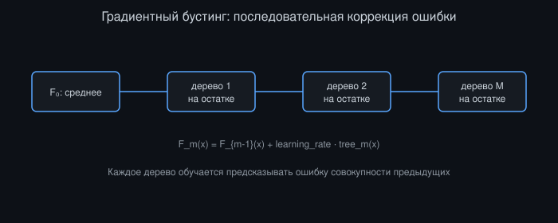
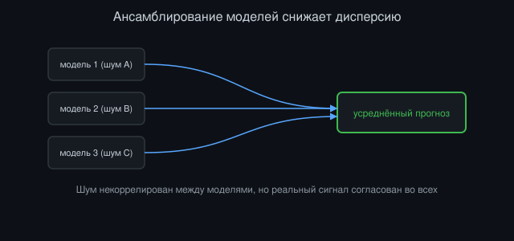

# Прикладной прогноз временных рядов с помощью машинного обучения

*Автор: Vizanix — уровень: средний*

> Вы разберётесь, как выбрать и правильно валидировать модель машинного обучения для прогноза финансовых временных рядов, и почему большинство «впечатляющих» результатов подобных моделей в статьях не переживают честную проверку на реальных данных.


## Содержание

1. Что реально означает «прогноз» на финансовых рынках
2. От классических моделей к машинному обучению: когда оправдан переход
3. Деревья решений и градиентный бустинг для табличных финансовых данных
4. Рекуррентные и последовательные модели для временных рядов
5. Ансамблирование и почему оно особенно ценно в финансах
6. Метрики качества прогноза, отражающие реальную прибыльность
7. Переобучение и почему бэктест результата модели: это не сама торговая стратегия
8. Практический пайплайн: от прогноза до торгового решения

## 1. Что реально означает «прогноз» на финансовых рынках

Прежде чем говорить о моделях, важно точно определить, что вы на самом деле пытаетесь предсказать, потому что расплывчатая постановка задачи: источник большинства разочарований при переходе от впечатляющих результатов на бумаге к реальной торговле. «Прогноз цены»: слишком общая и, честно говоря, обманчивая формулировка. Более точные и практически осмысленные постановки задачи включают: прогноз знака доходности на заданном горизонте (задача бинарной классификации), прогноз величины будущей волатильности (регрессия, часто более предсказуемая величина, чем сама доходность, в силу кластеризации волатильности из книги про анализ временных рядов), прогноз вероятности достижения определённого уровня цены до определённого момента времени (что естественно связывается с triple-barrier постановкой из книги про feature engineering).

Ключевая методологическая установка, о которую разбивается наивный энтузиазм: даже небольшое, но устойчивое статистическое преимущество в прогнозе уже ценно, если оно масштабируется на достаточный оборот сделок и превышает транзакционные издержки. Модель, правильно предсказывающая направление движения в 52% случаев вместо случайных 50%, звучит скромно, но при достаточном числе независимых ставок и правильном контроле риска может быть основой прибыльной стратегии. Модель же, показывающая эффектные 70% точности на историческом тестовом наборе, почти наверняка переобучена или содержит утечку данных, потому что предсказуемость такого масштаба на ликвидных финансовых рынках противоречила бы базовым принципам эффективности рынка на достаточно длинном историческом горизонте.

Эта интуиция должна калибровать ваши ожидания на протяжении всей работы с моделью. Цель не «точный прогноз будущего», а статистически устойчивое, пусть и скромное, преимущество над случайностью, которое остаётся положительным после учёта реалистичных издержек исполнения и переносится на новые данные.

## 2. От классических моделей к машинному обучению: когда оправдан переход

Классические статистические модели временных рядов (авторегрессионные модели, модели скользящего среднего, их комбинации, GARCH-семейство из книги про анализ временных рядов) остаются сильной и часто недооценённой отправной точкой. Они интерпретируемы, устойчивы к переобучению благодаря малому числу параметров, и требуют относительно небольшого объёма данных для надёжной калибровки.

Переход к более гибким моделям машинного обучения оправдан, когда есть конкретная причина полагать, что зависимость между признаками и таргетом нелинейна или включает сложное взаимодействие между несколькими признаками, которое классическая линейная модель структурно не способна уловить. Например, эффект моментум-признака может зависеть от текущего уровня волатильности рынка (моментум работает иначе в спокойном и в волатильном режиме). Это взаимодействие двух признаков линейная регрессия улавливает только если вы явно сконструируете произведение этих признаков как отдельную фичу, тогда как модели на основе деревьев решений улавливают подобные взаимодействия автоматически, без явного конструирования.

Важно понимать плату за этот переход: более гибкая модель имеет больше параметров и, соответственно, больший риск переобучения на ограниченном объёме финансовых данных с низким соотношением сигнал/шум. Практическое правило: усложняйте модель только тогда, когда более простая модель демонстрирует явно неудовлетворительный результат по честной out-of-sample валидации, а не по умолчанию в надежде, что более сложная модель «сама разберётся» с плохо спроектированными признаками. Хорошо продуманные признаки (см. предыдущую книгу) с простой моделью почти всегда превосходят сырые данные со сложной моделью на финансовых задачах именно из-за ограниченного соотношения сигнал/шум.

## 3. Деревья решений и градиентный бустинг для табличных финансовых данных

Для табличных данных (набор сконструированных признаков на каждый момент времени, а не сырые последовательности) ансамбли деревьев решений, особенно градиентный бустинг, стабильно демонстрируют одни из лучших практических результатов среди широкого класса моделей машинного обучения, и это справедливо и для финансовых табличных данных.

Градиентный бустинг строит последовательность деревьев, каждое из которых обучается предсказывать остаток (ошибку) ансамбля предыдущих деревьев, постепенно улучшая совокупный прогноз:

```
F_0(x) = начальное простое предсказание (например, среднее по таргету)
for m in range(1, M):
    residuals = target - F_{m-1}(x)
    tree_m = fit_decision_tree(features, residuals)
    F_m(x) = F_{m-1}(x) + learning_rate * tree_m(x)
```

Практическая ценность градиентного бустинга для финансовых данных дополнительно усиливается встроенной устойчивостью к нерелевантным признакам (дерево решений естественным образом игнорирует признак, не дающий улучшения разбиения) и возможностью получить интерпретируемые оценки важности признаков (feature importance), что критично для соответствия описанному в предыдущей книге требованию объяснимости в финансовом контексте.

Ключевой практический риск при использовании градиентного бустинга на финансовых данных: переобучение через избыточное число деревьев или избыточную глубину каждого дерева, особенно в комбинации с большим числом слабо информативных признаков-кандидатов. Регуляризация через ограничение глубины дерева, минимального числа наблюдений в листе, и, что особенно важно для временных рядов, ранняя остановка (early stopping) по honest out-of-sample метрике, вычисленной на данных, следующих хронологически за обучающей выборкой, а не на случайно перемешанном holdout наборе. Обычная кросс-валидация со случайным перемешиванием строк здесь методологически некорректна именно из-за временной структуры данных и риска утечки, разобранного в предыдущей книге.

```
early_stopping_validation = data[train_end : train_end + validation_horizon]
# НЕ случайно выбранное подмножество из всего датасета
```



*Рисунок 1: каждое следующее дерево обучается на остатке ансамбля предыдущих, постепенно улучшая совокупный прогноз.*

## 4. Рекуррентные и последовательные модели для временных рядов

Когда задача явно требует моделирования последовательной, временнóй зависимости внутри самого входа (а не набора уже агрегированных статических признаков на каждый момент времени), архитектуры, специально спроектированные для последовательностей: рекуррентные нейронные сети (RNN) и их более устойчивые к затуханию градиента варианты (LSTM, GRU), а также архитектуры на основе механизма внимания (attention), предоставляют естественный способ обработки временной зависимости без явного конструирования лаговых признаков вручную.

```
h[t] = f(W_h * h[t-1] + W_x * x[t] + b)
prediction[t] = g(h[t])
```

Скрытое состояние `h[t]` рекуррентной модели, в теории, накапливает релевантную информацию из всей предшествующей истории последовательности, что избавляет от необходимости вручную решать, сколько лагов включить в признаки (как в случае с табличными моделями главы 3). На практике эта теоретическая гибкость даётся ценой значительно большего числа параметров модели, что при типичном для финансовых данных ограниченном объёме надёжной истории (особенно для узких, специфичных задач: конкретного инструмента, конкретного режима рынка) создаёт заметно более высокий риск переобучения по сравнению с более простыми табличными моделями.

Практическая рекомендация для среднего инженерного уровня: начинайте с более простых табличных моделей (глава 3), явно кодируя разумный набор лаговых и агрегированных временных признаков, и переходите к последовательным нейросетевым архитектурам только тогда, когда у вас есть достаточный объём данных (типично значительно больше наблюдений, чем требуется для надёжной калибровки табличной модели) и конкретная гипотеза о том, что зависимость от истории имеет сложную, не поддающуюся ручному конструированию признаков форму. Более глубокий разбор специфичных архитектур для рыночного прогноза: в профессиональной книге этой библиотеки о глубоком обучении для рыночного прогноза.

## 5. Ансамблирование и почему оно особенно ценно в финансах

Ансамблирование, комбинирование прогнозов нескольких моделей (или нескольких версий одной модели, обученных на разных подвыборках или с разными случайными инициализациями), особенно ценная техника именно в финансовом контексте из-за уже упомянутого низкого соотношения сигнал/шум. Отдельная модель, обученная на зашумлённых данных, неизбежно захватывает часть шума конкретной обучающей выборки как ложную закономерность, и этот шумовой компонент обычно некоррелирован между разными моделями (обученными на разных подвыборках, с разной архитектурой, разными признаками), тогда как реальный сигнал, если он есть, присутствует в прогнозах всех разумных моделей согласованно.

Усреднение прогнозов нескольких независимо обученных моделей математически снижает дисперсию совокупного прогноза (аналогично тому, как диверсификация снижает риск портфеля некоррелированных позиций, см. книгу про портфельный риск), сохраняя при этом реальный сигнал, если он присутствует во всех моделях:

```
ensemble_prediction = mean([model_1.predict(x), model_2.predict(x), ..., model_k.predict(x)])
```

Практические способы построения разнообразия внутри ансамбля включают обучение на разных подвыборках данных (bagging, естественно реализованный, например, в случайном лесе), использование разных наборов признаков для разных моделей ансамбля (feature bagging), и комбинирование принципиально разных типов моделей (например, градиентный бустинг и рекуррентная сеть), чей шумовой компонент, скорее всего, ещё менее коррелирован именно из-за структурного различия подходов.

Отдельная практическая техника, особенно уместная для временных рядов,: ансамблирование по времени: обучение нескольких версий модели на разных, но частично перекрывающихся временных окнах истории и усреднение их прогнозов на текущий момент. Это снижает чувствительность итогового прогноза к специфике конкретного выбора границ обучающего окна, которая сама по себе является источником нестабильности, аналогичным чувствительности к выбору порога в главе про переобучение сигналов из книги об анализе временных рядов.



*Рисунок 2: усреднение прогнозов нескольких моделей гасит некоррелированный шум, сохраняя согласованный реальный сигнал.*

## 6. Метрики качества прогноза, отражающие реальную прибыльность

Стандартные метрики машинного обучения: точность классификации (accuracy), среднеквадратичная ошибка регрессии (RMSE), площадь под ROC-кривой (AUC): измеряют статистическое качество прогноза, но не напрямую отражают экономическую ценность этого прогноза для торговой стратегии. Модель может показывать превосходный AUC, но систематически ошибаться именно в те редкие, но крупные по амплитуде моменты, когда цена реального прогноза для P&L максимальна. И наоборот, модель с посредственным AUC может быть высокоприбыльной, если её ошибки сконцентрированы в незначительных по амплитуде движениях.

Практическая альтернатива: оценивать модель напрямую в терминах гипотетического P&L, который дала бы простая торговая стратегия, построенная на её прогнозах, применённая на честно отложенных out-of-sample данных с реалистичным учётом издержек (используя принципы честного event-driven бэктестинга из соответствующей книги):

```
def evaluate_model_as_strategy(model, test_data, transaction_cost):
    predictions = model.predict(test_data.features)
    positions = signal_to_position(predictions)  # например, знак прогноза
    returns = positions.shift(1) * test_data.actual_returns
    net_returns = returns - transaction_cost * abs(positions.diff())
    return compute_sharpe_ratio(net_returns), compute_max_drawdown(net_returns)
```

Такая оценка сразу же учитывает практически значимые факторы, которые чисто статистические метрики игнорируют: концентрацию прогнозной силы в периоды, когда это действительно важно для P&L, чувствительность к транзакционным издержкам (модель, требующая частой смены позиции при слабом сигнале на каждом шаге, может быть статистически «точной», но экономически невыгодной из-за накопленных издержек оборота), и реалистичное поведение стратегии в терминах просадки, а не только средней доходности.

Важная методологическая связь с предыдущими книгами библиотеки: эта оценка должна проводиться на данных walk-forward процедуры (книга про анализ временных рядов), а не на единственном отложенном наборе, чтобы честно оценить устойчивость гипотетической прибыльности к смене рыночного режима, а не полагаться на результат единственного, возможно удачно выбранного тестового периода.

## 7. Переобучение и почему бэктест результата модели: это не сама торговая стратегия

Даже при соблюдении всей методологической строгости, разобранной выше (честной walk-forward валидации, оценке в терминах гипотетического P&L, а не абстрактных статистических метрик), критично держать в уме принципиальное различие между «бэктест прогноза модели» и «реальная торговая стратегия». Прогноз модели: это вход в процесс принятия торгового решения, но реальная стратегия включает дополнительные компоненты, которые ML-модель сама по себе не учитывает: управление размером позиции с учётом текущего риск-бюджета портфеля (книга про портфельный риск), реалистичное исполнение через алгоритм исполнения с учётом market impact (книга про алгоритмы исполнения), и защитные механизмы на случай аномального поведения модели или рынка (стоп-лимиты, kill switch, темы профессиональных книг библиотеки).

Простая иллюстрация опасности пропуска этого различия: модель может показывать привлекательный гипотетический Sharpe ratio при равномерном по времени размере позиции, но реальная реализация стратегии с динамическим управлением риском (сокращающим позицию в периоды повышенной волатильности, как разобрано в книге про портфельный риск) может показать существенно иной, часто более скромный, но и более устойчивый профиль доходности. Сама по себе оценка «сырого» прогноза без интеграции с реалистичным риск-менеджментом даёт неполную и потенциально вводящую в заблуждение картину.

Практический совет: рассматривайте ML-прогноз как один из входных сигналов в общую архитектуру торговой системы, разобранную в других книгах этой библиотеки (Strategy → PortfolioMgr → risk-проверки → ExecutionEngine), а не как готовую самодостаточную торговую стратегию. Оценка одного лишь качества прогноза изолированно от остальной системы даёт полезную, но неполную информацию, и решение о реальном запуске капитала должно основываться на честной оценке всей интегрированной системы, включая издержки исполнения и риск-контроль, а не на изолированной метрике качества модели.

## 8. Практический пайплайн: от прогноза до торгового решения

Соберите разобранные принципы в конкретный практический процесс. Начните с чётко сформулированной задачи прогноза (глава 1) с явным экономическим обоснованием, почему предсказуемость такого рода вообще может существовать. Это защищает от чистого перебора моделей и таргетов в надежде найти что-то статистически значимое.

Постройте признаки, следуя принципам предыдущей книги, с явным контролем look-ahead bias через разделение event_time и knowledge_time, и отберите модель, соответствующую сложности реальной зависимости и доступному объёму данных, начиная с более простых и интерпретируемых вариантов (глава 3) перед переходом к более сложным (глава 4).

Валидируйте модель через walk-forward процедуру, оценивая как статистические метрики, так и гипотетический P&L с реалистичными издержками (главы 6-7), проверяя устойчивость результата по разным подпериодам, а не полагаясь на единственную усреднённую метрику. Рассмотрите ансамблирование (глава 5) для снижения дисперсии, вызванной переобучением на шуме конкретной обучающей выборки.

```
pipeline = [
    define_prediction_target(economic_rationale),
    build_features(causal_only=True, knowledge_time_aware=True),
    select_model_complexity(data_volume, hypothesized_relationship_complexity),
    walkforward_validate(model, metric=[statistical, hypothetical_pnl]),
    ensemble_if_beneficial(),
    integrate_with_risk_and_execution_layer(),
]
```

Наконец, прежде чем выделять реальный капитал под стратегию, основанную на ML-прогнозе, интегрируйте прогноз в полную систему, включающую риск-менеджмент и реалистичный движок исполнения, и оцените результат всей интегрированной системы, а не изолированного прогноза. Только на этом этапе оценка результата действительно отражает то, что вы получите в реальной торговле, а не гипотетическую верхнюю границу, недостижимую после учёта реальных операционных ограничений.

## Итоги

- Финансовый прогноз ценен как устойчивое статистическое преимущество над случайностью, а не как точное предсказание будущей цены; чрезмерно высокая точность на исторических данных: сигнал переобучения или утечки.
- Переходите к более сложным моделям только тогда, когда есть конкретная гипотеза о нелинейности или взаимодействии признаков, которую простая модель структурно не улавливает.
- Градиентный бустинг: сильная отправная точка для табличных финансовых данных, но требует регуляризации и ранней остановки на хронологически честном валидационном наборе.
- Последовательные архитектуры (RNN/LSTM) оправданы при достаточном объёме данных и явной гипотезе о сложной временной зависимости, но несут повышенный риск переобучения.
- Ансамблирование снижает дисперсию, вызванную шумом обучающей выборки, что особенно ценно при низком соотношении сигнал/шум финансовых данных.
- Оценивайте модель в терминах гипотетического P&L с реалистичными издержками, а не только статистическими метриками вроде accuracy или AUC.
- Бэктест изолированного ML-прогноза: не то же самое, что оценка реальной торговой стратегии; интегрируйте прогноз с риск-менеджментом и движком исполнения перед выделением капитала.
- Придерживайтесь единого практического пайплайна: экономическая гипотеза → каузальные признаки → выбор сложности модели → walk-forward валидация → интеграция с риском и исполнением.

---

*Эта книга — часть библиотеки Vizanix Quant Engineering Library. Лицензия CC BY 4.0 — можно свободно читать, распространять и адаптировать с указанием авторства Vizanix.*
