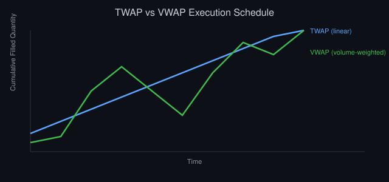
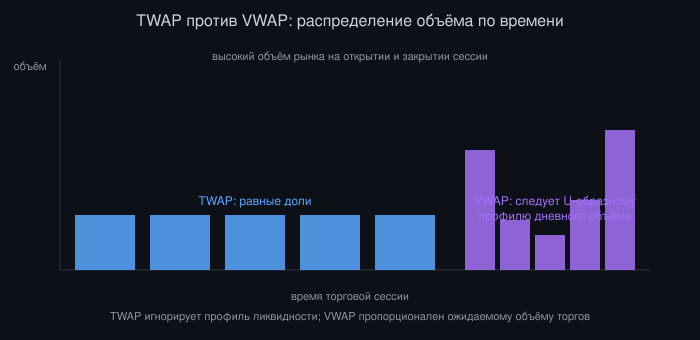
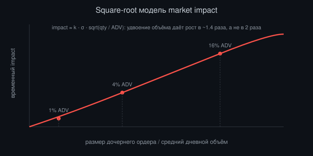

# Алгоритмы исполнения на практике: TWAP, VWAP и не только

*Автор: Vizanix — уровень: средний*

> Вы разберётесь, как устроены основные алгоритмы исполнения изнутри, почему их наивные реализации проигрывают рынку, и как построить собственный движок исполнения с адаптивным поведением.



## Содержание

1. Зачем нужны алгоритмы исполнения
2. TWAP: простота, которая обманчива
3. VWAP: следование за объёмом рынка
4. Implementation Shortfall и цена промедления
5. Participation rate и адаптивное поведение
6. Управление market impact
7. Обработка частичных исполнений внутри алгоритма
8. Защита от неблагоприятных условий: circuit breakers алгоритма

## 1. Зачем нужны алгоритмы исполнения

Когда у вас есть решение купить 500 000 акций компании, наивный подход, отправить один рыночный ордер на весь объём, почти гарантированно даёт худшую цену, чем рынок в среднем показывал бы за тот же период. Причина проста: книга заявок имеет ограниченную глубину на каждом уровне цены. Съедая её полностью одним ударом, вы платите растущую премию за немедленную ликвидность. Это называется market impact.

Алгоритмы исполнения решают задачу разбиения крупного родительского ордера (parent order) на последовательность дочерних ордеров (child orders), распределённых во времени и по объёму так, чтобы минимизировать совокупные издержки исполнения при заданных ограничениях: временном окне, допустимом риске незавершения, толерантности к markout после исполнения.

Не существует «лучшего» алгоритма исполнения в абсолютном смысле. Каждый алгоритм: конкретный компромисс между риском рыночного воздействия (impact risk) и риском времени (timing risk, он же риск того, что цена уйдёт против вас, пока вы медленно исполняетесь). TWAP минимизирует предсказуемость для наблюдателей за счёт игнорирования профиля объёма. VWAP следует за объёмом, но раскрывает предсказуемый паттерн. Implementation Shortfall агрессивно исполняется в начале, принимая больше impact risk ради меньшего timing risk. Выбор алгоритма отвечает на один вопрос: какой из двух рисков для конкретной сделки дороже.

## 2. TWAP: простота, которая обманчива

Time-Weighted Average Price: алгоритм, который делит родительский ордер на равные по объёму части и исполняет их через равные интервалы времени, независимо от того, что происходит с объёмом торгов на рынке. Формально, для родительского ордера объёмом Q, исполняемого за N интервалов:

```
child_qty[i] = Q / N   для каждого i от 1 до N
target_time[i] = start_time + i * (duration / N)
```

Наивная реализация именно такая: посчитать N, поделить Q поровну, отправлять по одному дочернему ордеру на каждом интервале. Проблема в том, что такая реализация игнорирует реальность рынка. Если объём торгов сконцентрирован в первый и последний час сессии (типичная U-образная кривая внутридневного объёма), равномерное распределение TWAP означает, что в середине дня, когда ликвидности мало, ваши дочерние ордера составляют непропорционально большую долю объёма. Они двигают цену сильнее, чем аналогичный по размеру ордер в час пик.

Более зрелая реализация TWAP добавляет случайный джиттер к времени и размеру каждого дочернего ордера, чтобы алгоритм не превращался в предсказуемый паттерн, который легко распознать по регулярности интервалов. Представьте, что вы отправляете ордер ровно каждые 30 секунд одинакового размера. Любой участник рынка, наблюдающий ленту сделок, за несколько итераций угадает следующий ордер и выставит встречную заявку чуть впереди вашей цены, что называется front-running алгоритма (не путать с незаконным front-running брокера, здесь речь о законной адаптации других участников к предсказуемому паттерну).

```
jittered_qty[i]  = child_qty[i] * (1 + uniform(-0.15, 0.15))
jittered_time[i] = target_time[i] + uniform(-interval*0.2, interval*0.2)
```

TWAP хорошо подходит, когда у вас нет сильного мнения о внутридневном профиле объёма конкретного инструмента, либо когда задача, минимизировать сигнальный риск (не выдать намерение крупного игрока), важнее точного следования бенчмарку объёма. Он плохо подходит для низколиквидных инструментов с рваным объёмом, где равномерное распределение может привести к исполнению крупной доли ордера в моменты почти полного отсутствия встречной ликвидности.

## 3. VWAP: следование за объёмом рынка

Volume-Weighted Average Price: бенчмарк, равный сумме цена×объём по всем сделкам за период, делённой на суммарный объём. Алгоритм VWAP пытается исполнить родительский ордер так, чтобы средняя цена исполнения была близка к этому бенчмарку, распределяя дочерние ордера пропорционально ожидаемому профилю объёма рынка, а не равномерно по времени.

Первый шаг: построение прогнозируемого профиля объёма (volume curve) на основе исторических данных, обычно усреднённого по последним 20-60 торговым дням, с разбивкой на интервалы (например, 5-минутные бакеты):

```
expected_volume_share[bucket] = avg_historical_volume[bucket] / sum(avg_historical_volume)
child_qty[bucket] = Q * expected_volume_share[bucket]
```

Наивная реализация использует статический исторический профиль и следует ему без коррекции в реальном времени. Проблема очевидна: сегодняшний день может кардинально отличаться от среднего. Публикация отчётности, макроэкономическое событие, ребалансировка индекса создают всплеск объёма, не похожий на исторический паттерн. Зрелая реализация VWAP отслеживает реализованный объём внутри дня и динамически перераспределяет оставшуюся часть родительского ордера, если текущий объём существенно отклоняется от прогноза:

```
realized_share = cumulative_realized_volume / expected_total_volume_so_far
if realized_share > 1.2:
    # рынок торгует активнее ожидания: можно ускориться,
    # используя дополнительную ликвидность без чрезмерного impact
    accelerate_remaining_schedule()
elif realized_share < 0.8:
    # объём ниже ожидания: агрессивное исполнение по графику
    # создаст непропорциональный impact, стоит придержать часть
    decelerate_remaining_schedule()
```

Важный нюанс: VWAP как бенчмарк вычисляется постфактум, включая ваши собственные сделки. Если ваш родительский ордер составляет заметную долю дневного объёма (скажем, больше 10%), вы сами существенно влияете на бенчмарк, к которому стремитесь. Это называется self-impact на бенчмарк, и в таких случаях сравнение результата исполнения с VWAP становится менее информативным индикатором качества, чем сравнение с ценой на момент принятия решения (arrival price).



*Рисунок 1: TWAP делит объём равномерно во времени, тогда как VWAP следует U-образному профилю дневной ликвидности.*

## 4. Implementation Shortfall и цена промедления

Implementation Shortfall (IS), концепция, восходящая к базовой теории транзакционных издержек, измеряет разницу между ценой, по которой актив теоретически мог быть куплен в момент принятия решения (arrival price), и фактической средней ценой исполнения, с учётом издержек на неисполненный остаток при отмене части ордера.

```
IS = (avg_execution_price - arrival_price) * filled_qty
     + (arrival_price - cancel_price) * unfilled_qty   [опциональный член упущенной выгоды]
```

Алгоритмы, оптимизирующие под Implementation Shortfall, явно балансируют два вида издержек, которые растут в противоположных направлениях по мере ускорения исполнения. Market impact cost растёт со скоростью исполнения: чем быстрее вы хотите купить крупный объём, тем больше премии платите за немедленную ликвидность. Timing risk (риск неблагоприятного движения цены за время, пока вы медленно исполняетесь) растёт с продолжительностью исполнения: чем дольше вы размазываете ордер, тем выше шанс, что рынок уйдёт против вас за это время просто в силу волатильности, безотносительно вашего собственного воздействия.

Классическая формализация этого компромисса (в духе моделей оптимального исполнения, использующих квадратичный штраф за риск) выражает общую стоимость исполнения как сумму ожидаемого impact cost, растущего со скоростью торговли, и штрафа за дисперсию цены исполнения, пропорционального времени исполнения и волатильности инструмента. Практический вывод для инженера прост: параметр «агрессивность» алгоритма IS, по сути, коэффициент неприятия риска (risk aversion), который трейдер задаёт явно, и который определяет, насколько круто убывает график планового объёма исполнения от начала к концу окна.

В отличие от TWAP и VWAP, которые следуют фиксированному графику, IS-алгоритмы обычно наиболее агрессивны в начале окна исполнения (front-loaded), потому что каждая единица времени промедления несёт риск неблагоприятного движения цены, а impact cost на единицу объёма относительно предсказуем и контролируем.

## 5. Participation rate и адаптивное поведение

Participation rate: доля вашего объёма исполнения от суммарного объёма рынка за тот же интервал времени. Алгоритм с ограничением по participation rate (часто называемый POV, percentage of volume) гарантирует, что вы никогда не составляете больше заданного процента (например, 10%) от реального рыночного объёма в каждый момент времени.

```
max_child_qty[t] = target_pov * market_volume[t]
actual_child_qty[t] = min(remaining_qty, max_child_qty[t])
```

Это фундаментально отличается от VWAP, который следует прогнозируемому профилю: POV реагирует на фактический объём в реальном времени, а не на исторический прогноз. Если рынок внезапно затих (например, участники ждут публикации макростатистики), POV-алгоритм автоматически замедляется, тогда как наивный VWAP по статичному расписанию продолжит отправлять запланированный объём, создавая непропорциональный impact на тонком рынке.

Компромисс POV: потеря контроля над временем завершения. Если рынок весь день торгуется вяло, POV-алгоритм может не успеть исполнить весь родительский объём к концу торговой сессии. Практические реализации добавляют «аварийный» режим: если к определённому моменту (скажем, за час до закрытия) отставание от плана превышает порог, алгоритм временно повышает целевой participation rate, жертвуя частью market impact ради гарантии завершения. Этот механизм часто называют «catch-up logic» или «urgency escalation».

## 6. Управление market impact

Market impact разделяется на два компонента с разной природой. Временный impact (temporary impact) отражает премию за потребление немедленной ликвидности и рассасывается после завершения исполнения. Постоянный impact (permanent impact) отражает информационное содержание вашей торговли: рынок обновляет своё представление о справедливой цене, увидев устойчивое давление в одну сторону, и это давление не откатывается назад после завершения ордера.

Простая иллюстративная модель temporary impact, используемая многими практиками для оценки издержек (форма, вдохновлённая классическими работами по square-root impact law):

```
temporary_impact ≈ k * sigma * sqrt(child_qty / avg_daily_volume)
```

где `sigma`: дневная волатильность инструмента, `k`: калиброванный на исторических данных коэффициент, специфичный для класса активов и структуры рынка. Квадратный корень отражает эмпирическое наблюдение: impact растёт медленнее, чем линейно с объёмом одной сделки. Удвоение размера сделки не удваивает impact, а увеличивает его примерно в 1.4 раза. Это ключевая причина, почему дробление крупного ордера на много мелких почти всегда снижает совокупный impact по сравнению с одной крупной сделкой, при условии, что интервалы между дочерними ордерами достаточны для частичного восстановления книги.

Инженерное следствие простое: ваш движок исполнения должен вести собственную модель impact (пусть простую), чтобы оценивать trade-off между скоростью и издержками до, а не после исполнения. При выборе параметров алгоритма (длительность окна, максимальный participation rate) сверяйтесь с оценкой impact cost, а не только с интуицией трейдера. Это позволяет количественно объяснить, почему для конкретного ордера восьмичасовое окно исполнения дешевле часового.



*Рисунок 2: временный impact растёт медленнее, чем линейно с размером сделки относительно среднего дневного объёма.*

## 7. Обработка частичных исполнений внутри алгоритма

Движок исполнения работает поверх OMS (см. книгу про проектирование OMS) и должен корректно реагировать на частичные исполнения дочерних ордеров, не теряя синхронизацию с общим планом родительского ордера. Частая ошибка: алгоритм, который отправляет следующий дочерний ордер по расписанию, не дожидаясь и не учитывая, исполнился ли предыдущий полностью.

Правильная модель ведёт отдельно «плановый прогресс» (сколько должно быть исполнено к текущему моменту по графику) и «фактический прогресс» (сколько реально исполнено), и на каждом шаге вычисляет разницу:

```
schedule_progress(t) = sum(planned_qty[0..t])
actual_progress(t)   = sum(filled_qty[0..t])
deficit(t) = schedule_progress(t) - actual_progress(t)
next_child_qty = base_planned_qty[t+1] + catch_up_fraction * deficit(t)
```

`catch_up_fraction`: параметр, контролирующий, насколько агрессивно алгоритм пытается наверстать отставание. Значение, равное единице, означает немедленную полную компенсацию любого отставания в следующем интервале. Это резко увеличивает объём следующего дочернего ордера и, соответственно, его market impact. Значение около 0.3-0.5 сглаживает компенсацию на несколько интервалов вперёд, снижая всплески impact ценой чуть большего риска не уложиться в общее временное окно.

Отдельно обработайте случай, когда дочерний ордер отклонён биржей (reject). Это не то же самое, что неисполнение по недостатку ликвидности. Reject обычно означает проблему с параметрами ордера (например, нарушение tick size или lot size), и слепой ретрай того же ордера просто повторит ошибку. Алгоритм должен различать «ордер не исполнился, потому что не было встречной ликвидности» (нормальная ситуация, обрабатывается through catch-up logic) и «ордер отклонён из-за ошибки параметров» (аномалия, требующая логирования и, возможно, приостановки алгоритма для человеческого вмешательства).

## 8. Защита от неблагоприятных условий: circuit breakers алгоритма

Каждый производственный алгоритм исполнения должен иметь встроенные защитные механизмы, независимые от основной логики планирования, которые останавливают или замедляют исполнение при аномальных рыночных условиях. Это не опционально. Это разница между контролируемыми издержками и катастрофическим исполнением на flash-crash или технической аномалии биржи.

Минимальный набор защитных проверок перед отправкой каждого дочернего ордера:

```
def pre_send_checks(child_order, market_state):
    if market_state.spread > max_allowed_spread:
        return DEFER
    if market_state.last_price deviates from arrival_price > max_deviation_pct:
        return PAUSE_AND_ALERT
    if market_state.quote_staleness > max_staleness_ms:
        return DEFER
    if cumulative_impact_estimate > max_impact_budget:
        return THROTTLE
    return PROCEED
```

Проверка на аномальный спред защищает от отправки ордеров в момент, когда книга заявок аномально тонкая, например, во время технического сбоя маркет-мейкера на этом инструменте. Проверка на отклонение от arrival price ловит ситуации резкого движения рынка, где продолжение исполнения по изначальному плану может быть уже не тем решением, которое принял бы трейдер, видя текущую картину. Проверка на staleness котировок защищает от торговли на основе устаревших данных при проблемах фида.

Эти проверки должны быть отделены от основной логики планирования и не могут быть отключены параметром конфигурации алгоритма по умолчанию. Трейдер может осознанно повысить пороги для конкретного исполнения, но не может случайно отключить защиту, просто не указав нужный флаг. Разделяйте «параметры стратегии исполнения» и «защитные лимиты» на уровне кода и конфигурации, чтобы человек, редактирующий первое, физически не мог случайно тронуть второе.

## Итоги

- Выбор алгоритма исполнения: это явный выбор компромисса между market impact risk и timing risk, а не универсальный «лучший вариант».
- Наивные реализации TWAP и VWAP предсказуемы и уязвимы к front-running другими участниками: джиттер и адаптивность обязательны.
- VWAP требует динамической коррекции относительно реализованного объёма, а не слепого следования историческому профилю.
- Implementation Shortfall балансирует impact cost и timing risk через явный параметр риск-аппетита, обычно исполняясь агрессивнее в начале окна.
- POV-алгоритмы реагируют на фактический объём в реальном времени, жертвуя гарантией срока завершения ради контроля доли участия.
- Square-root модель impact: практичный инструмент для количественной оценки trade-off между скоростью и издержками исполнения.
- Catch-up logic должна сглаживать компенсацию отставания, а не создавать всплески объёма, которые сами по себе увеличивают impact.
- Защитные circuit breakers алгоритма обязаны быть независимы от логики планирования и не отключаемы по умолчанию.

---

*Эта книга — часть библиотеки Vizanix Quant Engineering Library. Лицензия CC BY 4.0 — можно свободно читать, распространять и адаптировать с указанием авторства Vizanix.*
