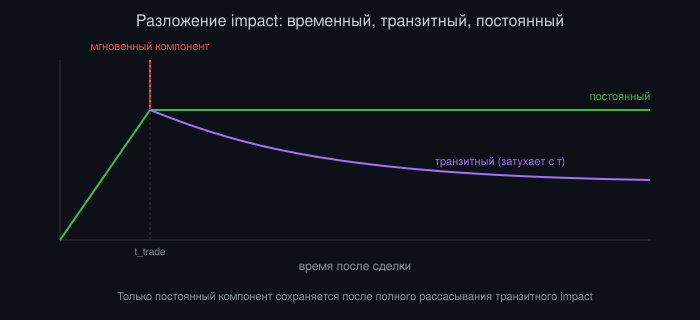
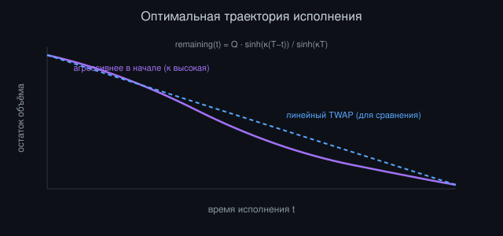
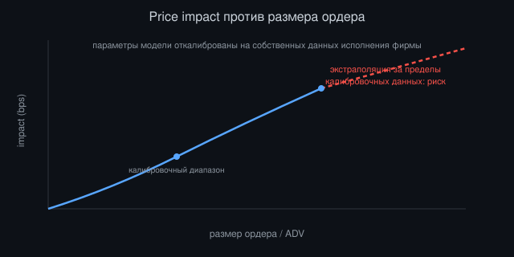

# Продвинутая микроструктура рынка и моделирование price impact

*Автор: Vizanix — уровень: профессиональный*

> Вы разберётесь, как строго моделировать price impact за пределами простой square-root эвристики, как калибровать эти модели на реальных данных исполнения, и как избежать типичных ошибок, которые превращают модель impact в источник систематически неверных торговых решений.


## Содержание

1. Зачем нужна строгая модель impact, а не только интуиция
2. Разложение impact: временный, постоянный и транзитный компоненты
3. Калибровка модели impact на собственных данных исполнения
4. Impact нескольких одновременных участников и игровая динамика
5. Кросс-импакт между коррелированными инструментами
6. Оптимальное исполнение как задача управления с учётом impact
7. Ограничения моделей impact и режимная нестабильность
8. От модели impact к практическому решению: интеграция в алгоритм исполнения
9. Валидация модели impact против реальности

## 1. Зачем нужна строгая модель impact, а не только интуиция

В книге про алгоритмы исполнения среднего уровня мы ввели простую square-root эвристику для оценки market impact, достаточную для качественного понимания компромисса между скоростью исполнения и издержками. Профессиональный трейдинговый деск, управляющий значимым капиталом на активном обороте, не может остановиться на этом уровне точности. Разница между грубой эвристикой и строго калиброванной моделью impact прямо конвертируется в реальные деньги на каждой крупной сделке, и на достаточном объёме годового оборота эта разница может составлять значительную долю совокупной прибыльности всего торгового подразделения.

Строгая модель impact служит нескольким конкретным профессиональным задачам одновременно. Она даёт количественную основу для оптимального планирования исполнения (сколько времени и какой объём в единицу времени, чтобы минимизировать ожидаемые совокупные издержки при заданном допустимом уровне риска, формализация интуитивного компромисса из книги про алгоритмы исполнения). Она даёт основу для честной pre-trade оценки издержек, необходимой портфельным менеджерам для принятия обоснованного решения о размере позиции с учётом реалистичной стоимости входа и выхода, а не только предполагаемой альфы сигнала без учёта издержек реализации. И она даёт основу для постфактум объективной оценки качества исполнения (TCA), отличая реальные издержки impact вашей собственной торговли от общего движения рынка, которое произошло бы независимо от вашей активности.

Ключевая методологическая установка этой книги, отличающая профессиональный уровень от академического упражнения: модель impact никогда не бывает окончательно «правильной» в смысле точного соответствия реальности. Рынок: адаптивная система, где контрагенты меняют поведение в ответ на наблюдаемые паттерны, и любая модель impact: это приближение, требующее непрерывной калибровки и явного понимания границ своей применимости, а не статичная формула, откалиброванная один раз и используемая бессрочно без пересмотра.

## 2. Разложение impact: временный, постоянный и транзитный компоненты

Профессиональная модель impact разделяет наблюдаемое движение цены, связанное с исполнением ордера, на несколько компонентов с разной динамикой затухания во времени, что критично для правильного планирования исполнения. Эвристика, объединяющая все компоненты в единый неразличимый показатель, теряет ключевую информацию для оптимизации.

Временный impact (transient impact) отражает премию за немедленное потребление доступной ликвидности: цена сдвигается в момент исполнения сделки, но это движение частично или полностью рассасывается (mean-reverts) после прекращения давления вашей торговли, по мере того как маркет-мейкеры восстанавливают котировки на прежних уровнях. Постоянный impact (permanent impact) отражает реальный сдвиг информационного консенсуса о справедливой цене актива: рынок обновляет своё представление о цене на основе наблюдаемого устойчивого направленного давления и не возвращается к прежнему уровню после завершения вашей торговли, даже если сама торговля была полностью нейтральна с точки зрения новой информации об активе.

Более полная и практически ценная декомпозиция, используемая в профессиональных моделях (в духе многофакторных моделей impact, развивающих базовую square-root интуицию), вводит третий, промежуточный компонент: транзитный impact с конечным, но ненулевым временем полураспада, который затухает медленнее временного, но не является полностью постоянным:

```
total_impact(t) = permanent_component
                + transient_component * exp(-(t - t_trade) / tau_transient)
                + immediate_component * indicator(t == t_trade)
```

где `tau_transient`: характерное время полураспада транзитного компонента, эмпирически калибруемое на исторических данных (см. главу 3). Практическая ценность этого разложения для алгоритма исполнения: если вы торгуете последовательность дочерних ордеров с интервалом, значительно превышающим `tau_transient`, транзитный компонент impact от предыдущего дочернего ордера успевает существенно рассосаться до отправки следующего, и вы не платите накопленный impact повторно. Если интервал слишком короткий относительно `tau_transient`, вы фактически торгуете против ещё не рассосавшегося impact собственной предыдущей сделки, что эвристическая square-root модель, игнорирующая временную динамику, не способна корректно уловить.



*Рисунок 1: транзитный компонент затухает с характерным временем τ, тогда как постоянный компонент остаётся после завершения торговли.*

## 3. Калибровка модели impact на собственных данных исполнения

Модель impact, взятая из общей академической литературы без калибровки на собственных данных, даёт лишь приблизительную отправную точку. Реальные параметры (коэффициент влияния объёма, время полураспада транзитного компонента, соотношение постоянного и временного компонентов) существенно варьируются между классами активов, конкретными инструментами, рыночными условиями, и, что важно профессионально признать, между вашей собственной инфраструктурой исполнения и инфраструктурой других участников, чьи данные легли в основу общей публичной модели.

Практическая процедура калибровки использует собственную историю исполнения фирмы как обучающий датасет: для каждой исполненной сделки (или последовательности дочерних ордеров одного родительского) вы измеряете фактическое движение цены до, во время и после исполнения, и подгоняете параметры модели impact так, чтобы минимизировать расхождение между предсказанным и наблюдаемым движением цены:

```
def calibrate_impact_model(historical_executions):
    observations = []
    for execution in historical_executions:
        pre_trade_price = execution.arrival_price
        realized_path = execution.price_path_around_trade  # цена до, во время, после
        observations.append((execution.qty, execution.adv, realized_path, pre_trade_price))

    params = fit_model_parameters(
        observations,
        model=lambda qty, adv, params: params.k * (qty / adv) ** params.alpha,
        loss=weighted_squared_error
    )
    return params
```

Критическая профессиональная практика: сегментировать калибровку по режиму рынка (высокая и низкая волатильность, разное время суток с учётом характерного внутридневного профиля ликвидности, разные рыночные условия: трендовый и флэтовый рынок), потому что параметры impact систематически различаются между режимами, аналогично нестабильности корреляций в кризис, разобранной в книге про портфельный риск. Единая, усреднённая по всем режимам калибровка модели impact даёт значение, которое плохо соответствует реальности в любом конкретном режиме, будучи компромиссом между несопоставимыми условиями.

Отдельная методологическая тонкость калибровки: необходимость аккуратно отделить собственный impact от общего рыночного шума и от импакта других участников, торгующих в это же время в том же направлении (co-impact, разобранный подробнее в главе 4). Наивная калибровка, приписывающая всё наблюдаемое движение цены исключительно вашей собственной торговле, систематически завышает оценённый impact в периоды, когда рынок и без вашего участия двигался в том же направлении по независимым причинам (например, крупная макроэкономическая новость, совпавшая по времени с вашим исполнением).

## 4. Impact нескольких одновременных участников и игровая динамика

Профессиональный анализ impact должен учитывать, что вы почти никогда не единственный крупный участник, воздействующий на цену в данный момент времени. Если несколько независимых участников одновременно исполняют крупные ордера в одном направлении (например, несколько институциональных фондов ребалансируют портфели в один и тот же день по схожей причине, распространённая ситуация вокруг ребалансировки индексов или дат исполнения деривативов), совокупный impact на цену значительно превышает то, что предсказала бы модель, откалиброванная на предположении об изолированной торговле единственного крупного участника.

Это создаёт практическую сложность идентификации: наблюдая необычно сильное движение цены во время собственного исполнения, вы не всегда можете отличить «моя модель impact недооценивает мой собственный impact» от «в это же время действует другой крупный участник, чей impact складывается с моим». Практическая эвристика для различения: анализ объёма и паттерна сделок в период аномального движения: если наблюдаемый совокупный объём торгов значительно превышает ваш собственный объём исполнения плюс типичный фоновый объём рынка, это указывает на присутствие дополнительных крупных участников, а не на исключительно недооценённый ваш собственный impact.

Более тонкий, стратегический аспект этой темы: рефлексивная реакция других участников на наблюдаемый паттерн вашей торговли, разобранная как anti-gaming проблема в книге про smart order routing применительно к маршрутизации, но имеющая более глубокое проявление на уровне самого impact: если ваша фирма систематически и предсказуемо торгует крупные объёмы определённым паттерном, другие участники (особенно высокочастотные маркет-мейкеры и статистические арбитражёры) могут научиться предсказывать продолжение вашей торговой активности на основе наблюдения её начала, и заранее позиционировать свои котировки против вашего предсказуемого продолжения. Это увеличивает эффективный impact, наблюдаемый вами, сверх того, что предсказала бы модель, откалиброванная в предположении, что рынок не адаптируется к специфике вашего конкретного паттерна поведения.

Профессиональный ответ на эту динамику: та же логика рандомизации паттерна исполнения, разобранная в книге про алгоритмы исполнения и smart order routing, применённая теперь с явным осознанием, что модель impact, откалиброванная на исторических данных прошлого паттерна поведения, систематически недооценивает impact будущего исполнения того же самого предсказуемого паттерна, потому что контрагенты за это время успели адаптироваться к нему.

## 5. Кросс-импакт между коррелированными инструментами

Продвинутая модель impact для портфеля, торгующего несколько коррелированных инструментов одновременно (например, спот и фьючерс на один базовый актив, или несколько компаний одного сектора), должна учитывать не только прямой impact сделки на цену торгуемого инструмента, но и кросс-импакт: сдвиг цены связанных инструментов, вызванный вашей торговлей на первом инструменте, через механизм арбитражной связи или общего информационного содержания сделки.

```
own_price_impact[i] = k_own[i] * sqrt(qty[i] / adv[i])
cross_price_impact[j] = k_cross[i][j] * own_price_impact[i]   # передаётся на связанный инструмент j
                        для всех j, коинтегрированных или арбитражно связанных с i
```

Практическая значимость учёта кросс-импакта для торговой стратегии, одновременно управляющей позициями по нескольким связанным инструментам: если вы исполняете крупный ордер на покупку базового актива и одновременно планируете исполнить связанный ордер на инструменте, который систематически реагирует на движение первого (например, при парном трейдинге, см. книгу про анализ временных рядов), кросс-импакт первой сделки уже частично двигает цену второго инструмента в невыгодном для вашей второй сделки направлении ещё до того, как вы её отправили. Модель, игнорирующая эту связь, недооценивает совокупные издержки исполнения всей связанной позиции.

Калибровка кросс-импакта технически сложнее прямого impact, потому что требует отделения истинной кросс-реакции от простого совпадения по времени двух коррелированных, но независимо движущихся инструментов. На практике эта задача обычно решается через регрессионный анализ, где движение цены связанного инструмента объясняется как функция от вашей известной торговой активности на первом инструменте с контролем на собственную независимую волатильность второго инструмента, аналогично методологической строгости коинтеграционного анализа из книги про анализ временных рядов, применённой теперь к оценке impact, а не к самому торговому сигналу.

## 6. Оптимальное исполнение как задача управления с учётом impact

Строгая модель impact позволяет формализовать задачу оптимального планирования исполнения как задачу оптимального управления (optimal control), а не полагаться на эвристический выбор параметров алгоритма исполнения интуитивно. Классическая формализация (развивающая интуицию Implementation Shortfall из книги про алгоритмы исполнения строгим математическим аппаратом) минимизирует ожидаемую сумму издержек impact и штрафа за риск отклонения цены исполнения от ожидания, накопленного за время исполнения:

```
minimize: E[impact_cost(trading_trajectory)] + lambda * Var[execution_price]

subject to: sum(trading_trajectory) == total_quantity
            trading_trajectory[t] >= 0 для всех t (при монотонном исполнении в одну сторону)
```

где `lambda`: параметр неприятия риска (risk aversion), явно задаваемый трейдером или деском, отражающий относительную важность минимизации ожидаемых издержек против минимизации дисперсии (неопределённости) итоговой цены исполнения. Решение этой задачи оптимизации для достаточно простой (например, линейной) модели impact даёт аналитическую форму оптимальной траектории торговли. Классический результат этого рода математики показывает, что оптимальная траектория при линейном временном impact и квадратичном штрафе за риск представляет собой экспоненциально затухающую скорость исполнения, более агрессивную в начале окна и постепенно замедляющуюся, с формой затухания, определяемой соотношением коэффициента impact и параметра неприятия риска.

Практическая ценность этой формализации для инженера, строящего алгоритм исполнения: вместо произвольного выбора формы графика исполнения (равномерный TWAP, следование историческому профилю VWAP из среднего уровня книги), вы получаете математически обоснованную траекторию, явно оптимизированную под конкретно откалиброванную модель impact вашей фирмы и явно заданный уровень неприятия риска, а не универсальный шаблон, не учитывающий специфику вашей реальной калибровки издержек.

```
def optimal_trajectory(total_qty, T, impact_coefficient, risk_aversion, volatility):
    kappa = compute_kappa(impact_coefficient, risk_aversion, volatility)
    trajectory = []
    for t in linspace(0, T, num_steps):
        remaining_fraction = sinh(kappa * (T - t)) / sinh(kappa * T)
        trajectory.append(total_qty * remaining_fraction)
    return trajectory  # монотонно убывающая от total_qty к нулю, форма зависит от kappa
```

Важная практическая оговорка: эта элегантная аналитическая форма справедлива для упрощённых предположений о линейности impact и постоянстве параметров модели на протяжении всего окна исполнения. Реальная реализация должна дополнять эту теоретическую траекторию адаптивной коррекцией в реальном времени на основе фактически наблюдаемого impact и рыночных условий (аналогично catch-up логике из книги про алгоритмы исполнения), потому что слепое следование заранее вычисленной оптимальной траектории без адаптации к реальности исполнения теряет значительную часть теоретической ценности этой оптимизации при столкновении с реальными отклонениями от идеализированных предположений модели.



*Рисунок 2: оптимальная траектория более агрессивна в начале окна исполнения по сравнению с линейным TWAP-графиком.*

## 7. Ограничения моделей impact и режимная нестабильность

Профессиональная зрелость в работе с моделями impact требует честного понимания их фундаментальных ограничений, а не слепого доверия к результатам калибровки как к объективной истине о рынке. Первое и самое важное ограничение: параметры impact систематически нестабильны во времени и между режимами рынка, что уже упоминалось в главе 3, но заслуживает более глубокого разбора здесь: в периоды рыночного стресса (резкое падение ликвидности, паническое бегство маркет-мейкеров с рынка) реальный impact той же номинальной сделки может в разы превышать значение, предсказанное моделью, откалиброванной на спокойном историческом периоде, именно тогда, когда точная оценка impact наиболее критична для принятия обоснованного решения о темпе исполнения экстренной ликвидации позиции.

Второе ограничение: модели impact, особенно калиброванные на относительно скромных по историческим меркам объёмах, экстраполируют плохо на значительно больший масштаб сделки, чем всё, что наблюдалось в калибровочных данных. Square-root закономерность и её более сложные обобщения: эмпирические аппроксимации, подтверждённые в определённом диапазоне относительного размера сделки к дневному объёму, и экстраполяция за пределы этого проверенного диапазона (например, попытка оценить impact сделки размером в 50% дневного объёма на основе модели, откалиброванной на сделках до 5% дневного объёма) несёт значительный и трудно оцениваемый риск систематической ошибки.

Третье, более концептуальное ограничение: модели impact, по построению, предполагают определённую стабильность структуры рынка (число активных маркет-мейкеров, их капитал, готовность предоставлять ликвидность), которая сама может резко измениться в ответ на внешние события, не отражённые в исторических данных калибровки (регуляторное изменение, банкротство крупного маркет-мейкера, структурное изменение конкуренции на рынке). Профессиональная практика: регулярный, не реже ежеквартального, пересмотр не только параметров, но и самой функциональной формы модели impact, с явной проверкой, продолжает ли базовая square-root или более сложная функциональная форма адекватно описывать наблюдаемые данные, а не только автоматическое обновление числовых параметров в рамках неизменной, потенциально устаревшей функциональной формы.



*Рисунок 3: за пределами калибровочного диапазона размера сделки экстраполяция модели несёт значительный риск систематической ошибки.*

## 8. От модели impact к практическому решению: интеграция в алгоритм исполнения

Строго откалиброванная модель impact реализует свою практическую ценность только через интеграцию в реальный конвейер принятия решений об исполнении, а не как изолированный аналитический артефакт. Первая точка интеграции: pre-trade оценка издержек, предоставляемая портфельному менеджеру или трейдеру до принятия решения о размере позиции: явная оценка ожидаемой стоимости входа и последующего выхода из позиции заданного размера, позволяющая скорректировать желаемый размер позиции с учётом реалистичной, а не идеализированной стоимости реализации сигнала.

```
def pretrade_cost_estimate(instrument, desired_qty, urgency, impact_model):
    optimal_traj = optimal_trajectory(desired_qty, urgency_to_horizon(urgency),
                                       impact_model.coefficient[instrument],
                                       risk_aversion_default, impact_model.volatility[instrument])
    expected_cost = sum(impact_model.marginal_cost(q) for q in optimal_traj)
    return expected_cost, expected_cost / (desired_qty * current_price)  # в bps
```

Вторая точка интеграции: динамическое планирование внутри самого алгоритма исполнения (расширяя логику из книги про алгоритмы исполнения строго откалиброванной моделью вместо эвристической square-root оценки), где оптимальная траектория из главы 6 пересчитывается на регулярной основе с учётом фактически наблюдаемого impact собственных предыдущих дочерних ордеров, а не только теоретического предсказания модели, сформированного до начала исполнения.

Третья, более редко реализуемая, но профессионально ценная точка интеграции: обратная связь от TCA (см. книгу про smart order routing) не только для перекалибровки самой модели impact (глава 3), но и для систематической атрибуции реализованных издержек исполнения между компонентами: сколько из совокупной разницы между arrival price и итоговой ценой исполнения объясняется предсказанным вашей моделью impact, сколько независимым движением рынка, не связанным с вашей торговлей, и сколько неучтённой разницей между моделью и реальностью (residual), которая сама по себе является ценным сигналом о качестве и актуальности калибровки модели, требующим внимания, если она систематически растёт со временем.

## 9. Валидация модели impact против реальности

Финальная профессиональная дисциплина: систематическая, непрерывная валидация модели impact против фактических исходов исполнения, а не разовая калибровка, которой доверяют бессрочно. Практическая процедура валидации использует ту же логику out-of-sample тестирования, что и общая методология анализа временных рядов и финансового ML из соответствующих книг: модель, откалиброванная на данных до момента t, должна оцениваться на её точность предсказания impact сделок, исполненных после t, а не только на точность соответствия данным, на которых она сама была откалибрована.

```
def validate_impact_model(model, out_of_sample_executions):
    predicted = [model.predict_impact(e.qty, e.adv, e.volatility) for e in out_of_sample_executions]
    observed = [e.realized_impact for e in out_of_sample_executions]
    calibration_error = compute_bias_and_dispersion(predicted, observed)
    if calibration_error.systematic_bias > threshold:
        flag_for_recalibration(model, calibration_error)
```

Ключевой практический индикатор необходимости пересмотра модели: не столько абсолютная величина ошибки предсказания (некоторая ошибка неизбежна для любой модели рыночного явления такой сложности), сколько систематическое смещение (bias) ошибки в одном направлении на протяжении продолжительного времени, что указывает на структурный сдвиг в реальном impact, не отражённый в текущих параметрах модели, а не на случайный шум отдельных наблюдений. Модель, систематически недооценивающая реальный impact на протяжении нескольких недель подряд, требует немедленного внимания и, вероятно, срочной перекалибровки или пересмотра функциональной формы, а не постепенного, отложенного планового обновления по обычному расписанию.

Организационная практика, обеспечивающая устойчивость этой дисциплины: явное владение моделью impact конкретной командой (обычно quantitative research или execution quality team), с формальной регулярной отчётностью о точности модели перед трейдинговым деском и портфельными менеджерами, использующими её выходы для реальных решений. Модель impact, за точностью которой никто явно не следит и о деградации которой никто явно не обязан сообщать заинтересованным пользователям, неизбежно устаревает незаметно, продолжая давать решениям исполнения ложное ощущение количественной строгости, уже давно не соответствующее реальности рынка.

## Итоги

- Разложение impact на временный, транзитный и постоянный компоненты с явной динамикой затухания критично для правильного планирования интервалов между дочерними ордерами.
- Калибруйте модель impact на собственных данных исполнения фирмы, сегментированных по режиму рынка, а не используйте единую усреднённую калибровку или общую академическую модель без адаптации.
- Учитывайте присутствие других крупных участников (co-impact) и рефлексивную адаптацию контрагентов к предсказуемым паттернам вашей торговли.
- Кросс-импакт между коррелированными инструментами требует учёта при одновременном исполнении связанных позиций, чтобы не недооценить совокупные издержки.
- Формализация оптимального исполнения как задачи управления с явным параметром неприятия риска даёт математически обоснованную, а не эвристическую траекторию торговли.
- Модели impact систематически нестабильны в кризисных режимах и плохо экстраполируются на масштаб сделок, значительно превышающий калибровочные данные.
- Интегрируйте модель impact на нескольких точках конвейера: pre-trade оценка издержек, динамическое планирование внутри алгоритма исполнения, атрибуция в TCA.
- Валидируйте модель непрерывно на out-of-sample исполнениях и реагируйте на систематическое смещение ошибки, а не только на разовую точность калибровки.
- Явное организационное владение моделью impact с регулярной отчётностью о её точности предотвращает незаметное устаревание количественной строгости решений исполнения.

---

*Эта книга — часть библиотеки Vizanix Quant Engineering Library. Лицензия CC BY 4.0 — можно свободно читать, распространять и адаптировать с указанием авторства Vizanix.*
